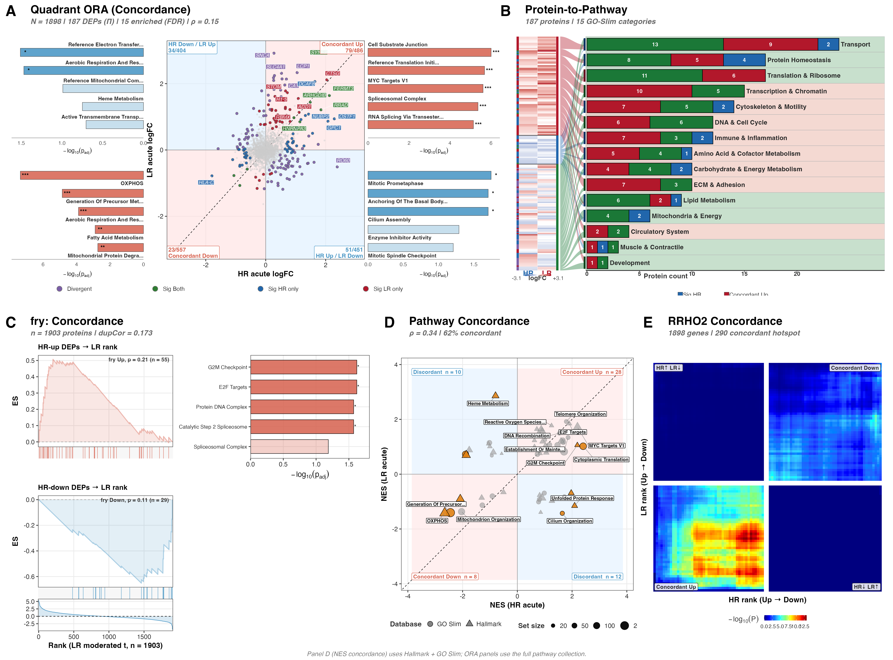
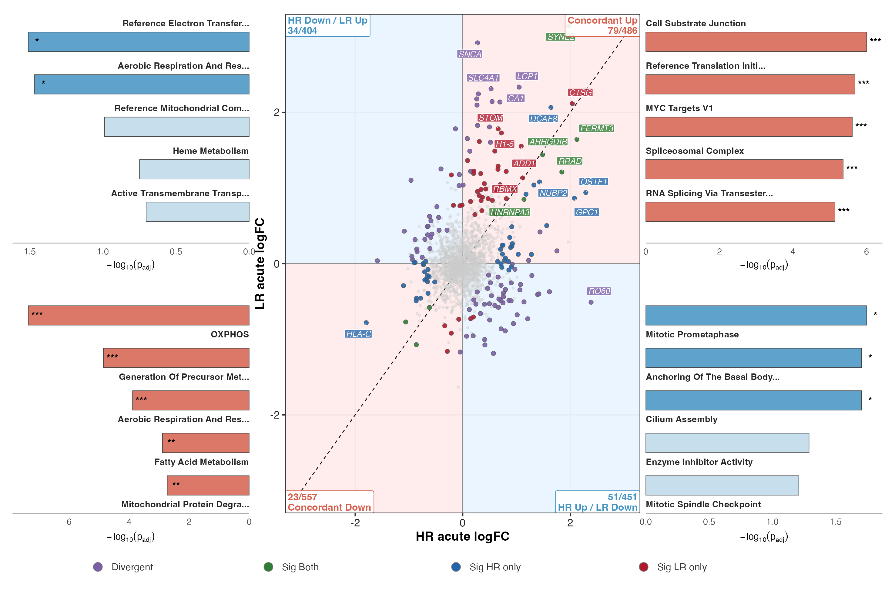
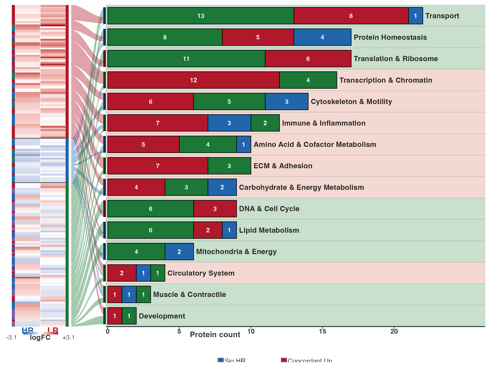
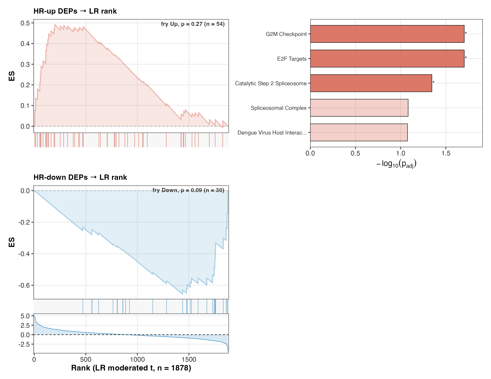
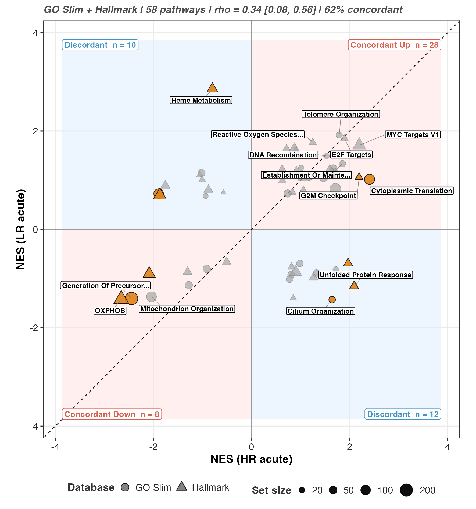
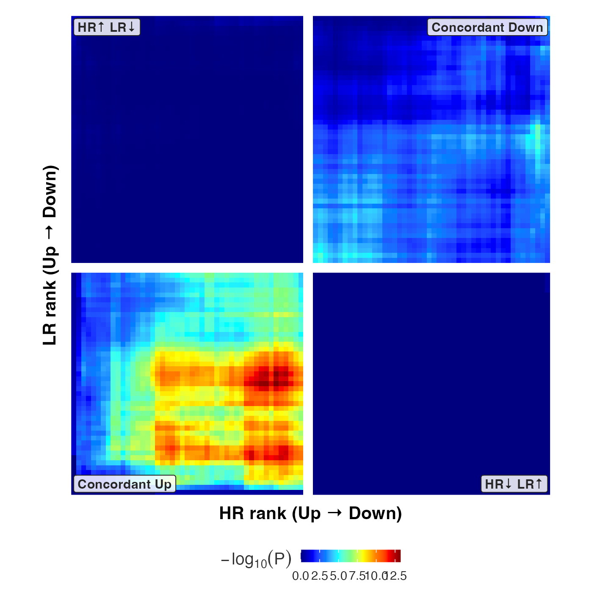
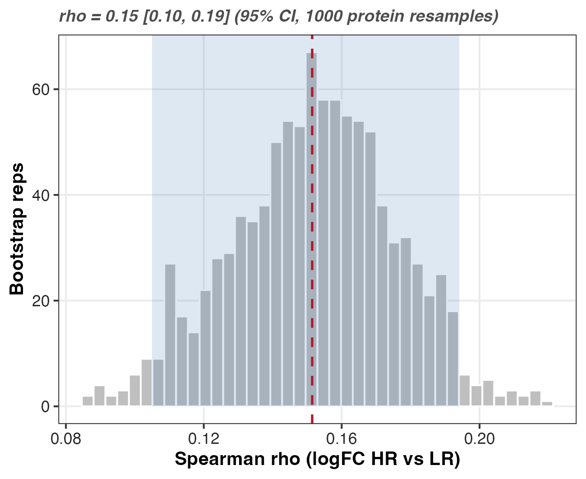
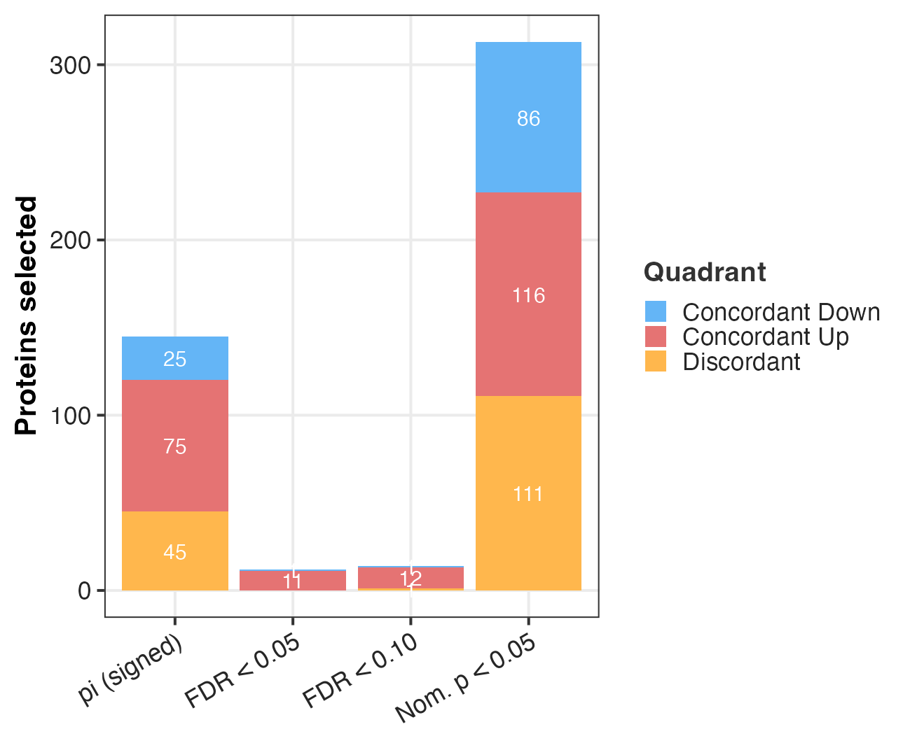
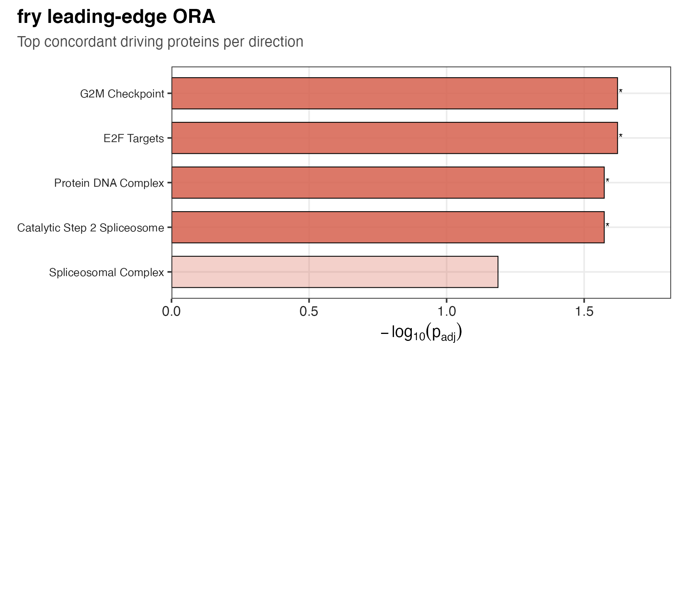

## The question

This figure is the acute arm of the concordance comparison. Where the training figure asked how HR and LR
proteomes move over a training block (T1 → T2), This figure asks how they move in the hour
after a single bout (T2 → T3). Same question, different timescale: which proteins
and pathways respond the same way in both groups, and which respond in a way that
depends on responder status.

The acute contrast is the one where a difference is most plausible *a priori*. A
training-block change is slow and cumulative; the acute response is the muscle's
immediate signalling reaction to a stimulus, and that is where a "high responder"
might reasonably differ. This figure tests that.

Divergence is read off the modelled interaction contrast, not off the eye. This figure and
the training figure call the same driver, `render_concordance_figure()`, and differ only in
configuration (the contrast triple, the factor levels, the labels). There is one
pipeline, not two — so a method change lands in both figures at once and they
cannot silently drift apart.

## What this figure found

**The acute responses of HR and LR are, if anything, *less* concordant than their
training responses.** The protein-level Spearman correlation between the HR and LR
acute logFC vectors is **ρ = 0.15** (bootstrap 95% CI 0.11–0.20), below the training figure's 0.20.
1,035 of 1,873 proteins (**55%**) sit in a concordant quadrant — five points above a
coin flip.

**Again, no set-level test survives correction.** fry along the LR acute ranking:
HR-up (n = 54) p = 0.27 (FDR 0.27); HR-down (n = 30) p = 0.087 (FDR 0.17). The
HR-down direction is the closest thing to a signal anywhere in the training figure or This figure, and it is
still not significant. (The mixed-direction p for the up set is 0.026, but its FDR is
0.052 — it does not clear either.)

**The divergent set is larger here but no better controlled.** 86 proteins are flagged
divergent, all by the π gate, which controls no error rate (see @sec-pi).

**The pathway-level picture is the most interesting in the pipeline.** At the pathway
grain the correlation rises to **ρ = 0.31 with 63% concordant** — the highest agreement
anywhere in the training figure/This figure — and 10 of 57 pathways are flagged divergent, against 2 in the training figure.
The acute response is where HR and LR most resemble each other *in aggregate* and
where the most individual pathways are flagged as differing. That tension is real and
worth stating rather than resolving by picking whichever number reads better.

The honest headline is unchanged from the training figure: **at n = 8 per group this figure does not
establish a responder-specific acute program.** It generates leads.

## Composite



## Inputs and outputs

Reads:

- `03_DEP/a_non_imputed/c_data/03_combined_results.csv` — per-protein logFC, moderated
  t, p-values, FDR, and the signed π flag for `Acute_HR`, `Acute_LR`, and
  `Acute_Interaction`.
- `02_Normalization/imputation/c_data/DAList_imputed_missforest.rds` — the
  missForest-imputed matrix. fry needs a complete matrix.
- `04_Figures/F03_volcanoes/c_data/F03_volcanoes_source_data.xlsx` (sheet `fgsea_all`) — the fgsea cache,
  computed once in F03 and reused so no permutation test reruns.

Writes, under `04_Figures/F00_PILOT/concordance_acute/`: panel and supplementary PNG + PDF, one `c_data/*.csv`
per panel, and the bundled `c_data/concordance_acute_source_data.xlsx`.

```r
render_concordance_figure(list(
  fig_id = "concordance_acute",
  c_hi = "Acute_HR", c_lo = "Acute_LR", c_int = "Acute_Interaction",
  lo_levels = c("LR_T2", "LR_T3"),
  labels = list(
    hi = "HR", lo = "LR", phase = "Acute",
    x = "HR acute logFC", y = "LR acute logFC"
  )
))
```

The acute contrast is always **T3 − T2**, never T3 − T1. It isolates the response to
the final bout from the training block that preceded it.

## The two correlations, and why they differ {#sec-rho}

The composite prints ρ twice and they are **not the same number**. Panel A's ρ = 0.15
is the correlation across *proteins*. Panel D's ρ = 0.31 is the correlation across
*pathways*. Pathway scores average over many member proteins, so they cancel
protein-level noise and correlate more tightly. Neither is more correct; they answer
the question at different grain.

The gap is wider here than in the training figure (0.15 → 0.31, versus 0.20 → 0.28), which is what you
would expect if the acute signal is coherent at the level of pathways but noisy at the
level of individual proteins. Quoting only the 0.31 would be cherry-picking the
flattering resolution.

## Panel A — quadrant concordance map with per-quadrant ORA



**What.** Each protein is placed by the sign pair of its HR and LR acute logFC. The
concordant quadrants hold proteins moving the same direction in both groups; the
off-diagonal quadrants hold proteins moving opposite ways. Points are coloured by
class: divergent (interaction-flagged), significant in both, HR-only, LR-only, NS.

**Result.** Concordant Down 553, Concordant Up 482, HR Up / LR Down 440, HR Down / LR
Up 398 — 1,035 concordant of 1,873 (55%), ρ = 0.15. Of the 181 selected proteins: 86
divergent, 46 HR-only, 39 LR-only, 10 significant in both arms.

**How to read it.** The cloud is rounder than the training figure's. Note the asymmetry: the two
*discordant* quadrants together (838) nearly match the two concordant ones (1,035).
That is close to what you would see if the two groups' acute responses were largely
independent of each other.

**Why the universe is the measured proteome.** ORA runs per quadrant against the
proteins actually tested here, not the human genome. A proteomics run measures a biased
slice of the proteome (abundant, soluble, tryptic-friendly), so scoring a quadrant
against all human genes would count that measurement bias as biology and inflate every
term. Redundant pathways collapse by Jaccard overlap (`jaccard_cutoff = 0.5`);
`padj_cutoff = 1` keeps non-significant terms visible so a sparse quadrant still reports
its leading terms, with significance carried by bar alpha and stars rather than by
omission.

## Panel B — protein-to-pathway



**What.** Panel B takes the 181 proteins selected in either arm or by the interaction,
shows their HR and LR logFC side by side as a heatmap, and links each to a consolidated
GO-Slim category, with bars counting proteins per category split by which arm selected
them.

**Why it exists.** Panel A counts proteins; Panel B says what they are. It is the bridge
from quadrant counts to biology.

**How to read it.** Transport (22), Translation & Ribosome (17), Protein Homeostasis
(17) and Transcription & Chromatin (16) lead — a coherent acute-signalling picture, since
a bout perturbs transport, transcription and the translational apparatus. Compare with
the training figure, where the selected proteins scattered thinly across categories. The acute response
is the more biologically organised of the two, which is exactly why the pathway-level ρ
is higher.

## Panel C — fry rotation test



**What.** fry asks the directional version of the concordance question: do the proteins
that changed acutely in HR sit high (or low) in the *LR* acute ranking?

**Result — the null that matters.** HR-up set (n = 54): **p = 0.27**, FDR 0.27. HR-down
set (n = 30): **p = 0.087**, FDR 0.17. The within-subject `duplicateCorrelation`
consensus is 0.174. Neither is significant. The HR-down set is the nearest miss in the
whole concordance analysis, and a p of 0.087 on one of two tests, at n = 8 per group, is
a lead and nothing more.

**Why fry and not camera.** These are repeated measures on 16 subjects, so residuals
within a subject are correlated. fry carries that structure directly: same design matrix,
the within-subject block, and the `duplicateCorrelation` consensus that the DEP model
uses, so the rotation respects the subject grouping [@wu2010]. camera has no route to
carry the block here and would treat paired samples as independent, estimating its
variance-inflation factor on the wrong footing. fry gives a valid set-level p-value where
camera would not. The seed is fixed so the rotation is reproducible.

```r
run_fry_concordance <- function(da, dep, pw, c_hi, c_lo, lo_levels) {
  set.seed(42)
  mat <- as.matrix(da$data)
  meta <- da$metadata
  design <- model.matrix(~ 0 + factor(Group_Time), data = meta)
  block <- meta$Subject_ID
  corfit <- duplicateCorrelation(mat, design, block = block)
  cm <- makeContrasts(contrasts = paste0(lo_levels[2], " - ", lo_levels[1]), levels = design)

  sig <- dep[dep[[paste0("sig_pi_", c_hi)]] != 0 & dep$uniprot_id %in% rownames(mat), ]
  lfc_hi <- sig[[paste0("logFC_", c_hi)]]
  idx <- list(
    Up   = match(sig$uniprot_id[lfc_hi > 0], rownames(mat)),
    Down = match(sig$uniprot_id[lfc_hi < 0], rownames(mat))
  )
  fry(mat,
    index = idx, design = design, contrast = cm[, 1],
    block = block, correlation = corfit$consensus.correlation
  )
}
```

## Panel D — pathway NES concordance



**What is NES.** A gene-set enrichment score asks whether a pathway's proteins sit
systematically high or low in a ranked list of all proteins. The raw score depends on how
many proteins the set contains, so fgsea divides it by the mean score of random sets of
the same size. That ratio is the **normalised enrichment score (NES)**: positive means
the pathway is shifted up the ranking, negative means shifted down, and because it is
size-normalised, a NES of +2 means the same thing for a 20-protein set as for a
200-protein set. It is the colour scale of every ring in F03 and both axes here.

**Result.** ρ = 0.31 across 57 pathways, **63% concordant** (Concordant Up 27, Concordant
Down 9, discordant 21). **10 of 57** pathways are flagged divergent by the cached
interaction GSEA — five times the training figure's count.

**How to read it.** This is the strongest concordance number in the pipeline, and it still
explains under 10% of the cross-pathway variance. The interesting structure is in the
labelled points: OXPHOS and mitochondrial organisation sit concordant-down in both groups
(a bout acutely suppresses the oxidative program in everybody), while Heme Metabolism sits
well off the diagonal. The panel is **not** a prediction: a high ρ would mean the groups
respond alike, not that responder status can be read off the acute proteome.

NES values are read from the F03 cache, not recomputed, so this panel is numerically
identical to the F03 enrichment figure and no second stochastic run happens.

## Panel E — RRHO2



**What.** RRHO2 slides a threshold across both moderated-t rankings and maps where the HR
and LR lists overlap, so agreement shows as signed hotspots without any protein being
called significant. It checks that the quadrant story does not hinge on a cutoff.

**Result.** Of 1,873 shared genes the concordant hotspot holds **305** (259 concordant-up,
46 concordant-down); the discordant corners hold 3. This is far smaller than the training figure's 694,
and the map is visibly cooler (peak −log₁₀ p ≈ 12 against ≈ 15).

**How to read it.** The concordant-up corner carries nearly all of it, matching Panel D's
27 concordant-up pathways. As in the training figure, a hot concordant corner is expected whenever two
contrasts share *any* common component — including an acute bout effect present in
everybody, which is not a responder result. It corroborates the direction of the weak ρ;
it does not rescue it.

## Supplements



The bootstrap puts an interval on Panel A's ρ: **0.152, 95% CI 0.108–0.199**, from 1,000
resamples.

The resampled unit is the **protein**, and that is the whole caveat. This is a confidence
interval on cross-protein concordance — how stable the agreement is to which proteins
entered the comparison. It is **not** a subject-level interval and does not capture
between-subject sampling variability. With 8 per group the subject-level uncertainty is
far larger and entirely separate. The CI excluding zero says the weak correlation is
stably estimated across proteins, not that it would replicate in a new cohort.



Recomputes the concordant and discordant counts under four selection rules (signed π flag,
FDR < 0.05, FDR < 0.10, nominal p < 0.05) so the balance reads as a function of stringency
rather than at one arbitrary line.



Leading-edge terms are shown for completeness. Since **neither fry test is significant**,
these terms describe the leading edge of a null result and must not be reported as enriched
biology.

## The π gate is not an FDR gate {#sec-pi}

Every "significant" protein on this page — the 181 in Panels A and B, the 86 divergent, the
fry input sets — is selected by `sig_pi`, the π-score flag [@xiao2014], not by BH-FDR.

The π-score is `p^|log2FC|`, thresholded at 0.05. Because a large fold change drives the
score down on its own, **fold change alone can buy admission**: across the nine contrasts,
71 of 489 π-calls (14.5%) have a raw p ≥ 0.05, the largest being p = 0.269. π controls no
error rate — not FDR, not FWER — and the π-selected set is *not* a subset of the p < 0.05
set. Xiao's paper prescribes a dataset-specific empirical-null critical value rather than a
flat 0.05.

Under BH-FDR the acute interaction returns essentially nothing. Read the 86 divergent
proteins as an **effect-size-weighted, hypothesis-generating ranking**, never as an
FDR-controlled discovery list. An error-rate-controlled alternative with a biological
effect-size floor is `limma::treat()` [@mccarthy2009]; here it would very likely return
zero, which is the correct and much stronger statement.

The π score is also written into a column literally named `padj` in
`04_Figures/F03_volcanoes/a_script/rings.R`, a few lines from a genuine fgsea BH q-value. The
name is wrong. The number is not an adjusted p-value.

## Key terms

**Acute contrast** — always `T3 − T2`, the response to the final bout, never `T3 − T1`. It
deliberately excludes the training block that preceded it.

**Concordance (ρ)** — Spearman correlation between the HR and LR logFC vectors. Across
proteins (Panel A, 0.15) or across pathway NES (Panel D, 0.31). A within-cohort
association, not a prediction.

**NES** — normalised enrichment score. Enrichment score divided by the mean score of random
sets of the same size, so scores compare across sets of different size.

**fry** — rotation-based gene-set test. Needs no minimum sample size and accepts a
within-subject block plus a `duplicateCorrelation` consensus, so it is valid on this
repeated-measures design where camera is not.

**RRHO2** — rank-rank hypergeometric overlap. Threshold-free map of where two ranked lists
agree.

**Divergent** — flagged by the π gate on the *interaction* contrast. Not FDR-significant.
See @sec-pi.

## Recap

- HR and LR acute responses are **weakly** concordant, and less so than their training
  responses: ρ = 0.15 across proteins (CI 0.11–0.20), 55% in a concordant quadrant.
- The fry rotation test is **null in both directions** (p = 0.27 up, p = 0.087 down). The
  down set is the nearest miss in the pipeline; it is still not significant.
- At the pathway grain agreement is the best anywhere here (ρ = 0.31, 63% concordant) and
  10 of 57 pathways are flagged divergent. The acute response is the most organised, and
  the most promising lead the data offer.
- The 86 "divergent" proteins come from the π gate, which controls no error rate.
- This figure does not establish a responder-specific acute program. Stating that is the result.

```{r sessioninfo, eval=TRUE}
sessionInfo()
```

## References

::: {#refs}
:::
