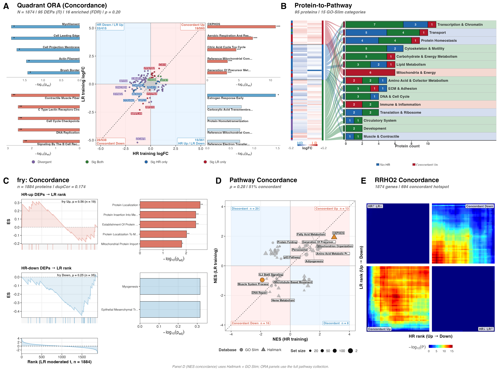
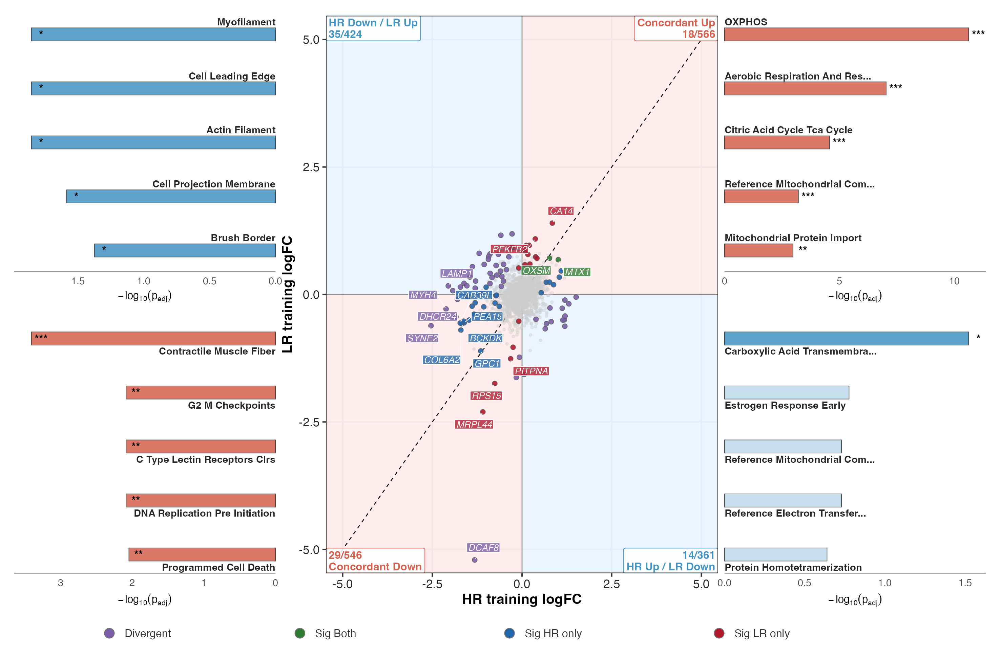
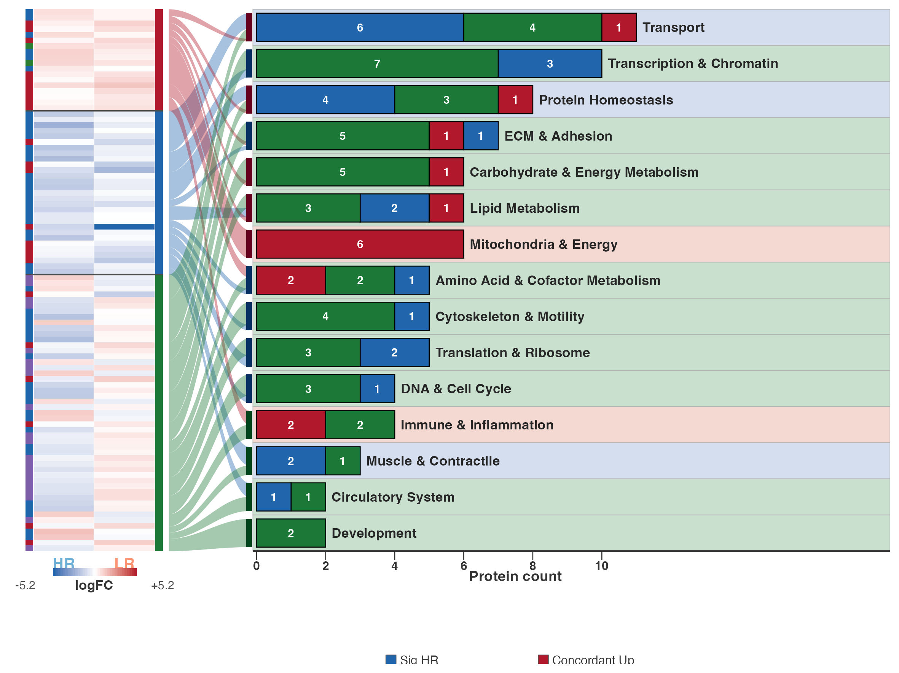
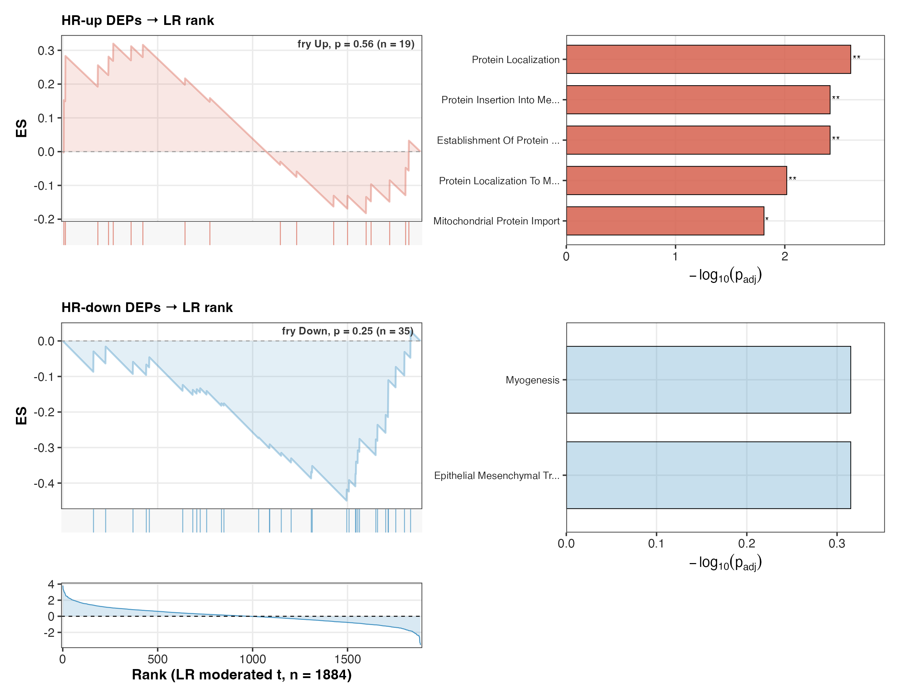
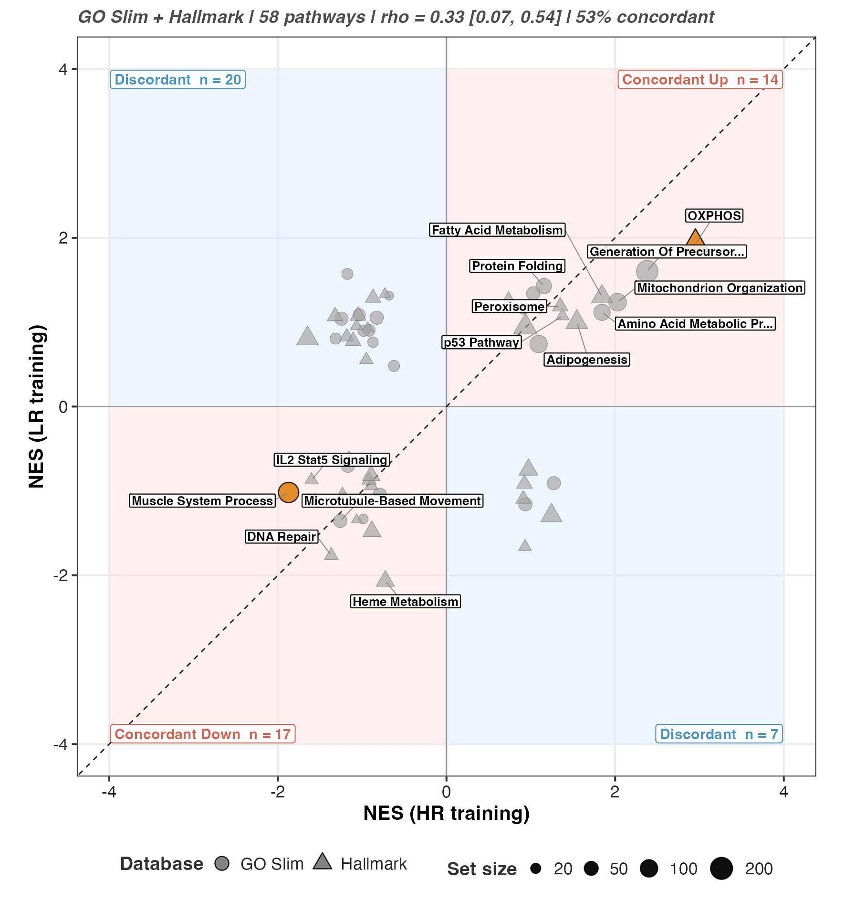
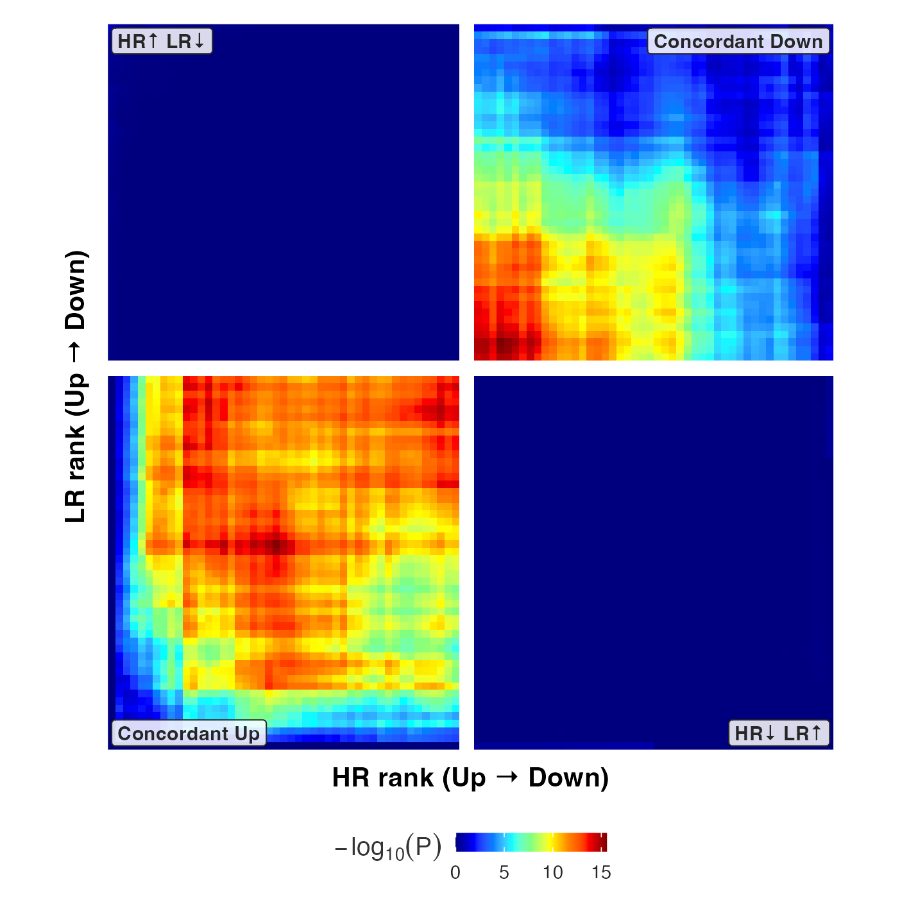
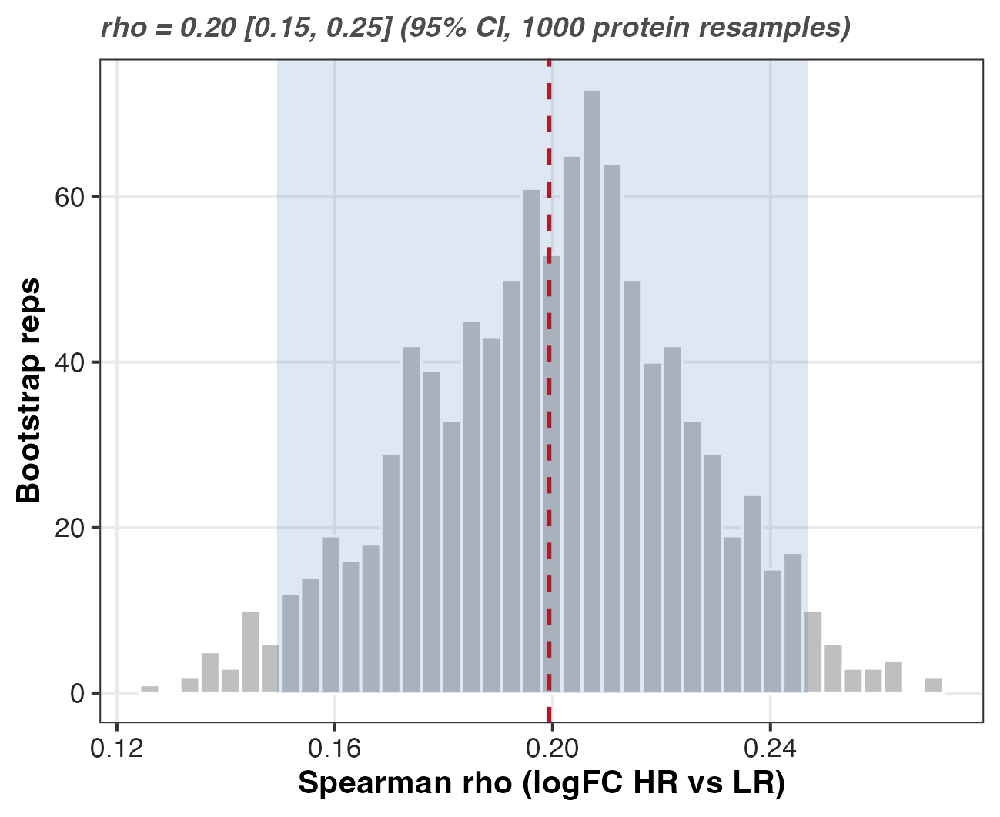
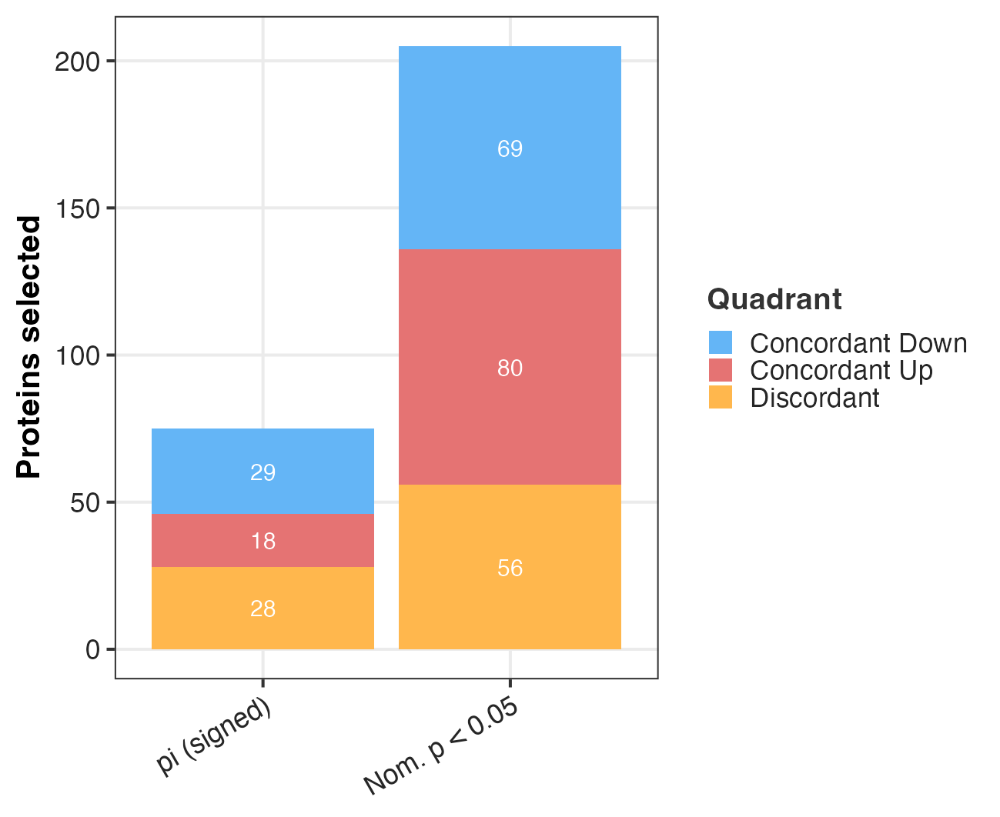
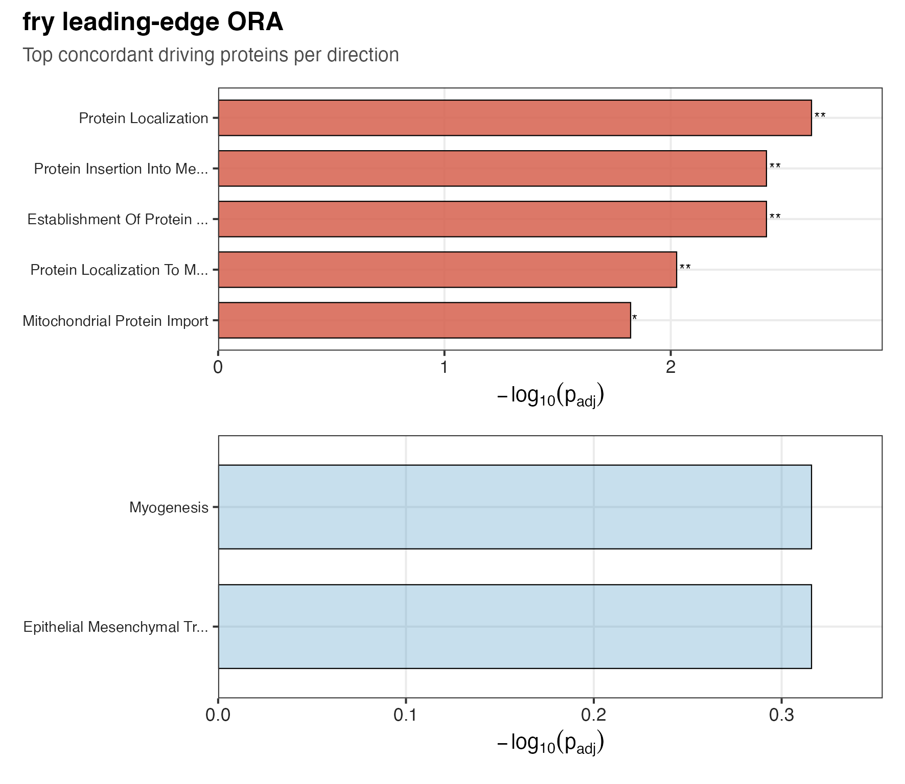

## The question

Eight high responders (HR) and eight low responders (LR) trained over the same
block. Both groups adapt from T1 to T2, so the question is not whether the
proteome moves but where the two groups move the same way and where they part.
This figure is the training arm of that comparison. It maps the HR training response
against the LR training response and asks two things: which proteins and pathways
shift in the same direction in both groups (shared adaptation), and which shift in
a way that depends on responder status (responder-specific divergence).

Divergence is read off the modelled interaction contrast, not off the eye. A
protein sits in the divergent class because its HR-vs-LR training difference is
flagged by the interaction test, not because its two point estimates happen to
fall on opposite sides of a line. That anchors the divergence claim to a test
rather than to visual separation on a scatter.

This figure is the training figure (T1 → T2). Its acute sibling, runs the same code
on the acute contrast pair. Both call one parameterised driver,
`render_concordance_figure()`, and differ only in configuration. There is one
pipeline, not two.

## What this figure found

Read this section before the panels, because the panels are easy to over-read.

**HR and LR adapt to training in broadly the same direction, and the agreement is
weak.** The protein-level Spearman correlation between the HR and LR training
logFC vectors is **ρ = 0.20** (bootstrap 95% CI 0.15–0.25). A correlation of 0.20
is a faint shared tendency, not a common program: it leaves the great majority of
the cross-protein variance unshared. 1,098 of 1,874 proteins (**59%**) sit in a
concordant quadrant, against the 50% a coin would give.

**No set-level test survives correction.** The fry rotation test — the one
properly-blocked, error-rate-controlled test on this page — is null in both
directions: HR-up proteins along the LR ranking give p = 0.56 (FDR 0.56), HR-down
give p = 0.25 (FDR 0.49). Nothing here reaches significance.

**The divergent proteins are a soft call, not an FDR-controlled one.** The 55
proteins in the divergent class are selected by the π gate, which controls no
error rate (see @sec-pi). Under BH-FDR the interaction contrast returns
essentially nothing. Treat the divergent set as a ranked, hypothesis-generating
list.

So the honest headline is a *negative, weakly-positive* one: the two groups' training
responses are faintly and non-significantly aligned, and this figure does not
establish a responder-specific training program. That is the finding, and it is
worth stating plainly rather than letting five busy panels imply otherwise.

## Composite



## Inputs and outputs

Reads:

- `03_DEP/a_non_imputed/c_data/03_combined_results.csv` — per-protein logFC,
  moderated t, p-values, FDR, and the signed π flag for every contrast.
- `02_Normalization/imputation/c_data/DAList_imputed_missforest.rds` — the
  missForest-imputed matrix. fry needs a complete matrix, so it uses the imputed
  DAList rather than the non-imputed DEP table.
- `04_Figures/F03_volcanoes/c_data/F03_volcanoes_source_data.xlsx` (sheet `fgsea_all`) — the fgsea
  cache. NES is computed once in F03 and reused here, so this NES scatter and
  the F03 enrichment figure cannot drift apart and no permutation test reruns.

Writes, under `04_Figures/F00_PILOT/concordance_training/`: `b_reports/panels/` and `b_reports/supp/` (PNG +
PDF), one `c_data/*.csv` per panel, and the bundled
`c_data/concordance_training_source_data.xlsx`.

```r
render_concordance_figure(list(
  fig_id = "concordance_training",
  c_hi = "Training_HR", c_lo = "Training_LR", c_int = "Training_Interaction",
  lo_levels = c("LR_T1", "LR_T2"),
  labels = list(
    hi = "HR", lo = "LR", phase = "Training",
    x = "HR training logFC", y = "LR training logFC"
  )
))
```

## The two correlations, and why they differ {#sec-rho}

The composite prints ρ twice and they are **not the same number**. Panel A's
ρ = 0.20 is the correlation across *proteins*. Panel D's ρ = 0.28 is the
correlation across *pathways*. Pathway scores average over many proteins, so they
cancel noise and correlate a little more tightly. Neither is more correct; they
answer the question at different grain. Quoting the higher one as "the"
concordance would be cherry-picking the resolution that flatters the result.

## Panel A — quadrant concordance map with per-quadrant ORA



**What.** Each protein is placed by the sign pair of its HR and LR training logFC.
The two concordant quadrants hold proteins that move the same direction in both
groups; the two off-diagonal quadrants hold proteins that move opposite ways.
Points are coloured by class: divergent (interaction-flagged), significant in
both, HR-only, LR-only, or NS. The dashed line is perfect agreement.

**Result.** Concordant Up 560, Concordant Down 538, HR Down / LR Up 415, HR Up /
LR Down 361. That is 1,098 concordant of 1,874 (59%), with ρ = 0.20. Of the
selected proteins, 55 are divergent, 23 HR-only, 15 LR-only, and just **2 are
significant in both arms**.

**How to read it.** The cloud is round, not cigar-shaped. A strong shared training
program would pull it onto the diagonal; it does not. The 59%-concordant split is
only nine points above chance.

**Why the universe is the measured proteome.** Over-representation runs per
quadrant against `universe <- quad_tbl$gene`, the proteins actually tested here,
not the human genome. A proteomics run measures a biased slice of the proteome
(abundant, soluble, tryptic-friendly), so scoring a quadrant against all human
genes would count that measurement bias as biology and inflate every term.

Redundant pathways collapse by Jaccard overlap (`jaccard_cutoff = 0.5`), so a
quadrant's bars show distinct biology rather than five phrasings of one gene set.
`padj_cutoff = 1` keeps non-significant terms in the table so a sparse quadrant
still reports its leading terms, with significance carried by bar alpha and stars
rather than by omission.

```r
run_quadrant_ora <- function(quad_tbl, pw, n_show = 5) {
  universe <- quad_tbl$gene
  out <- lapply(QUAD_LEVELS, function(q) {
    genes <- quad_tbl$gene[quad_tbl$quadrant == q]
    if (length(genes) < 5) return(NULL)
    res <- run_ora_deduplicated(
      genes = genes, universe = universe, pathways = pw,
      jaccard_cutoff = 0.5, min_size = 15, max_size = 500, padj_cutoff = 1
    )
    if (nrow(res) == 0) return(NULL)
    res |>
      mutate(quadrant = q, significant = padj < 0.05) |>
      arrange(padj) |>
      slice_head(n = n_show)
  })
  bind_rows(out)
}
```

## Panel B — protein-to-pathway



**What.** Panel B takes the 95 proteins selected in *either* arm or by the
interaction, shows their HR and LR logFC side by side as a heatmap, and links each
to a consolidated GO-Slim category. The bars count proteins per category, split by
which arm selected them.

**Why it exists.** Panel A tells you how many proteins fall where; it does not tell
you *what they are*. Panel B is the bridge from the quadrant counts to biology,
and it is the panel that shows the selected proteins are not one coherent program
but a scatter across 15 categories — the largest, Transcription & Chromatin, holds
11 of 95.

**How to read it.** Look for a category dominated by one colour. Mitochondria &
Energy is the one that stands out: all 6 of its proteins are concordant-up. Most
other categories mix HR-only, LR-only and concordant proteins, which is what a
weak shared response looks like at the protein level.

## Panel C — fry rotation test



**What.** The fry panel asks a directional version of the concordance question: do
the proteins that changed in HR sit high (or low) in the *LR* ranking? It takes the
HR up and down sets and tests their position along the LR moderated-t statistic.

**Result — this is the null that matters.** HR-up set (n = 19) along the LR
ranking: **p = 0.56**, FDR 0.56. HR-down set (n = 35): **p = 0.25**, FDR 0.49. The
within-subject `duplicateCorrelation` consensus is 0.174. Neither direction is
significant. fry is the only properly-blocked, error-rate-controlled set test on
this page, and it says the HR training signature is not detectably displaced in
the LR ranking.

**Why fry and not camera.** These are repeated measures on 16 subjects, so
residuals within a subject are correlated. fry carries that structure directly: it
takes the same design matrix, the within-subject block, and the
`duplicateCorrelation` consensus the DEP model uses, so the rotation respects the
subject grouping [@wu2010]. camera instead leans on an inter-gene correlation
estimate that assumes a simpler error structure; under this blocked design that
assumption does not hold and its variance-inflation factor would be estimated on
the wrong footing. The seed is fixed so the rotation is reproducible.

```r
run_fry_concordance <- function(da, dep, pw, c_hi, c_lo, lo_levels) {
  set.seed(42)
  mat <- as.matrix(da$data)
  meta <- da$metadata
  design <- model.matrix(~ 0 + factor(Group_Time), data = meta)
  block <- meta$Subject_ID
  corfit <- duplicateCorrelation(mat, design, block = block)
  cm <- makeContrasts(contrasts = paste0(lo_levels[2], " - ", lo_levels[1]), levels = design)

  sig <- dep[dep[[paste0("sig_pi_", c_hi)]] != 0 & dep$uniprot_id %in% rownames(mat), ]
  lfc_hi <- sig[[paste0("logFC_", c_hi)]]
  idx <- list(
    Up   = match(sig$uniprot_id[lfc_hi > 0], rownames(mat)),
    Down = match(sig$uniprot_id[lfc_hi < 0], rownames(mat))
  )
  fry(mat,
    index = idx, design = design, contrast = cm[, 1],
    block = block, correlation = corfit$consensus.correlation
  )
}
```

## Panel D — pathway NES concordance



**What is NES.** A gene-set enrichment score asks whether a pathway's proteins sit
systematically high or low in a ranked list of all proteins. The raw enrichment
score depends on how many proteins the set contains, so fgsea divides it by the
mean score of random sets of the same size. That ratio is the **normalised
enrichment score (NES)**: positive means the pathway is shifted up in the ranking,
negative means shifted down, and because it is size-normalised, a NES of +2 means
the same thing for a 20-protein set as for a 200-protein set. It is the colour
scale of every ring in F03 and both axes here.

**What the panel does.** It plots each pathway's NES for the HR training contrast
against its NES for the LR training contrast (Hallmark + GO Slim) and reports the
Spearman correlation of the two NES vectors.

**Result.** ρ = 0.28 across 57 pathways, 51% of them in a concordant quadrant
(Concordant Up 13, Concordant Down 16, discordant 28). Only **2 of 57** pathways
are flagged divergent by the cached interaction GSEA.

**How to read it.** Pathway-level agreement (0.28) is slightly better than
protein-level agreement (0.20), which is what averaging over set members buys you.
It is still weak. Note the panel is *not* a prediction: a high ρ would mean the two
groups adapt alike, not that responder status can be read off the training
proteome.

The NES values are read from the F03 cache, not recomputed. fgsea is a permutation
method, so computing NES once and reusing it keeps this panel numerically
identical to F03 and avoids a second stochastic run.

## Panel E — RRHO2



**What.** RRHO2 is the threshold-free view. Rather than committing to a
significance cut, it slides across both moderated-t rankings and maps where the HR
and LR lists overlap, so concordant-up and concordant-down agreement shows as
signed hotspots without any protein being called significant.

**Result.** Of 1,874 shared genes, the concordant hotspot holds **694** (504
concordant-down, 190 concordant-up); the discordant corners hold 1. The two
concordant corners light up and the two discordant corners are dark.

**How to read it.** This is the most *encouraging* panel here, and it needs the
most care. RRHO2 tests rank overlap without an error rate at the figure level, and
a hot concordant corner is exactly what you expect whenever two contrasts share
*any* common component — including a shared training effect present in everybody,
which is not a responder result. It confirms the direction of the weak ρ; it does
not rescue it.

## Supplements



The bootstrap puts an interval on Panel A's ρ. It draws **proteins** with
replacement 1,000 times and recomputes ρ, then takes the 2.5th and 97.5th
percentiles: ρ = 0.198, CI 0.151–0.249.

The resampled unit is the protein, and that is the whole caveat. This is a
confidence interval on cross-protein concordance — how stable the agreement is to
*which proteins* entered the comparison. It is **not** a subject-level interval and
does not capture between-subject sampling variability. With 8 per group the
subject-level uncertainty is much larger and entirely separate. The CI excluding
zero therefore says the weak correlation is stably estimated across proteins, not
that it would replicate in a new cohort.



The threshold panel recomputes the concordant and discordant counts under four
selection rules (the signed π flag, FDR < 0.05, FDR < 0.10, nominal p < 0.05) so
the balance can be read as a function of stringency rather than at one arbitrary
line.



The leading-edge terms are shown for completeness. Since **neither fry test is
significant**, these terms describe the leading edge of a null result and should
not be reported as enriched biology.

## The π gate is not an FDR gate {#sec-pi}

Every "significant" protein on this page — the 95 in Panels A and B, the 55
divergent, the fry input sets — is selected by `sig_pi`, the π-score flag
[@xiao2014], not by BH-FDR.

The π-score is `p^|log2FC|`, thresholded at 0.05. Because a large fold change
drives the score down on its own, **fold change alone can buy admission**: across
the nine contrasts, 71 of 489 π-calls (14.5%) have a raw p ≥ 0.05, the largest
being p = 0.269. π controls no error rate — not FDR, not FWER — and the π-selected
set is *not* a subset of the p < 0.05 set. Xiao's paper prescribes a
dataset-specific empirical-null critical value rather than a flat 0.05.

Under BH-FDR the training interaction returns essentially nothing. So read the 55
divergent proteins as an **effect-size-weighted, hypothesis-generating ranking**,
and never as an FDR-controlled discovery list. An error-rate-controlled alternative
that also respects a biological effect-size floor is `limma::treat()`
[@mccarthy2009]; on this data it would very likely return zero, which is the
correct and much stronger statement.

One further wrinkle worth knowing: the π score is written into a column literally
named `padj` in `04_Figures/F03_volcanoes/a_script/rings.R`, a few lines from a
genuine fgsea BH q-value. The name is wrong. The number is not an adjusted
p-value.

## Key terms

**Concordance (ρ)** — the Spearman correlation between the HR and LR logFC
vectors. Measured across proteins (Panel A, 0.20) or across pathway NES (Panel D,
0.28). It is a within-cohort association, not a prediction.

**NES** — normalised enrichment score. A pathway's enrichment score divided by the
mean score of random sets of the same size, so scores are comparable across sets of
different size. Positive = shifted up the ranking.

**fry** — a rotation-based gene-set test. Unlike permutation, it needs no minimum
sample size and it accepts a within-subject block plus a `duplicateCorrelation`
consensus, so it is valid on this repeated-measures design where camera is not.

**RRHO2** — rank-rank hypergeometric overlap. Slides a threshold across two ranked
lists and maps where they overlap, giving a threshold-free picture of agreement.

**Divergent** — flagged by the π gate on the *interaction* contrast. Not
FDR-significant. See @sec-pi.

**Quadrant ORA universe** — the proteins actually measured in this experiment, not
the human genome. Using the genome would score the mass spectrometer's abundance
bias as biology.

## Recap

- HR and LR training responses are **weakly** concordant: ρ = 0.20 across proteins
  (CI 0.15–0.25), 0.28 across pathways, 59% of proteins in a concordant quadrant.
- The fry rotation test — the only properly blocked, error-rate-controlled test
  here — is **null in both directions** (p = 0.56 up, p = 0.25 down).
- The 55 "divergent" proteins come from the π gate, which controls no error rate.
  They are a ranked lead list, not discoveries.
- This figure does not establish a responder-specific training program. Stating that is the
  result.

```{r sessioninfo, eval=TRUE}
sessionInfo()
```

## References

::: {#refs}
:::
