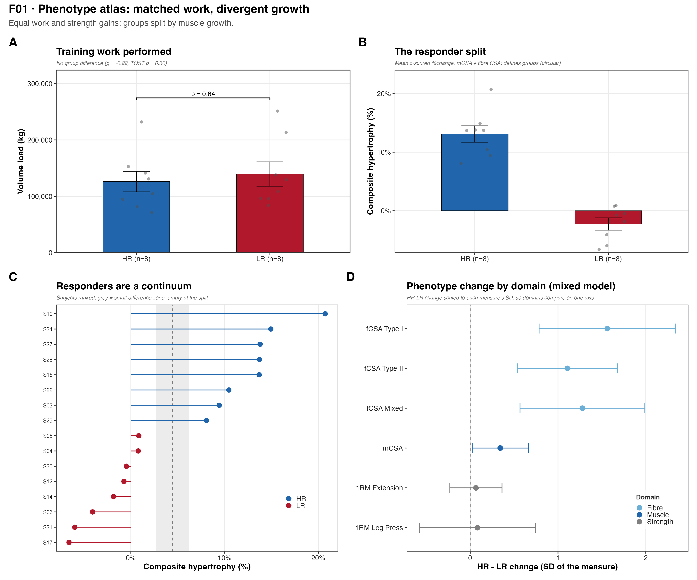
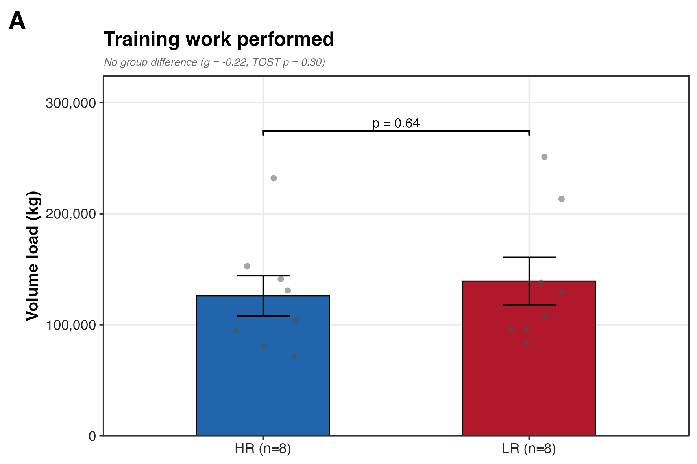
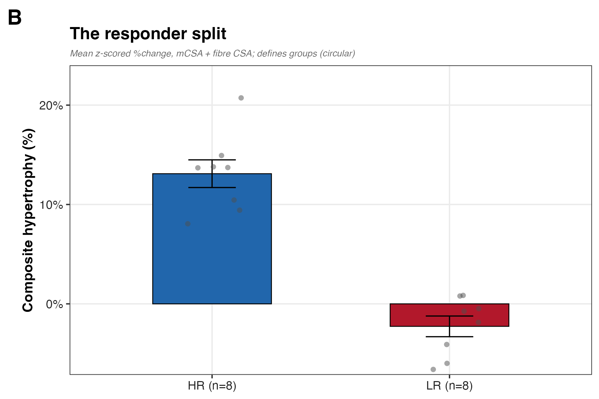
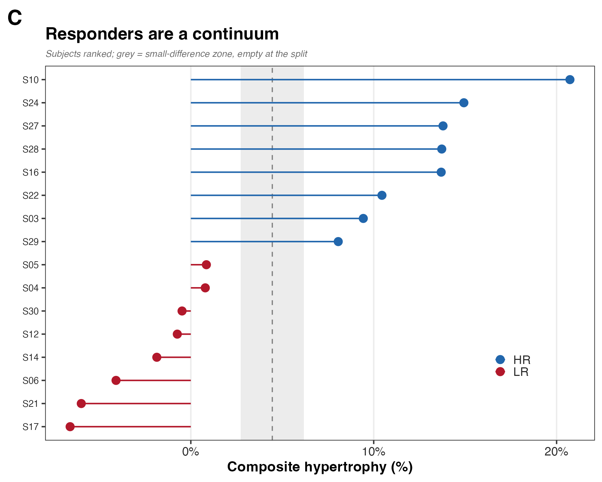
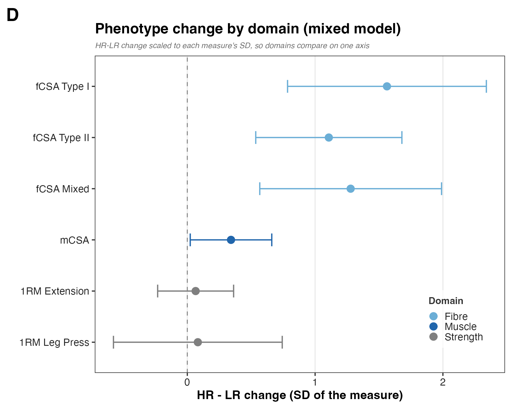
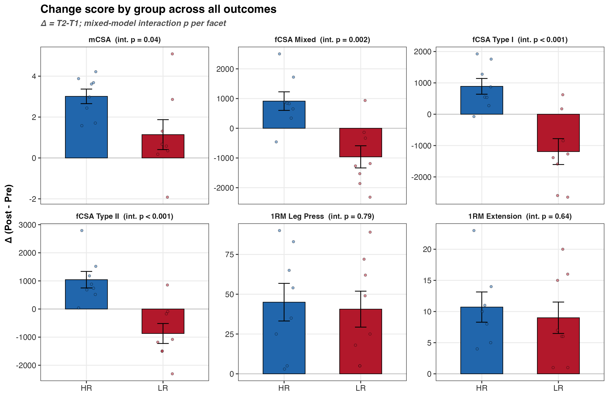
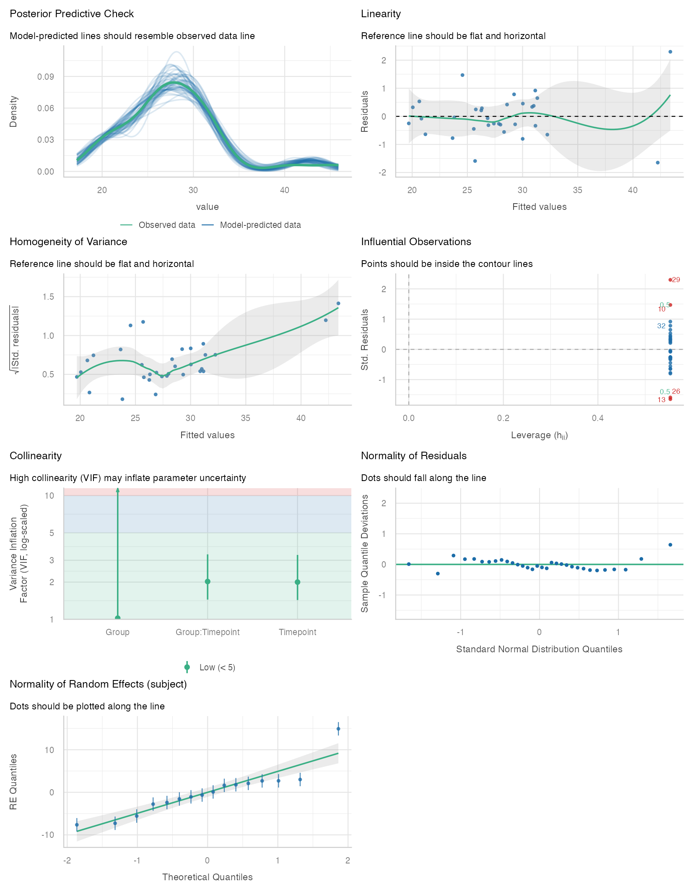

## What F01 establishes

The study rests on one claim: high and low responders differ in *how their muscle
responds to training*, not in how hard they trained. F01 proves the phenotype half
of that before any proteomics. It walks a short chain — they did the same work, we
split them by growth, the groups sit at opposite ends of a real continuum, and the
growth itself diverges while strength does not. If the chain holds, "high vs low
responder" is a biological contrast worth explaining rather than an artifact of
unequal effort.

The four panels map onto that chain: **A** shows equal training work, **B** shows
the split, **C** shows the split is a clean cut through a continuum, and **D**
shows where the response diverges.



## How it is built

The pipeline runs in four steps:

1. `setup.R` loads `HRvLR_meta.csv` and the six phenotype outcomes (`MEASURES`).
2. Each `panels/` script builds one main panel and registers it into the composite.
3. `pheno_supp.R` and `hlm_supp.R` build the two supplements.
4. `run.R` stitches the composite and writes the source-data workbook.

```
F01/
  HRvLR_F01.qmd            this document
  a_script/
    setup.R               packages, paths, metadata, the MEASURES table
    functions/build.R     panel builders and the mixed-model helpers
    panels/               one script per main panel
    run.R                 stitches the composite, writes the workbook
    supp/pheno/           pheno_supp.R   change-score supplement
    supp/hlm/             hlm_supp.R (check_model) + F01_lmm_report.qmd
  b_reports/              the composite, panels, and both supplements
  c_data/                 F01_source_data.xlsx (four sheets)
```

Rebuild everything with one call:

```r
source(here::here("04_Figures", "F01", "a_script", "run.R"))
```

## a_script — how each panel is made

Everything reads one file, `00_input/HRvLR_meta.csv`, and every dependency and
constant lives in `setup.R`, so the panels stay short.

```r
source(here("04_Figures", "F01", "a_script", "functions", "build.R"))
meta <- f01_meta()
```

### The mixed model, in plain terms

Each subject is measured before (T1) and after (T2), so the two readings are
linked and cannot be treated as independent. The model gives every subject their
own baseline (a random intercept), then estimates the average effect of time (did
everyone grow?), the average group difference (were HR and LR different to start?),
and the one that matters — the `Group × Timepoint` interaction, which asks whether
training moves HR and LR by *different* amounts. That interaction is divergence.

```r
fit <- lmer(value ~ Group * Timepoint + (1 | subject), data = long, REML = TRUE)
```

On F01's balanced before/after data the mixed model and a split-plot ANOVA give
the same interaction to the third decimal, so nothing is lost by using the model
throughout. It adds an intraclass correlation and a clean contrast the ANOVA does
not. The one measure that is not before/after — accumulated volume load — is a
single number per subject, so it gets a group comparison, not a model.

### Panel A — training work (the control)

Volume load is one number per subject. A non-significant t-test would not prove
the groups matched; at eight per group it is nearly guaranteed regardless of the
truth. The honest statement is an effect size with its interval plus a TOST
equivalence test.

```r
tost <- TOSTER::t_TOST(formula = value ~ Group, data = vl, eqb = 0.5 * pooled_sd)
```

The groups differ by g = −0.22 (90% CI −1.0, 0.6), and equivalence is not
established (TOST p = 0.30): no detectable difference, but too small a sample to
prove a match.



### Panel B — the responder split

The composite hypertrophy score assigns HR and LR, so a group test on it would be
circular. The panel shows the size of the split without a test.



The split is wide: HR sits near +13%, LR near −2%.

### Panel C — responders are a continuum

Every subject's composite score, ranked. The dashed line is the HR/LR boundary and
the grey band is a distribution-based 0.2 × SD band (a true measurement-error SWC
would need test-retest data we lack). Responders run smoothly from −6.6% to +20.7%,
and the cut lands in an empty gap wider than the band, so no subject sits
ambiguously at the boundary. Note the gap is partly built in — sorting by the
defining score puts a break at the cut — so read it as a clean split, not proof of
two natural kinds.



### Panel D — phenotype change by domain

For each outcome the `Group × Timepoint` interaction is standardized into the
HR-minus-LR difference in T1→T2 change, so fibre, muscle, and strength sit on one
axis. Read it with the split's origin in mind: the groups were **defined** by
muscle and fibre growth, so those rows show the magnitude of the defining split,
not an independent finding. The strength rows are the independent tests.

```r
emm <- emmeans(fit_std, ~ Group * Timepoint)
contrast(emm, method = list(adv = c(-1, 1, 0, 0) - c(0, 0, -1, 1)))
```



The honest take-home: the groups grew apart in muscle by construction, yet trained
to the same strength — the strength nulls are the independent result.

## b_reports — the supplements

Two supplements sit in their own subdirectories. The **phenotype** supplement
(`supp/pheno/`, from `pheno_supp.R`) is the raw change score by group for every
outcome, evenly faceted with the interaction p in each strip. It carries the
sharpest signal in the figure: manually traced fibre CSA rises in HR and *falls*
in LR (p < 0.001), while strength gains match.

The MyoVision fibre columns are excluded upstream. Their values (200–560) sit
10–30× below plausible fibre CSA and correlate negatively with manual tracing
(r ≈ −0.5) — the signature of a fibre-count metric mislabelled as area (MyoVision
reports CSA in thousands of µm²; Wen et al. 2018,
doi:10.1152/japplphysiol.00762.2017).



The **mixed-model** supplement (`supp/hlm/`, from `hlm_supp.R`) is one
`performance::check_model` exemplar — the canonical assumption suite
(posterior-predictive, linearity, homoscedasticity, influence, collinearity, and
residual and random-effect normality), each panel captioned with what a good fit
looks like. The six models share structure, so one figure carries the pattern; the
numeric tables that validate all six — coefficients, R²/ICC/fit, the Holm-adjusted
contrasts, and leave-one-subject influence — come from `easystats` in
`a_script/supp/hlm/F01_lmm_report.qmd`.



## c_data — the source workbook

`c_data/F01_source_data.xlsx` holds four sheets. `summary_by_measure` is one row
per measure and group: the change-score mean, the standardized mixed-model
advantage with its CI and p, and the ICC. `controls_and_axis` holds the volume and
composite group means and the per-subject responder axis. `hlm_fit_summary` gives
each model's marginal/conditional R², ICC, singular-fit flag, and sample size.
`metadata` records the design and model. Every number in the figure traces to this
workbook; the full model tables are in `a_script/supp/hlm/F01_lmm_report.qmd`.

## Key terms

**Group × Timepoint interaction** — the test of divergence: whether training moves
HR and LR by different amounts from T1 to T2. A flat interaction means the groups
changed alike.

**Change advantage (SD units)** — the interaction expressed as the standardized
HR-minus-LR difference in change, so every outcome sits on one axis. Above zero,
HR gains more.

**ICC** — intraclass correlation, the share of variance sitting between subjects
rather than within. High ICC (here 0.7–0.97) means subjects differ from each
other far more than a training block moves any one of them.

**Marginal vs conditional R²** — marginal is the variance the fixed effects
explain; conditional adds the subject random intercept. A wide gap signals
between-subject dominance.

**0.2 × SD band** — a distribution-based band around the responder cut (Cohen's
small effect), used to check no subject sits ambiguously at the boundary. It is
not a measurement-error SWC, which would need test-retest data we do not have.

**TOST equivalence** — two one-sided tests asking whether a difference is small
enough to call the groups equivalent. Failing it (as volume load does) means the
sample is too small to *prove* a match, not that a difference exists.

## Recap

- Matched work, divergent growth: equal volume and strength gains, HR-only muscle
  and fibre growth, LR fibre loss.
- One engine (the mixed model) carries the divergence; the volume control is the
  one non-model panel.
- The split is shown as a continuum with a noise-aware cut, never tested against
  itself.
- A mislabelled MyoVision column was caught and excluded rather than read as
  hypertrophy.

```{r sessioninfo, eval=TRUE}
sessionInfo()
```
