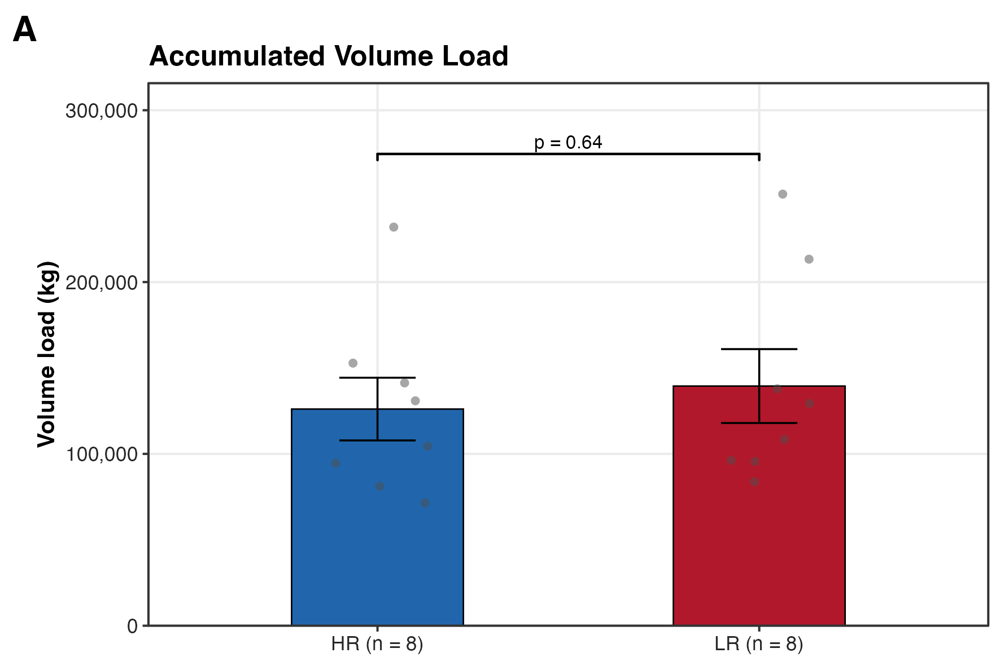
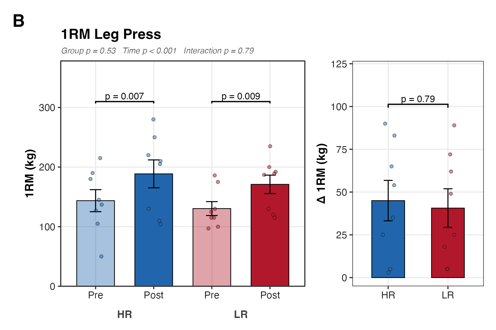
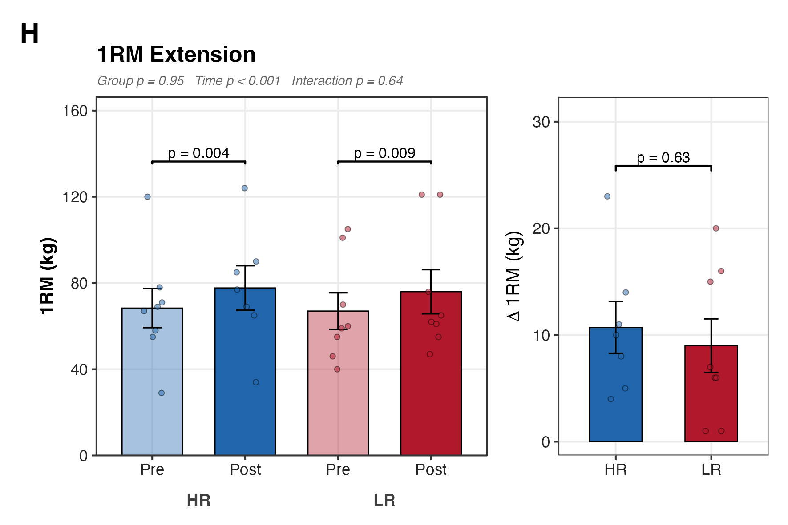
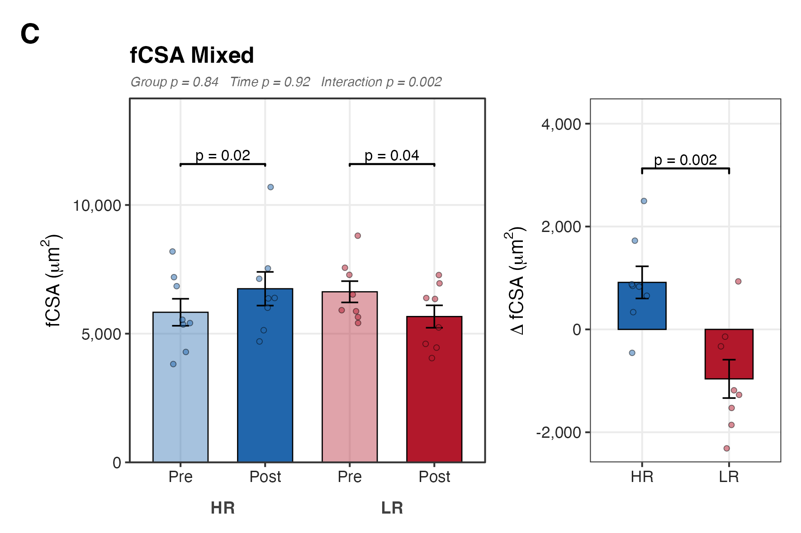
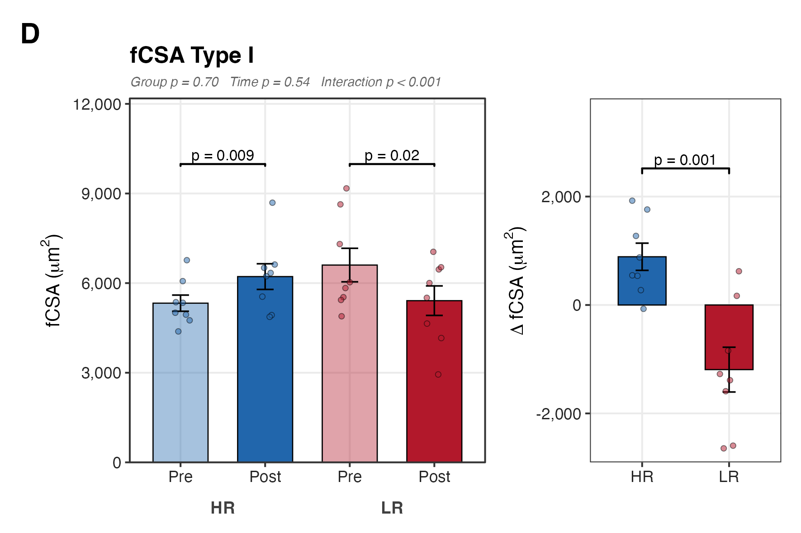
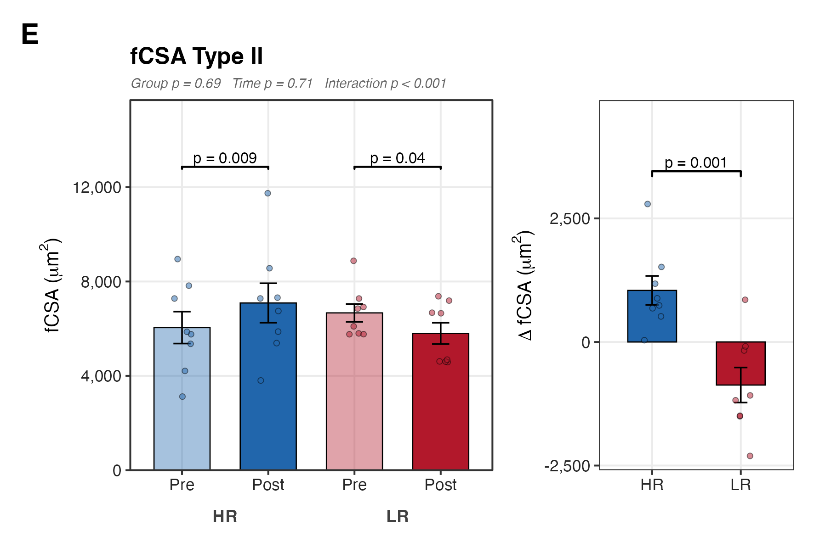
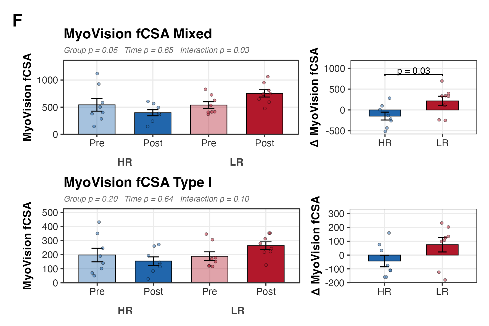
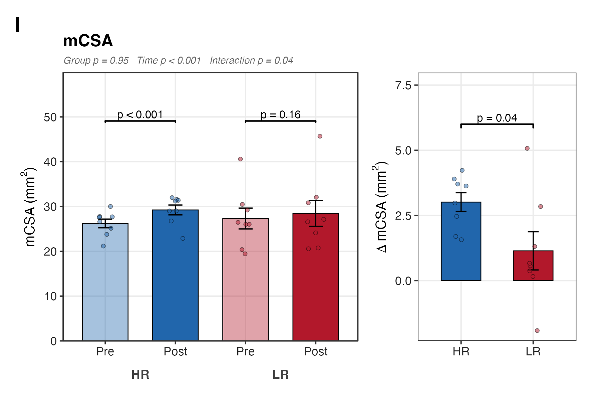
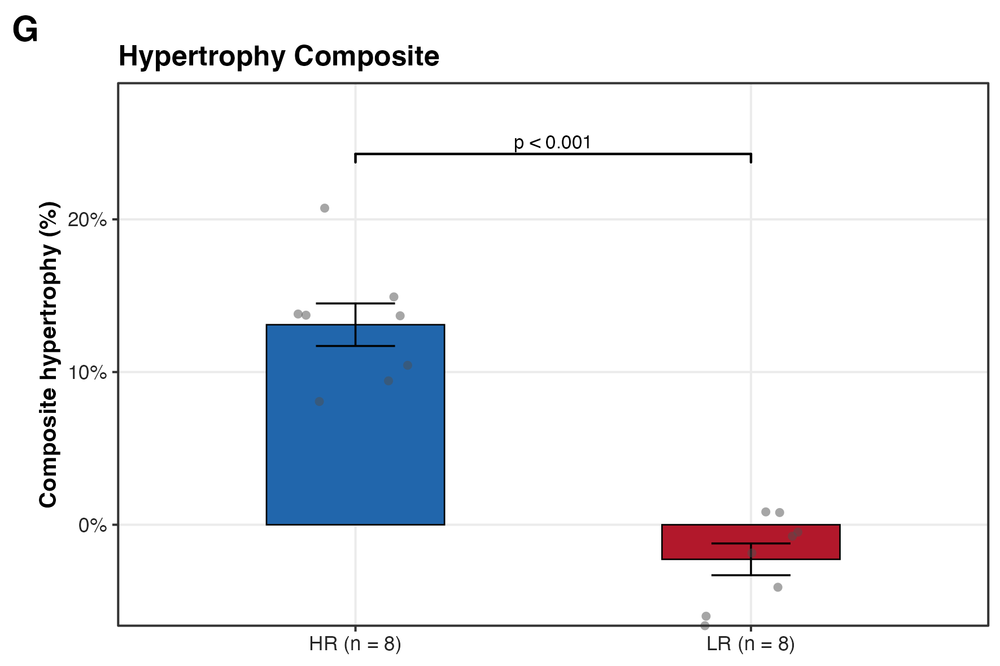

## What Figure 1 shows

Figure 1 is the phenotype atlas for the high-responder (HR) versus low-responder
(LR) contrast. It gathers the physical training outcomes that define the two
groups: how much work each subject accumulated, how much stronger they got, and
how much their fibres and whole muscle grew. The question is simple. Before
touching any proteomics, do HR and LR actually differ in the phenotype we are
about to explain?

The grouping itself is set by panel G, a composite hypertrophy score. HR and LR
are not predicted from the other panels; they are defined by that composite, and
the remaining panels describe how the two groups diverge across training volume,
strength, and cross-sectional area.

The design is repeated measures. Sixteen subjects (8 HR, 8 LR) with fibre,
strength, and muscle measurements at T1, T2, and T3. Two subjects are partial,
so a group can drop to seven at a timepoint where a measurement is missing. The
per-panel tests are chosen around that structure.

## Reads and writes

The panels read one file: `00_input/HRvLR_meta.csv`, the subject-level metadata
with group, timepoint, and every phenotype column. Nothing else is loaded from
disk.

Outputs land in two sibling directories. `b_reports/panels/` holds the nine
per-panel PNG and PDF files; `b_reports/F01_composite.png` and
`F01_composite.pdf` are the stitched figure. `c_data/` holds one
`audit_panel_*.csv` per panel (the group means, SEMs, and test p-values behind
each bar) plus `F01_source_data.xlsx`, which collects those audit tables into
one workbook, one sheet per panel.

`HRvLR_F01_run.R` clears `b_reports`, sources panels A–I in turn, then sources
`HRvLR_F01_composite.R` to stitch and write the workbook.

```r
RPT <- here("04_Figures", "F01", "b_reports")
for (p in LETTERS[1:9]) {
  source(here("04_Figures", "F01", "a_script", "panels", sprintf("panel_%s.R", p)))
}
source(here("04_Figures", "F01", "a_script", "HRvLR_F01_composite.R"))
```

## Training volume — Panel A

Panel A is the accumulated volume load (kg lifted across the programme), read at
T3 where the cumulative total is complete. There is one value per subject and no
repeated measure, so the group difference is an unpaired Welch t-test on the two
independent groups. Bars are group mean with SEM error bars.

```r
vl_df <- meta |>
  filter(Timepoint == "T3", !is.na(ACCUM_VL)) |>
  select(Subject_ID, Group, ACCUM_VL) |>
  mutate(Group = factor(Group, levels = c("HR", "LR")))

stats_A <- t.test(ACCUM_VL ~ Group, data = vl_df)

ggplot(vl_df, aes(x = Group, y = ACCUM_VL, fill = Group)) +
  geom_bar(stat = "summary", fun = mean, width = 0.45, color = "black") +
  geom_errorbar(stat = "summary", fun.data = mean_se, width = 0.2) +
  geom_signif(
    comparisons = list(c("HR", "LR")),
    annotations = fmt_p(stats_A$p.value), y_position = bracket_pos(vl_df$ACCUM_VL)
  )
```



## Strength — Panels B and H

Panels B (1RM leg press) and H (1RM knee extension) both track maximal strength
from pre (T1) to post (T2). Each subject is measured twice, so the group and
time effects are not independent and a plain t-test would ignore the pairing.
The shared builder `prepost.R` fits a mixed ANOVA with `rstatix::anova_test`,
group between subjects and timepoint within, which is the natural model for a
between × within design and gives the Group, Time, and Group:Timepoint effects
reported in each panel subtitle.

Two follow-ups sit under that ANOVA. Within each group, a paired t-test on the
same subjects Pre versus Post (the pairing removes between-subject variance, so
it tests whether that group changed). Between groups, an unpaired t-test on the
per-subject delta (T2 − T1), which asks whether HR gained more than LR. Error
bars are mean ± SEM: SEM describes the precision of the group mean, which is the
quantity the bars compare, rather than the raw spread an SD would show.

```r
anova_tbl <- rstatix::anova_test(
  data = meta, dv = value, wid = subject_key,
  between = Group, within = Timepoint
)
paired_hr <- t.test(hr_wide$T2, hr_wide$T1, paired = TRUE)
paired_lr <- t.test(lr_wide$T2, lr_wide$T1, paired = TRUE)
delta_test <- t.test(delta ~ Group, data = pheno_wide)
```

Each strength panel is one call into that builder:

```r
prepost_delta_panel("X1RM_Leg_Pre", "1RM Leg Press", "1RM (kg)", "Δ 1RM (kg)", "B")
prepost_delta_panel("X1RM._Ext_Pre", "1RM Extension", "1RM (kg)", expression(Delta ~ "1RM (kg)"), "H")
```





## Fibre cross-sectional area — Panels C, D, E, F

Fibre size is the histology readout of hypertrophy. Panels C, D, and E give the
manually traced fibre cross-sectional area (fCSA) for mixed fibres, Type I, and
Type II, each from Pre to Post. They run through the same `prepost_delta_panel`
builder as the strength panels: mixed ANOVA, within-group paired tests, and a
between-group delta test.

```r
prepost_delta_panel("fCSA_Mixed_Pre", "fCSA Mixed", expression("fCSA (" * mu * m^2 * ")"), expression(Delta ~ "fCSA (" * mu * m^2 * ")"), "C")
prepost_delta_panel("fCSA_Type_I_Pre", "fCSA Type I", expression("fCSA (" * mu * m^2 * ")"), expression(Delta ~ "fCSA (" * mu * m^2 * ")"), "D")
prepost_delta_panel("fCSA_Type_II_Pre", "fCSA Type II", expression("fCSA (" * mu * m^2 * ")"), expression(Delta ~ "fCSA (" * mu * m^2 * ")"), "E")
```







Panel F is the automated MyoVision fCSA (mixed and Type I), the same measure by a
different pipeline, stacked as a cross-check on the manual tracing. It uses a
local `build_fiber_panel` helper with the same mixed-ANOVA and delta logic, so
the two fCSA sources are read on comparable terms.

```r
build_fiber_panel(meta, "MyoVision_fCSA_mixed_Pre", "MyoVision fCSA Mixed", "MyoVision fCSA", "F")
build_fiber_panel(meta, "MyoVision_fCSA_Type_I__Pre", "MyoVision fCSA Type I", "MyoVision fCSA", NULL)
```



## Muscle cross-sectional area — Panel I

Panel I is whole-muscle cross-sectional area (mCSA), the macro-scale counterpart
to the fibre panels. Same Pre/Post repeated measure, same builder, same three
tests.

```r
prepost_delta_panel("mCSA_Pre", "mCSA", expression("mCSA (" * mm^2 * ")"), expression(Delta ~ "mCSA (" * mm^2 * ")"), "I")
```



## Grouping composite — Panel G

Panel G is the composite hypertrophy score (`COMP.HYPERTROPHY`, read at T2). This
is the variable that assigns subjects to HR and LR. Because the groups are
defined by it, a between-group test would be circular: HR is high by
construction. The panel is shown without a group comparison, bars as group mean
± SEM, to make the size of the split that drives the rest of the figure visible.

```r
meta <- read_csv(here("00_input", "HRvLR_meta.csv"), show_col_types = FALSE) |>
  filter(Timepoint == "T2", !is.na(COMP.HYPERTROPHY)) |>
  transmute(
    Subject_ID,
    Group = factor(Group, levels = c("HR", "LR")),
    hypertrophy_pct = readr::parse_number(COMP.HYPERTROPHY)
  )

ggplot(meta, aes(x = Group, y = hypertrophy_pct, fill = Group)) +
  geom_bar(stat = "summary", fun = mean, width = 0.45, color = "black") +
  geom_errorbar(stat = "summary", fun.data = mean_se, width = 0.2) +
  labs(title = "Hypertrophy Composite", subtitle = "Groups defined by this composite")
```



## Composite figure

`HRvLR_F01_composite.R` reads the nine PNGs back in, arranges them three per row
with `patchwork`, and writes the assembled figure alongside the source-data
workbook.

```r
composite <- wrap_plots(lapply(panels, panel), ncol = 3) +
  plot_annotation(
    title = "Phenotype Atlas (HR vs LR)",
    subtitle = "Training volume, strength, and fiber/muscle cross-sectional area",
    caption = "Bars: group mean ± SEM. n = 8 per group; a partial subject drops out where its timepoint is missing."
  )
ggsave(file.path(RPT, "F01_composite.png"), composite, width = 470, height = 340, units = "mm", dpi = 300)
```


