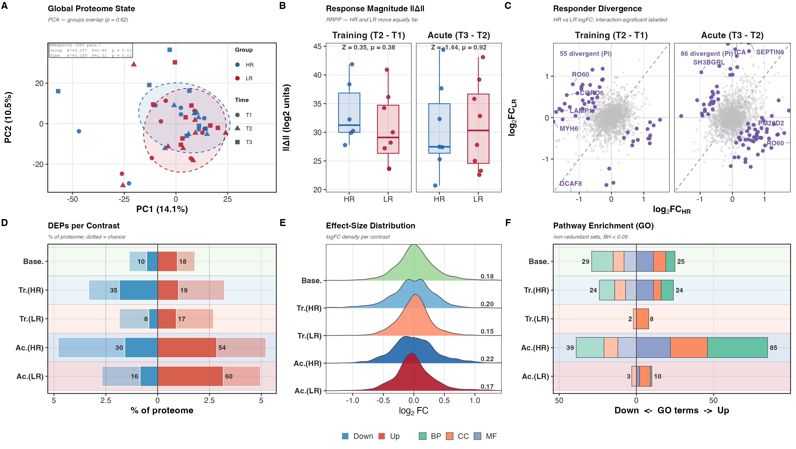
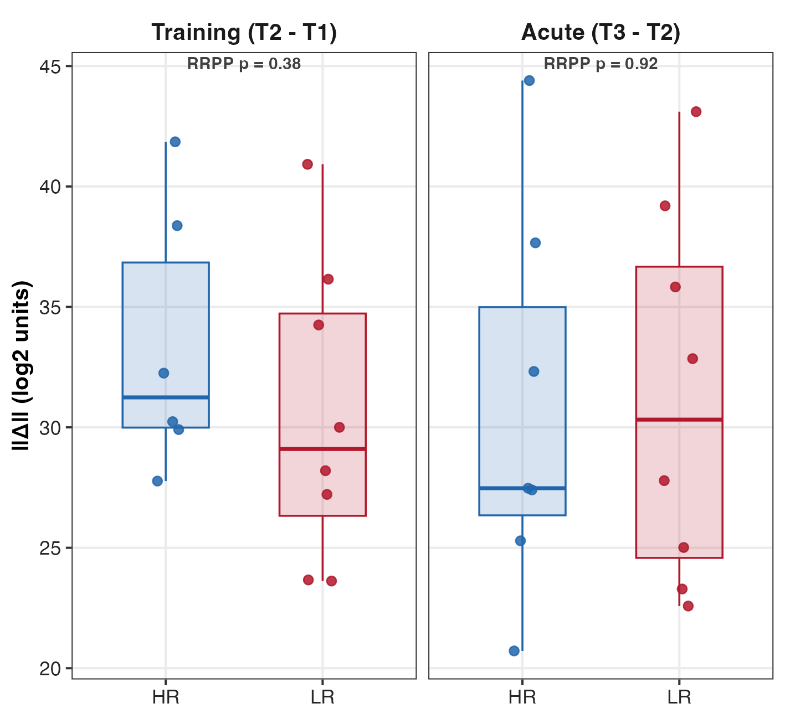
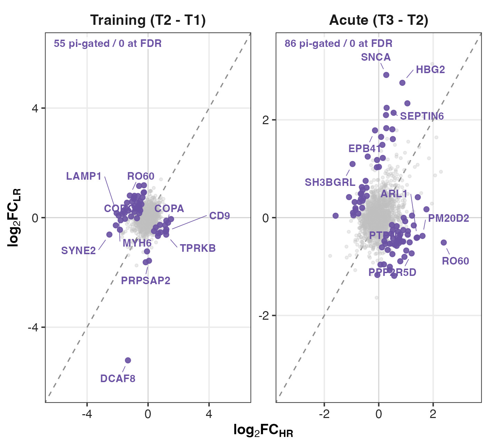
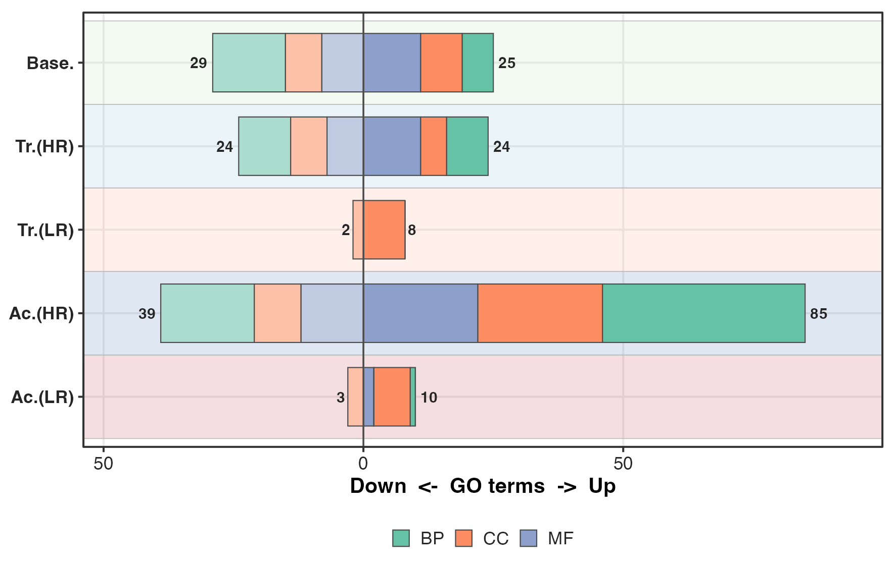
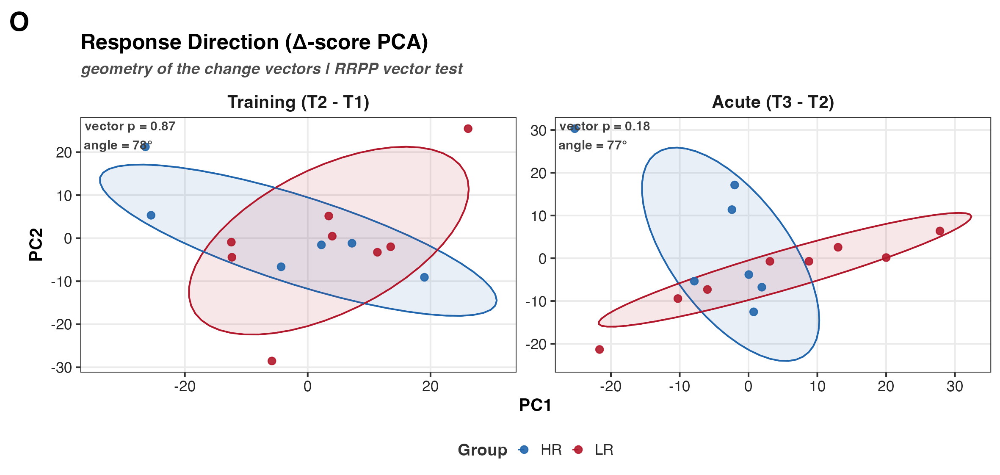

## What F02 is

F02 is the proteome-wide overview that comes before the contrast-specific figures. It
asks one question three ways: at the whole-proteome scale, do high and low responders
differ, and if so, where?

The hypothesis is that HR and LR diverge in the *magnitude and trajectory of their
response*, not in *baseline state*. F02 tests exactly that, and the answer shapes the
layout: global state, global response, and global variance structure all turn out to be
shared, so the figure locates the divergence at the protein and pathway level rather
than in any global geometry.

The study is 8 HR versus 8 LR subjects sampled at up to three timepoints, 45 quantified
samples. Two subjects are partial (S28 is T1-only, S29 is T2/T3-only), so the
repeated-measures design is unbalanced. Several panels are built to respect that: the
PERMANOVA in Panel A permutes within subject, and the trajectory tests in Panel B use
only subjects with a complete pre/post pair.

## What F02 found

**Every global test is null.** Groups do not separate in the proteome (PERMANOVA
p = 0.62). They do not move further (RRPP training p = 0.38, acute p = 0.92). They do not
move in different directions (vector p = 0.87, 0.18). They are not more heterogeneous
(PERMDISP p = 0.33/0.20/0.35). The design explains no more variance than chance
(median ω² ≈ 0). Even a *supervised* axis built to separate them fails to generalise
(CAP p ≈ 0.22, leave-one-out error ≈ 40%).

That is six independent ways of asking "is there a global HR/LR difference" and six
nulls. This is the figure's real result and it is a strong one — it is what licenses the
whole downstream strategy of looking at individual proteins and pathways instead.

**The divergence that remains is protein-specific and π-gated.** 55 proteins diverge in
training and 86 acutely (Panel C). Those counts come from the π gate, which controls no
error rate (see @sec-pi). Read them as leads.

## Reading order

A and B set the overview (state, then response magnitude); C carries the protein-level
divergence; D, E, and F carry the counts, effect sizes, and pathways. The supplement
holds the heterogeneity, variance-partition, supervised-ordination, and set-overlap
panels.

## A note on panel names {#sec-tags}

The composite is tagged **A–F** by patchwork in the order the panels are added, and the
stitcher adds the DEP-count panel before the effect-size panel. The result is that two
tags do not match their filenames:

| Composite tag | Content | File on disk |
|---|---|---|
| A | Global proteome state | `panel_a_pca.png` |
| B | Response magnitude ‖Δ‖ | `panel_b_trajectory.png` |
| C | Responder divergence | `panel_c_divergence.png` |
| **D** | **DEPs per contrast** | `panel_e_dep_counts.png` |
| **E** | **Effect-size distribution** | `panel_d_effectsize.png` |
| F | Pathway enrichment | `panel_f_pathways.png` |

This page uses the **composite tags**, since that is what a reader of the figure sees.
The filename swap is a wart in `HRvLR_F02_composite.R`, not a data problem.

## Composite



## Reads and writes

`HRvLR_F02_setup.R` loads everything the panels share and defines paths, the contrast
list, and the metadata join.

Reads:

- `02_Normalization/c_data/normalized.csv` — normalized log2 intensities.
- `02_Normalization/imputation/c_data/DAList_imputed_missforest.rds` — the
  missForest-imputed DAList.
- `03_DEP/a_non_imputed/c_data/03_combined_results.csv` — the stage-03 contrast results
  (logFC, moderated-t, P.Value, π flags), including the two interaction contrasts Panel
  C depends on.
- `00_input/HRvLR_meta.csv` — sample metadata.

Writes: main panel PNGs to `b_reports/panels`, supplements to `b_reports/supp`, per-panel
audit CSVs to `c_data`, the bundled `c_data/F02_source_data.xlsx`, and
`b_reports/F02_composite.{png,pdf}`.

```{r setup}
pacman::p_load(here, tidyverse, patchwork, grid, vegan, RRPP)

source(here("04_Figures", "functions", "style.R"))
source(here("04_Figures", "F02", "a_script", "HRvLR_F02_setup.R"))
```

**The imputed basis is a deliberate caveat.** The QC and ordination panels run on the
imputed matrix so `meta` and `imp_mat` always line up. missForest borrows information
across proteins and samples, which shrinks per-protein variance and inflates cross-sample
correlation — so those panels read the *imputed* structure, not raw measurement noise.
The DEP-derived panels (C, D, F) come from the non-imputed arm.

## Panel A — global proteome state (PCA, PERMANOVA)


**What.** PCA on the imputed matrix (samples as rows, zero-variance proteins dropped,
scaled) gives the unsupervised layout, drawn coloured by Group and by Timepoint with 80%
ellipses.

**What PERMANOVA is.** A permutation test of whether group *centroids* differ in
multivariate space. It shuffles group labels many times, recomputes the between-group
separation each time, and asks where the observed separation sits in that null
distribution. No normality assumption; it works directly on the distance matrix.

**Why the two factors are permuted differently.** Timepoint is *within*-subject, so its
permutations are restricted to within-subject blocks (`strata = Subject_ID`); permuting
timepoints across subjects would test the wrong null. Group is *between*-subject, so each
subject is collapsed to one mean profile and the test runs with subjects as the
independent units — which also stops the partial subjects (S28, S29) from acting as
unequal whole-plot blocks.

**Result.** Group is null (R² = 0.057, F = 0.85, **p = 0.62**). Timepoint is weak but
present (R² = 0.059, F = 1.31, **p = 0.02**). PC1 carries 14.1% of variance, PC2 10.5%.

**How to read it.** Read this as **"no detectable global shift," not "HR equals LR."** An
unsupervised PCA over ~1,900 scaled proteins gives equal weight to the overwhelmingly
null majority, so a real effect confined to a protein subset washes out. The null is
*consistent with* the hypothesis (shared state, divergent response) and is followed up in
Panel B.

**One caveat.** PERMANOVA confounds centroid location with dispersion, so a significant
term can reflect unequal *spread* rather than a mean shift (Anderson 2001,
doi:10.1111/j.1442-9993.2001.01070.pp.x). Dispersion is therefore tested directly in the
supplement, and it too is null.

## Panel B — response trajectories (RRPP)



**What.** Since global *state* does not separate responders, the test moves to the
*response*: each subject's within-subject change vector, training (T2 − T1) and acute
(T3 − T2).

**What RRPP is.** Randomised residual permutation procedure. A change vector has two
separable properties — how far the proteome moved (magnitude ‖Δ‖) and where it moved
(direction) — and RRPP tests each by permuting *residuals* rather than raw values. That
stays valid when variables vastly outnumber subjects, which is exactly this regime
(1,900 proteins, 16 subjects). It reports a Z (effect size) alongside the p.

**Result — null on both properties.** HR and LR move the **same distance** (training
Z = 0.35, **p = 0.38**; acute Z = 1.44, **p = 0.92**) and in **indistinguishable
directions** (vector p = 0.87 and 0.18).

**How to read it — and why the null is robust.** Restricting ‖Δ‖ to the top 1000, 500,
200, 100, or 50 most-variable proteins never brings either test near significance. So the
null is not an artefact of diluting signal across a mostly-null proteome: responders do
not remodel *more*, and they do not remodel *differently*, at the whole-proteome scale.

```{r panelB}
subject_of <- function(ids) sub("_T[123]$", "", ids)
subj_group <- setNames(meta$Group, subject_of(meta$Col_ID))

delta_matrix <- function(from_tp, to_tp) {
  from_ids <- meta$Col_ID[meta$Timepoint == from_tp & meta$Col_ID %in% colnames(imp_mat)]
  to_ids <- meta$Col_ID[meta$Timepoint == to_tp & meta$Col_ID %in% colnames(imp_mat)]
  paired <- intersect(subject_of(from_ids), subject_of(to_ids))
  d <- t(imp_mat[, to_ids[match(paired, subject_of(to_ids))]]) -
    t(imp_mat[, from_ids[match(paired, subject_of(from_ids))]])
  rownames(d) <- paired
  d[, apply(d, 2, var) > 0]
}

dm <- delta_matrix("T2", "T3")
grp <- droplevels(subj_group[rownames(dm)])
mag <- sqrt(rowSums(dm^2))
set.seed(42)
anova(lm.rrpp(mag ~ grp, data = rrpp.data.frame(mag = mag, grp = grp), iter = 999))
```

## Panel C — responder divergence (protein level)



**What.** For each protein, the training/acute logFC in HR against the same in LR.
On-diagonal is a concordant response; off-diagonal is divergent.

**Why "divergent" is defined by the interaction contrast.** Not by set-subtracting two
separately-thresholded lists. **The difference between "significant" and
"non-significant" is not itself significant** (Gelman & Stern 2006) — a protein can clear
the bar in HR and miss it in LR while the HR-vs-LR difference is nowhere near
significant. So divergence is read straight off the `Training_Interaction` /
`Acute_Interaction` contrast, which tests the difference directly. This is why the
interaction contrasts, dropped from the count panels, are the honest test of the
hypothesis.

**Result.** 55 proteins diverge in training, 86 in the acute bout.

**How to read it — the essential caveat.** Both counts come from the **π gate, not from
FDR** (see @sec-pi). Under BH neither interaction contrast returns anything. These are
ranked leads, not discoveries, and F02's headline claim of "protein-specific divergence"
rests entirely on them.

```{r panelC}
diverg <- tibble(
  gene = dep_df$gene,
  hr = dep_df$logFC_Acute_HR,
  lr = dep_df$logFC_Acute_LR,
  divergent = dep_df$sig_pi_Acute_Interaction != 0
)
```

## Panel D — DEP counts per contrast


**What.** Diverging bars, down left and up right, as a percent of the proteome. Each
direction nests nominal p < 0.05 (light) inside the π gate (dark); the tip counts are the
π-gated calls.

**Result.** Baseline 10 down / 18 up; Training HR 35 / 19; Training LR 8 / 17; Acute HR
30 / 54; Acute LR 16 / 60.

**How to read it — the dotted line is the whole point.** At α = 0.05 across ~1,900
proteins, roughly 2.5% of the proteome *per direction* is expected by chance. That is the
dotted line. **A light bar sitting near that line is indistinguishable from noise.** Read
every bar against it before reading it as biology.

The pattern that survives: the acute contrasts move far more of the proteome than the
training contrasts in both groups, and HR shows more training-down than LR. Both are
consistent with F04/F05, where the acute response is the more organised one.

## Panel E — effect-size distributions


**What.** Signed logFC per contrast as a density on the shared contrast axis, with median
|logFC| annotated.

**Result.** Effects are small and symmetric across every contrast: median |logFC| runs
0.15 (Training LR) to 0.22 (Acute HR).

**How to read it.** A median |logFC| of ~0.2 is a **~15% abundance change**. This is the
context for Panel D: the changes are modest everywhere, so the *counts*, not the
magnitudes, carry the between-contrast story. It also explains why the π gate behaves as
it does — with fold changes this small, `p^|logFC|` stays close to p for most proteins,
and only the few large-|logFC| proteins get the discount that admits them without a small
p.

## Panel F — pathway enrichment (GO GSEA, deduplicated)



**What.** fgsea on the per-contrast moderated-t ranks against the three GO ontologies (BP,
CC, MF from MSigDB C5). Ranking on the moderated-t uses the *full ordered list* rather than
a hard cutoff, so enrichment picks up coordinated shifts that a per-protein threshold
misses — a pathway can be significant even when no single member is.

**Why deduplicate.** GO is a hierarchy: nested and overlapping terms co-fire, so a raw
count of significant sets is badly inflated. Each ontology's significant sets (BH < 0.05)
are collapsed to non-redundant representatives with `fgsea::collapsePathways` before
counting (Korotkevich et al. 2021, doi:10.1101/060012).

**Result.** Baseline 29 down / 25 up; Training HR 24 / 24; Training LR 2 / 8; Acute HR 39
/ 85; Acute LR 3 / 10.

**How to read it.** Unlike the panels above, **these are genuine BH-controlled counts.**
The striking asymmetry is HR's acute response: 85 up-regulated non-redundant GO sets
against LR's 10. That is the pathway-level counterpart to Panel C's divergence and it is
the single strongest HR-versus-LR signal anywhere in F02.

Treat it with care all the same. This is a *count of significant sets per contrast*, not a
test of the HR-vs-LR difference. A contrast can accumulate more significant sets simply by
being better powered or less noisy. The direct test of "does HR differ from LR" is the
interaction contrast (Panel C) and the concordance analysis in F04/F05 — and those are the
ones that come back weak.

## Supplements

### Responder heterogeneity and per-protein CV


Reframes replicate variability from QC to biology: do HR and LR differ in how *spread out*
their proteomes are? PERMDISP tests homogeneity of multivariate dispersion — each subject's
distance to its group centroid — per timepoint (Anderson 2006,
doi:10.1111/j.1541-0420.2005.00440.x). **No timepoint shows a difference (p = 0.33, 0.20,
0.35)**, so responders are equally heterogeneous. This also clears the caveat Panel A
raised: the PERMANOVA null is a genuine centroid null, not a dispersion artefact.

The CV scatter underneath is the per-protein detail, computed on the **linear** scale
(`2^imp_mat`), because a coefficient of variation is only interpretable on a ratio scale
with a true zero — which log intensities lack (Brenes et al. 2019,
doi:10.1074/mcp.RA119.001472).

### Variance explained by design (bias-corrected ω²)


For each protein, how much of its variance the `Group_Time` design explains.

**Why ω² and not η².** Raw η² is upward-biased, worst in exactly this small-df regime: with
5 between-group and ~39 residual df the null expectation is about 5/44 ≈ **0.11**. A raw-η²
histogram would place the median protein at the chance level and read as structure where
there is none. ω² subtracts that null expectation, so unstructured proteins centre on zero
(Lakens 2013, doi:10.3389/fpsyg.2013.00863; Olejnik & Algina 2003,
doi:10.1037/1082-989X.8.4.434).

**Result.** The observed distribution sits on the label-permuted null for the bulk (median
ω² ≈ 0) with a modest right tail exceeding the null 95th percentile — the honest version of
"a minority of proteins are design-structured."

### Supervised ordination (CAP)


Where the PCA is unsupervised, CAP *seeks* the axis that best discriminates HR from LR on
the sample distance matrix, conditioned on timepoint — then stays honest with a permutation
test and leave-one-out misclassification (Anderson & Willis 2003).

**Result.** Even when a separating axis is actively sought, it **does not generalise**
(p ≈ 0.22, LOO error ≈ 40%). This corroborates the null PCA rather than contradicting it.

**Why CAP and not PLS-DA.** A supervised method like PLS-DA will separate 8 versus 8 in
~1,900 dimensions *every time*, even on shuffled labels — the geometry guarantees it. CAP's
cross-validated allocation is the honest choice precisely because it can fail, and here it
does.

### Set overlap


An UpSet of the π-gated DEP sets across the main contrasts, with baseline-anchored Euler
diagrams of the training and acute responder sets alongside
(`panel_i_venn_training.png`, `panel_j_venn_acute.png`).

These live in the supplement on principle: **set overlap describes shared membership but
cannot test responder divergence.** Panel C does that. A protein appearing in the HR set
and not the LR set is not evidence the groups differ — see the Gelman & Stern point above.



## The π gate is not an FDR gate {#sec-pi}

The 55 / 86 divergent proteins in Panel C, and the dark bars in Panel D, are selected by
`sig_pi` — the π-score [@xiao2014] — not by BH-FDR.

π is `p^|log2FC|`, thresholded at 0.05. Because a large fold change drives the score down
on its own, **fold change alone can buy admission**: across the nine contrasts, 71 of 489
π-calls (14.5%) have a raw p ≥ 0.05, the largest being p = 0.269. π controls no error rate,
and the π-selected set is *not* a subset of the p < 0.05 set.

This matters more in F02 than anywhere else, because **F02's entire "shared global,
protein-specific divergence" thesis rests on the π-gated divergent counts.** Under BH the
interaction contrasts return essentially nothing. The global nulls in Panels A and B are
solid; the protein-specific divergence that F02 offers in their place is a lead list. Say
both.

An error-rate-controlled alternative with an effect-size floor is `limma::treat()`
[@mccarthy2009].

## Key terms

**PERMANOVA** — permutation test for a difference in multivariate *centroids*. Confounds
location with dispersion, hence the PERMDISP check.

**PERMDISP** — permutation test for a difference in multivariate *spread*. Null here, which
validates the PERMANOVA null.

**RRPP** — randomised residual permutation procedure. Permutes residuals, so it stays valid
when proteins vastly outnumber subjects. Tests change-vector magnitude and direction
separately.

**CAP** — canonical analysis of principal coordinates. A *supervised* ordination that seeks
a discriminating axis, then cross-validates it. Unlike PLS-DA it can fail, which is what
makes a CAP null informative.

**ω² (omega-squared)** — bias-corrected variance-explained. Subtracts the null expectation
(≈0.11 here), so unstructured proteins centre on zero instead of on chance.

**Interaction contrast** — the direct test of HR-vs-LR difference in response. The only
valid way to claim divergence; set-subtracting two thresholded lists is not.

**π gate** — `p^|logFC| < 0.05`. An effect-size-weighted ranking, **not** an FDR-controlled
significance filter. See @sec-pi.

## Recap

- **Six global tests, six nulls.** State does not separate responders (A, p = 0.62), nor
  does response magnitude or direction (B, all p ≥ 0.38), nor heterogeneity (PERMDISP), nor
  design-explained variance (ω² ≈ 0), nor even a supervised axis (CAP p ≈ 0.22, 40% LOO
  error). The null is robust to feature selection.
- The remaining divergence is **protein-specific** (C: 55 training, 86 acute) and
  **π-gated**, so it is a lead list rather than an FDR-controlled result.
- The clearest HR/LR asymmetry is at the pathway level and is BH-controlled: HR shows 85
  up-regulated non-redundant GO sets acutely against LR's 10 (F). It is a per-contrast
  count, not a test of the difference.
- The honest claim is **shared global response, protein-specific divergence** — the
  hypothesis restated at the scale the data actually support.

```{r sessioninfo, eval=TRUE}
sessionInfo()
```

## References

::: {#refs}
:::
