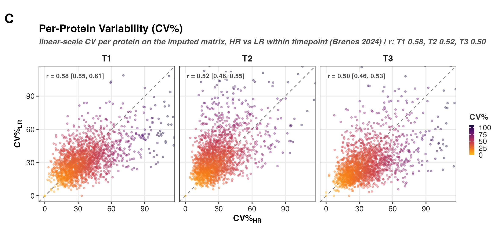
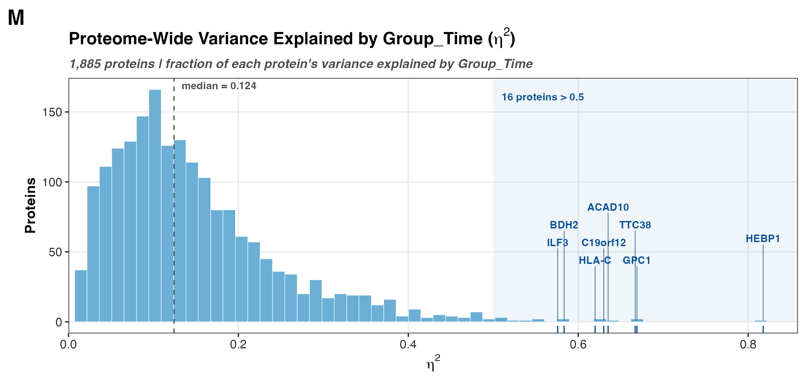
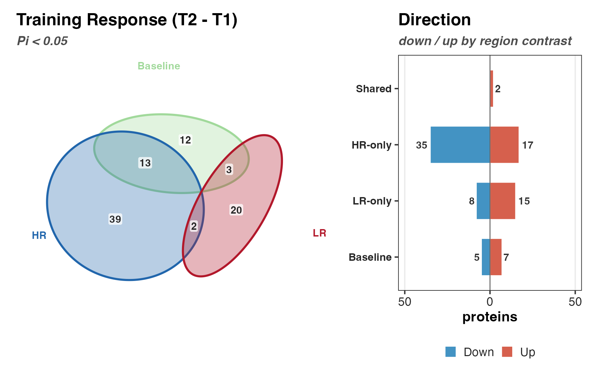
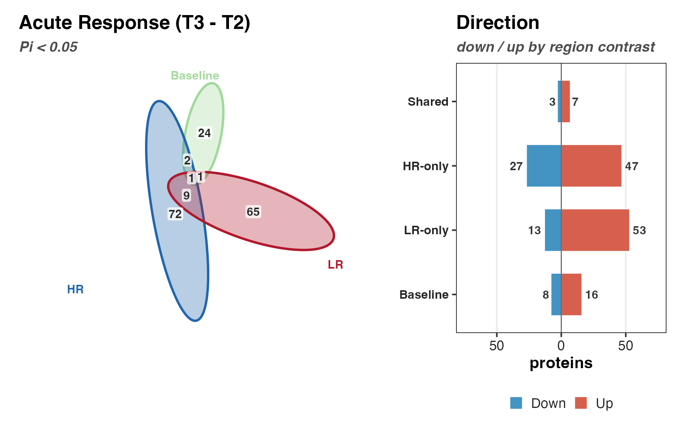

## What Figure 2 is

Figure 2 is the proteome-wide overview that comes before the contrast-specific
figures. It answers three questions about the dataset as a whole: does the design
structure (responder group, timepoint) show up in the unsupervised geometry, is
replicate quality even enough across groups and timepoints to trust the contrasts,
and how much signal is there once we do test. The panels cover PCA with PERMANOVA,
effect-size distributions, per-protein CV, differential-protein counts, pathway
counts, and a variance decomposition. Nothing here is contrast-specific biology;
this is the quality-control and orientation layer.

The study is 8 HR versus 8 LR subjects sampled at up to three timepoints, 45
quantified samples in all. Two subjects are partial (S28 is T1-only, S29 is
T2/T3-only), so the repeated-measures design is unbalanced. Several panels are
built to respect that, most visibly the PERMANOVA in Panel A.

## Reads and writes

Setup (`HRvLR_F02_setup.R`) loads everything the panels share and defines the
paths, the contrast list, and the metadata join. The panels read from it rather
than re-loading.

Reads:

- `02_Normalization/c_data/normalized.csv` — normalized log2 intensities.
- `02_Normalization/imputation/c_data/DAList_imputed_missforest.rds` — the
  missForest-imputed DAList (the analysis-ready sample set; QC can drop samples
  during imputation, so it may hold fewer columns than the normalized table).
- `03_DEP/a_non_imputed/c_data/03_combined_results.csv` — the stage-03 contrast
  results (logFC, moderated-t, P.Value, and the pi-score significance flags).
- `00_input/HRvLR_meta.csv` — sample metadata (subject, group, timepoint).

Writes:

- Panel PNGs to `04_Figures/F02/b_reports/panels` (and `supp` for Panel G).
- Per-panel audit CSVs to `04_Figures/F02/c_data`.
- `04_Figures/F02/c_data/F02_source_data.xlsx`, one sheet per audit CSV.

```{r setup}
pacman::p_load(here, tidyverse, patchwork, grid, vegan)

source(here("04_Figures", "functions", "style.R"))

NORM_FILE <- here("02_Normalization", "c_data", "normalized.csv")
IMP_FILE <- here("02_Normalization", "imputation", "c_data", "DAList_imputed_missforest.rds")
DEP_FILE <- here("03_DEP", "a_non_imputed", "c_data", "03_combined_results.csv")
META_FILE <- here("00_input", "HRvLR_meta.csv")

MAIN_CONTRASTS <- c(
  "Baseline_HRvLR",
  "Training_HR", "Training_LR", "Training_Interaction",
  "Acute_HR", "Acute_LR", "Acute_Interaction"
)

norm_df <- read_csv(NORM_FILE, show_col_types = FALSE)
imp_dal <- readRDS(IMP_FILE)
imp_df <- bind_cols(
  as_tibble(imp_dal$annotation[, c("uniprot_id", "protein", "gene", "description")]),
  as_tibble(imp_dal$data)
)
dep_df <- read_csv(DEP_FILE, show_col_types = FALSE)

ann_cols <- c("uniprot_id", "protein", "gene", "description")
imp_samps <- setdiff(names(imp_df), intersect(names(imp_df), ann_cols))
imp_mat <- as.matrix(imp_df[, imp_samps])
rownames(imp_mat) <- imp_df$gene
```

Metadata is joined onto the imputed sample set, so `meta` and `imp_mat` always
line up. `Group_Time` is the crossed responder-by-timepoint factor several panels
key off.

```{r meta}
meta_raw <- read_csv(META_FILE, show_col_types = FALSE)
meta <- tibble(sample_id = imp_samps) |>
  left_join(meta_raw |> select(Col_ID, Subject_ID, Group, Timepoint, Group_Time),
    by = c("sample_id" = "Col_ID")
  ) |>
  mutate(
    Col_ID = sample_id,
    Group = factor(Group, levels = c("HR", "LR")),
    Timepoint = factor(Timepoint, levels = c("T1", "T2", "T3"))
  )
```

The panels are PNG-only. There is no composite script; the eight main panels are
stitched into the figure by hand at one shared height (`PANEL_H = 95` mm) so they
align when placed side by side.

## Panel A — PCA and PERMANOVA

PCA on the imputed matrix (samples as rows, zero-variance proteins dropped, scaled)
gives the unsupervised layout. The same scores are drawn twice, once colored by
Group and once by Timepoint, each with 80% ellipses. The point of the two colorings
is that Group and Timepoint enter the design differently, so they need different
significance tests.

The PERMANOVA split is what respects the repeated-measures design. Timepoint is a
within-subject factor, so its permutations are restricted to within-subject blocks
(`strata = Subject_ID`); permuting timepoints across subjects would test the wrong
null. Group is between-subject, so each subject is collapsed to one mean profile and
the test runs with subjects as the independent units. Collapsing first is what keeps
the unbalanced partial subjects (S28, S29) from acting as unequal whole-plot blocks,
which restricted permutation of the raw samples could not handle cleanly.

```{r panelA}
samp_ids <- meta$Col_ID[meta$Col_ID %in% colnames(imp_mat)]
mat <- t(imp_mat[, samp_ids])
mat <- mat[, apply(mat, 2, var, na.rm = TRUE) > 0]

pca_res <- prcomp(mat, center = TRUE, scale. = TRUE)
var_pct <- round(100 * pca_res$sdev^2 / sum(pca_res$sdev^2), 1)

pca_df <- as.data.frame(pca_res$x[, 1:2]) |>
  mutate(sample = rownames(pca_res$x)) |>
  left_join(meta |> select(Col_ID, Group, Timepoint, Group_Time, Subject_ID),
    by = c("sample" = "Col_ID")
  )

set.seed(42)
dist_mat <- vegdist(mat, method = "euclidean")
perm_time <- adonis2(dist_mat ~ Timepoint,
  data = pca_df, permutations = 999,
  strata = pca_df$Subject_ID
)
subj_mat <- rowsum(mat, pca_df$Subject_ID)
subj_mat <- subj_mat / as.integer(table(pca_df$Subject_ID)[rownames(subj_mat)])
subj_group <- pca_df$Group[match(rownames(subj_mat), pca_df$Subject_ID)]
perm_group <- adonis2(vegdist(subj_mat, method = "euclidean") ~ subj_group,
  permutations = 999
)
```


## Panel B — Effect-size distributions

Signed logFC per contrast, one facet each, with a density overlay and the median
absolute logFC annotated. The two interaction contrasts are dropped, leaving the
five main effects. This shows how large the changes are before any significance
filter, which is the context for reading the DEP counts in Panel F.

```{r panelB}
display_contrasts <- setdiff(MAIN_CONTRASTS, c("Training_Interaction", "Acute_Interaction"))

lfc_long <- dep_df |>
  select(gene, starts_with("logFC_")) |>
  pivot_longer(starts_with("logFC_"), names_to = "contrast", values_to = "logFC") |>
  mutate(contrast = sub("logFC_", "", contrast)) |>
  filter(contrast %in% display_contrasts, !is.na(logFC)) |>
  mutate(contrast = factor(contrast, levels = display_contrasts))

lfc_stats <- lfc_long |>
  group_by(contrast) |>
  summarise(med_abs_lfc = median(abs(logFC)), .groups = "drop") |>
  mutate(annotation = sprintf("%.2f", med_abs_lfc))
```


## Panel C — Per-protein CV

Inter-individual CV% per protein, computed within each responder group at each
timepoint, plotted HR against LR so a point off the diagonal is a protein that is
noisier in one group than the other. CV is computed on the linear scale
(`2^imp_mat`), not on the log2 values. CV is a ratio of a standard deviation to a
mean, which is only interpretable when the mean is on a ratio scale with a true
zero; log intensities have neither, so a CV on log values would not mean what CV is
supposed to mean. This is the Brenes 2024 convention. The Fisher-z confidence
interval on the HR-vs-LR correlation is annotated per timepoint.

```{r panelC}
lin_mat <- 2^as.matrix(imp_mat)

group_cv <- function(ids) {
  ids <- intersect(ids, colnames(lin_mat))
  if (length(ids) < 2) {
    return(rep(NA_real_, nrow(lin_mat)))
  }
  apply(lin_mat[, ids, drop = FALSE], 1, function(x) {
    x <- x[!is.na(x)]
    if (length(x) < 2) {
      return(NA_real_)
    }
    sd(x) / mean(x) * 100
  })
}

timepoints <- c("T1", "T2", "T3")
cv_df <- lapply(timepoints, function(tp) {
  hr_ids <- meta$Col_ID[meta$Group == "HR" & meta$Timepoint == tp]
  lr_ids <- meta$Col_ID[meta$Group == "LR" & meta$Timepoint == tp]
  tibble(
    uniprot_id = imp_df$uniprot_id,
    gene = imp_df$gene,
    timepoint = tp,
    cv_HR = group_cv(hr_ids),
    cv_LR = group_cv(lr_ids)
  )
}) |>
  bind_rows() |>
  filter(!is.na(cv_HR), !is.na(cv_LR)) |>
  mutate(timepoint = factor(timepoint, levels = timepoints))
```



## Panel F — DEP counts per contrast

Diverging bars, down on the left and up on the right, as a percent of the proteome.
Each direction is nested: nominal p < 0.05 in the light shade with the pi-score
gate (`sig_pi`) drawn on top in the dark shade. The counts at the bar tips are the
pi-gated calls. Using `sig_pi` here keeps Figure 2 consistent with stage 03, where
the pi-score is the significance rule that combines effect size and evidence rather
than thresholding p alone.

```{r panelF}
n_total <- nrow(dep_df)

frac_df <- lapply(display_contrasts, function(ct) {
  p <- dep_df[[paste0("P.Value_", ct)]]
  lfc <- dep_df[[paste0("logFC_", ct)]]
  pi <- dep_df[[paste0("sig_pi_", ct)]]
  tibble(
    contrast = ct,
    key = c("Down p", "Down Pi", "Up p", "Up Pi"),
    direction = c("Down", "Down", "Up", "Up"),
    threshold = c("p", "Pi", "p", "Pi"),
    n = c(
      sum(p < 0.05 & lfc < 0, na.rm = TRUE), sum(pi == -1, na.rm = TRUE),
      sum(p < 0.05 & lfc > 0, na.rm = TRUE), sum(pi == 1, na.rm = TRUE)
    )
  )
}) |>
  bind_rows() |>
  mutate(pct = 100 * n / n_total)
```


## Panel H — GO GSEA counts

fgsea on the per-contrast moderated-t ranks against the three GO ontologies (BP,
CC, MF from MSigDB C5). Ranking on the moderated-t statistic uses the full ordered
list rather than a hard DEP cutoff, so enrichment picks up coordinated shifts that
per-protein thresholds miss. The panel counts significant gene sets (BH < 0.05),
split by NES sign so up-regulated sets go above zero and down-regulated below,
stacked by ontology.

```{r panelH}
pacman::p_load(fgsea, msigdbr)

ONT_COLORS <- c(BP = "#66C2A5", CC = "#FC8D62", MF = "#8DA0CB")

go_sets <- function(sub) {
  g <- tryCatch(
    msigdbr(species = "Homo sapiens", collection = "C5", subcollection = paste0("GO:", sub)),
    error = function(e) msigdbr(species = "Homo sapiens", category = "C5", subcategory = paste0("GO:", sub))
  )
  split(g$gene_symbol, g$gs_name)
}
pathways <- lapply(c(BP = "BP", CC = "CC", MF = "MF"), go_sets)

set.seed(42)
go_counts <- lapply(display_contrasts, function(cn) {
  ranks <- setNames(dep_df[[paste0("t_", cn)]], dep_df$gene)
  ranks <- ranks[!is.na(ranks) & !is.na(names(ranks)) & !duplicated(names(ranks))]
  ranks <- sort(ranks, decreasing = TRUE)
  lapply(names(ONT_COLORS), function(ont) {
    res <- fgsea(pathways[[ont]], ranks, minSize = 10, maxSize = 500)
    sig <- res[!is.na(res$padj) & res$padj < 0.05, ]
    tibble(contrast = cn, ontology = ont, Up = sum(sig$NES > 0), Down = sum(sig$NES < 0))
  }) |> bind_rows()
}) |>
  bind_rows()
```


## Panel M — Variance explained by design (eta-squared)

For each protein, eta-squared is the between-`Group_Time` sum of squares over the
total sum of squares, the fraction of that protein's variance the responder-by-
timepoint design accounts for. The panel is the distribution of eta2 across all
proteins, with the median marked and the high tail (eta2 > 0.5) flagged and
labeled. Most proteins sit low, which is expected; the right tail is the set whose
variance is genuinely structured by the design and where the contrast signal lives.
The per-protein eta2 values are read from the stage-02 report intermediates.

```{r panelM}
pacman::p_load(ggrepel)

int <- readRDS(here("02_Normalization", "c_data", "00_report_intermediates.rds"))
eta_df <- tibble(uniprot_id = names(int$eta2_vals), eta2 = as.numeric(int$eta2_vals)) |>
  left_join(distinct(dep_df, uniprot_id, gene), by = "uniprot_id") |>
  mutate(label = if_else(is.na(gene) | gene == "", uniprot_id, gene))

med_eta <- median(eta_df$eta2, na.rm = TRUE)
hi_cut <- 0.5
n_hi <- sum(eta_df$eta2 > hi_cut)
top_lab <- eta_df |> slice_max(eta2, n = 8, with_ties = FALSE)
```



## Panels I and J — Baseline-anchored overlap (Euler)

Panels I and J ask which proteins move in HR, in LR, or in both, laid over the
baseline HR-vs-LR difference set. Both call `venn3_panel` (in `functions/venn.R`),
which builds a three-set Euler from the pi-gated DEP sets of the two responder
contrasts and the baseline contrast, plus a companion up/down bar per region. Panel
I uses the training response (T2 − T1), Panel J the acute response (T3 − T2). The
overlap of the two responder sets is the shared response; the group-specific
regions are what separates HR from LR.

```{r panelIJ}
source(here("04_Figures", "F02", "a_script", "functions", "venn.R"))

venn3_panel(
  "Training_HR", "Training_LR", "Baseline_HRvLR",
  "Training Response (T2 - T1)",
  file.path(RPT_DIR, "panels", "panel_i_venn_training")
)

venn3_panel(
  "Acute_HR", "Acute_LR", "Baseline_HRvLR",
  "Acute Response (T3 - T2)",
  file.path(RPT_DIR, "panels", "panel_j_venn_acute")
)
```





## Supplement Panel G — Contrast overlap (UpSet)

Panel G is an UpSet of the pi-gated DEP sets across all main contrasts, showing
which proteins are shared across which combinations. It is the many-set counterpart
to the three-set Eulers and lives in `supp` rather than the main figure.

```{r panelG}
pacman::p_load(UpSetR)

dep_sets <- lapply(MAIN_CONTRASTS, function(ct) {
  g <- dep_df$gene[which(dep_df[[paste0("sig_pi_", ct)]] != 0)]
  unique(g[!is.na(g)])
})
names(dep_sets) <- unname(CTR_SHORT[MAIN_CONTRASTS])
dep_sets <- dep_sets[lengths(dep_sets) > 0]

upset(fromList(dep_sets),
  nsets = length(dep_sets), order.by = "freq", nintersects = 20,
  mainbar.y.label = "Shared DEPs", sets.x.label = "DEPs / contrast"
)
```


## Assembly

Every F02 panel is a PNG rendered at the shared `PANEL_H` height. `HRvLR_F02_run.R`
clears `b_reports`, sources the panels in order, and writes the audit CSVs into one
`F02_source_data.xlsx` workbook. There is no composite plotting step; the panels are
placed into the final figure by hand.
