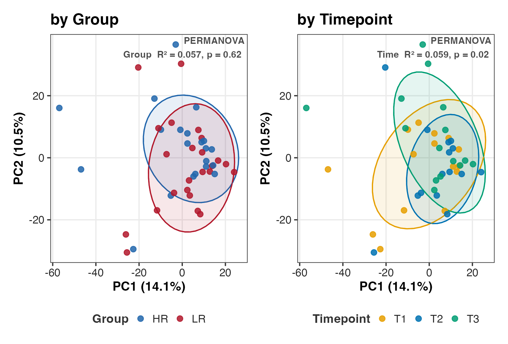
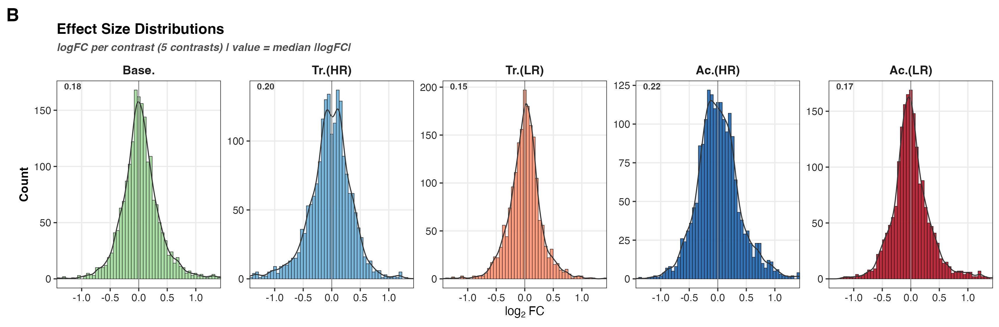
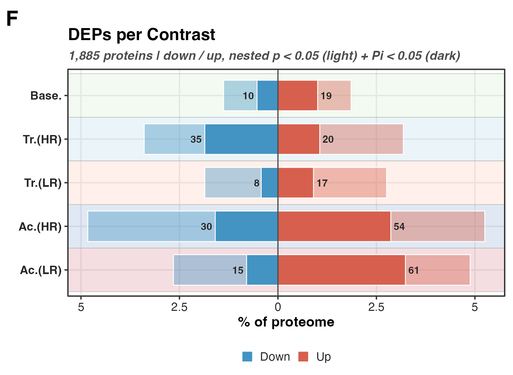
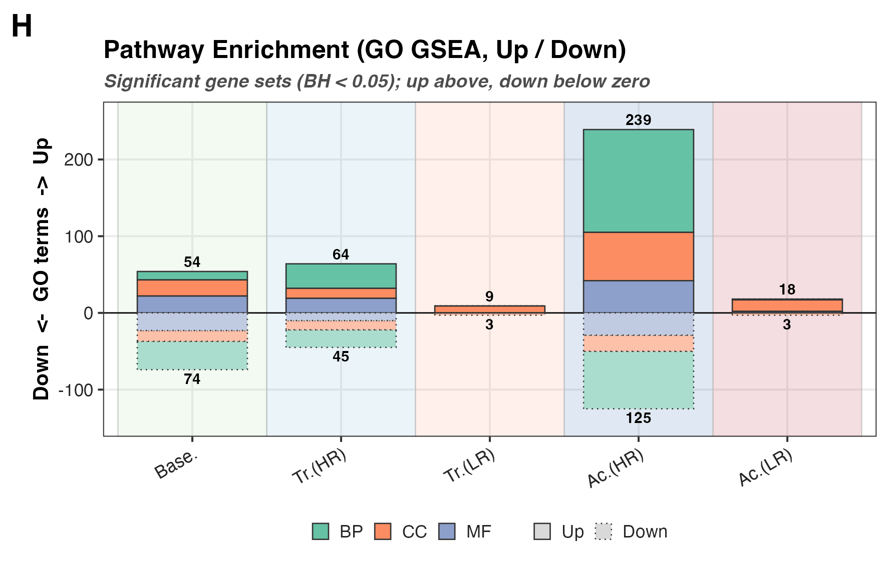
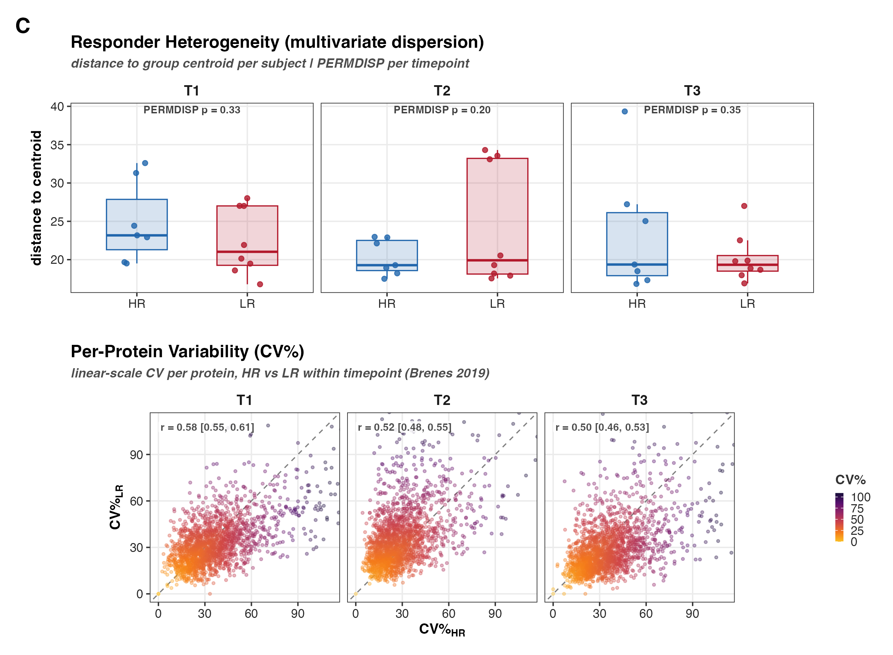
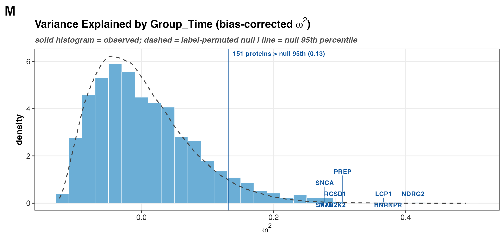
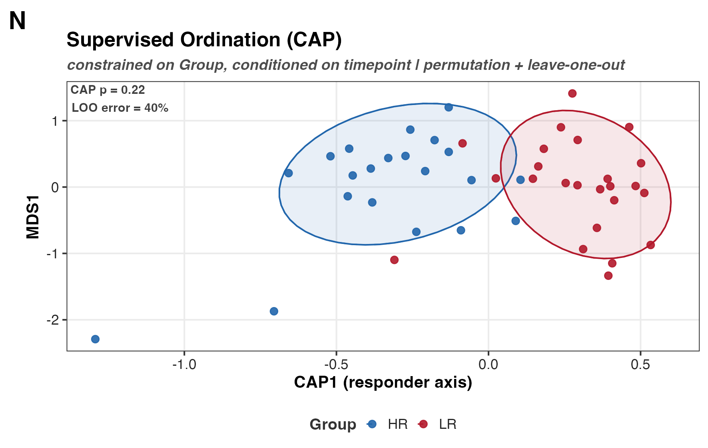
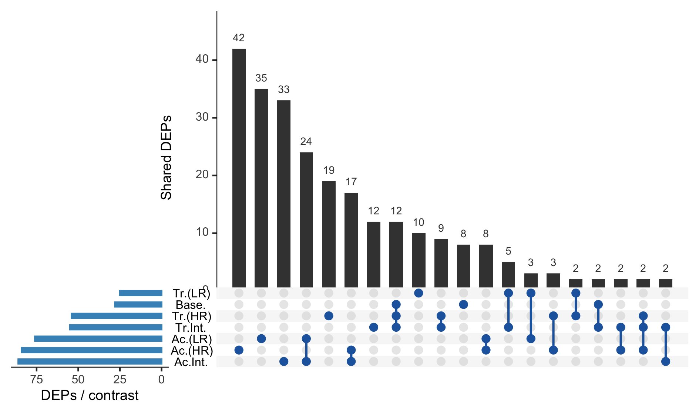

## What Figure 2 is

Figure 2 is the proteome-wide overview that comes before the contrast-specific
figures. It asks one question three ways: at the whole-proteome scale, do high and
low responders differ, and if so, where? The hypothesis is that HR and LR diverge in
the magnitude and trajectory of their response, not in baseline state. Figure 2 tests
exactly that, and the answer shapes the layout: global state, global response, and
global variance structure are all shared, so the figure locates the divergence at the
protein and pathway level rather than in any global geometry.

The study is 8 HR versus 8 LR subjects sampled at up to three timepoints, 45
quantified samples in all. Two subjects are partial (S28 is T1-only, S29 is
T2/T3-only), so the repeated-measures design is unbalanced. Several panels are built
to respect that: the PERMANOVA in Panel A permutes within subject, and the trajectory
tests in Panel D use only the subjects with a complete pre/post pair.

The reading order is: A and B set the overview (state, effect sizes); D is the
response-trajectory test; E, F, and H carry the signal (divergent proteins, DEP
counts, enriched pathways). The supplement holds the variability, variance-partition,
supervised-ordination, and set-overlap panels.

## Reads and writes

Setup (`HRvLR_F02_setup.R`) loads everything the panels share and defines the paths,
the contrast list, and the metadata join. The panels read from it rather than
re-loading.

Reads:

- `02_Normalization/c_data/normalized.csv` — normalized log2 intensities.
- `02_Normalization/imputation/c_data/DAList_imputed_missforest.rds` — the
  missForest-imputed DAList (the analysis-ready sample set).
- `03_DEP/a_non_imputed/c_data/03_combined_results.csv` — the stage-03 contrast
  results (logFC, moderated-t, P.Value, and the pi-score flags), including the two
  interaction contrasts Panel E depends on.
- `00_input/HRvLR_meta.csv` — sample metadata (subject, group, timepoint).

Writes:

- Main panel PNGs to `04_Figures/F02/b_reports/panels`, supplement to `.../supp`.
- Per-panel audit CSVs to `04_Figures/F02/c_data`.
- `04_Figures/F02/c_data/F02_source_data.xlsx`, one sheet per audit CSV.
- `04_Figures/F02/b_reports/F02_composite.{png,pdf}` from the composite stitcher.

```{r setup}
pacman::p_load(here, tidyverse, patchwork, grid, vegan, RRPP)

source(here("04_Figures", "functions", "style.R"))
source(here("04_Figures", "F02", "a_script", "HRvLR_F02_setup.R"))
```

The QC panels (A, C, M) run on the imputed matrix, so `meta` and `imp_mat` always line
up. `Group_Time` is the crossed responder-by-timepoint factor several panels key off.
The imputed basis is a deliberate caveat: missForest borrows information across
proteins and samples, which shrinks per-protein variance and inflates cross-sample
correlation, so the QC panels read the imputed structure, not raw measurement noise.
The DEP results (Panels E, F, H) come from the non-imputed arm.

## Panel A — Global proteome state (PCA, PERMANOVA)

PCA on the imputed matrix (samples as rows, zero-variance proteins dropped, scaled)
gives the unsupervised layout, drawn twice: coloured by Group and by Timepoint, each
with 80% ellipses. PERMANOVA is a permutation test of whether group centroids differ
in multivariate space. It enters differently for the two factors because they enter
the design differently. Timepoint is within-subject, so its permutations are
restricted to within-subject blocks (`strata = Subject_ID`); permuting timepoints
across subjects would test the wrong null. Group is between-subject, so each subject
is collapsed to one mean profile and the test runs with subjects as the independent
units, which keeps the partial subjects (S28, S29) from acting as unequal whole-plot
blocks.

The Group result is null (R² ≈ 0.06, p ≈ 0.62) and the Timepoint result is weak
(R² ≈ 0.06, p ≈ 0.02). Read this as "no detectable global shift," not "HR equals LR":
an unsupervised PCA on ~1,900 scaled proteins gives equal weight to the overwhelmingly
null majority, so a real effect in a protein subset washes out. The null is consistent
with the hypothesis (shared state, divergent response) and is followed up in Panel D.
One caveat for the reader: PERMANOVA confounds centroid location with dispersion, so a
significant term can reflect unequal spread rather than a mean shift (Anderson 2001,
doi:10.1111/j.1442-9993.2001.01070.pp.x); the dispersion is tested directly in
supplement Panel C.



## Panel B — Effect-size distributions

Signed logFC per contrast, drawn as a horizontal violin on the shared contrast axis so
down sits left and up sits right, matching Panels F and H. The median absolute logFC is
annotated. Effects are small and symmetric across every contrast (median |logFC| 0.15
to 0.22), which is the context for reading the DEP counts in Panel F: the changes are
modest, so the counts, not the magnitudes, carry the between-contrast contrast.



## Panel D — Response trajectories (RRPP)

Since global state does not separate responders, the test moves to the response: each
subject's within-subject change vector, training (T2 − T1) and acute (T3 − T2). A
change vector has two separable properties, and RRPP tests each by residual
randomisation, which is valid when variables far exceed subjects (Collyer, Sekora &
Adams 2015, doi:10.1038/hdy.2014.75; Adams & Collyer 2009,
doi:10.1111/j.1558-5646.2009.00649.x). Magnitude ‖Δ‖ is how far the proteome moved;
the panel plots it per subject and tests the group difference. Direction is where it
moved; the Δ-score PCA shows the geometry and the angle between the two group-mean
vectors summarises it, with the overall change-vector difference tested as well.

Both are null. HR and LR move the same distance (training Z = 0.35, p = 0.38; acute
Z = −1.44, p = 0.92) and in indistinguishable directions (vector p = 0.87 and 0.18).
The null is robust: restricting ‖Δ‖ to the top 1000, 500, 200, 100, or 50
most-variable proteins never brings either test near significance. So responders do
not remodel more, and they do not remodel differently, at the whole-proteome scale.

```{r panelD}
subject_of <- function(ids) sub("_T[123]$", "", ids)
subj_group <- setNames(meta$Group, subject_of(meta$Col_ID))

delta_matrix <- function(from_tp, to_tp) {
  from_ids <- meta$Col_ID[meta$Timepoint == from_tp & meta$Col_ID %in% colnames(imp_mat)]
  to_ids <- meta$Col_ID[meta$Timepoint == to_tp & meta$Col_ID %in% colnames(imp_mat)]
  paired <- intersect(subject_of(from_ids), subject_of(to_ids))
  d <- t(imp_mat[, to_ids[match(paired, subject_of(to_ids))]]) -
    t(imp_mat[, from_ids[match(paired, subject_of(from_ids))]])
  rownames(d) <- paired
  d[, apply(d, 2, var) > 0]
}

dm <- delta_matrix("T2", "T3")
grp <- droplevels(subj_group[rownames(dm)])
mag <- sqrt(rowSums(dm^2))
set.seed(42)
anova(lm.rrpp(mag ~ grp, data = rrpp.data.frame(mag = mag, grp = grp), iter = 999))
```


## Panel E — Responder divergence (protein level)

The divergence lives here. For each protein the panel plots the training/acute logFC
in HR against the same in LR; on-diagonal is a concordant response, off-diagonal is
divergent. The key point is what defines "divergent": not set subtraction of two
separately-thresholded lists, which cannot show a group difference (the difference
between significant and non-significant is not itself significant, Gelman & Stern
2006), but the interaction contrast directly. Proteins with `sig_pi` on
`Training_Interaction` or `Acute_Interaction` are the ones whose HR-versus-LR
difference is significant, highlighted and labelled. This is why the interaction
contrasts, dropped from the count panels, are the honest test of the hypothesis: 55
proteins diverge in training, 86 in the acute bout.

```{r panelE}
diverg <- tibble(
  gene = dep_df$gene,
  hr = dep_df$logFC_Acute_HR,
  lr = dep_df$logFC_Acute_LR,
  divergent = dep_df$sig_pi_Acute_Interaction != 0
)
```


## Panel F — DEP counts per contrast

Diverging bars, down on the left and up on the right, as a percent of the proteome.
Each direction nests nominal p < 0.05 (light) with the pi-score gate (dark), and the
counts at the tips are the pi-gated calls. The dotted lines mark the expected-by-chance
fraction: at α = 0.05 across ~1,900 proteins, roughly 2.5% of the proteome per
direction is a false positive, so a light bar near that line is indistinguishable from
noise. Using `sig_pi` for the reported counts keeps Figure 2 consistent with stage 03,
where the pi-score combines effect size and evidence rather than thresholding p alone.



## Panel H — Pathway enrichment (GO GSEA, deduplicated)

fgsea on the per-contrast moderated-t ranks against the three GO ontologies (BP, CC,
MF from MSigDB C5). Ranking on the moderated-t uses the full ordered list rather than a
hard cutoff, so enrichment picks up coordinated shifts a per-protein threshold misses.
The raw significant-set count is inflated by GO redundancy, where nested and
overlapping terms co-fire, so each ontology's significant sets (BH < 0.05) are
collapsed to non-redundant representatives with `fgsea::collapsePathways` before
counting (Korotkevich et al. 2021, doi:10.1101/060012). The layout mirrors Panel F. The
deduplicated counts show a broad HR pathway response, strongest acutely (85 up versus
LR's 10), which is the pathway-level counterpart to Panel E's divergence.



## Supplement C — Responder heterogeneity and per-protein CV

Reframes replicate variability from QC to biology: do HR and LR differ in how spread
out their proteomes are? PERMDISP tests homogeneity of multivariate dispersion, each
subject's distance to its group centroid, per timepoint (Anderson 2006,
doi:10.1111/j.1541-0420.2005.00440.x). No timepoint shows a difference (p = 0.33, 0.20,
0.35), so responders are equally heterogeneous. The CV scatter underneath is the
per-protein detail: CV on the linear scale (`2^imp_mat`), since a coefficient of
variation is only interpretable on a ratio scale with a true zero, which log
intensities lack (Brenes et al. 2019, doi:10.1074/mcp.RA119.001472).



## Supplement M — Variance explained by design (bias-corrected ω²)

For each protein, how much of its variance the Group_Time design explains. Raw η² is
upward-biased, worst in this small-df regime: with 5 between-group and ~39 residual df
the null expectation is about 5/44 ≈ 0.11, so a raw-η² histogram places the median
protein at the chance level and reads as structure where there is none. This panel uses
ω², which subtracts the null expectation so unstructured proteins centre on zero
(Lakens 2013, doi:10.3389/fpsyg.2013.00863; Olejnik & Algina 2003,
doi:10.1037/1082-989X.8.4.434), overlaid on a label-permuted null. The observed
distribution sits on the null for the bulk (median ω² ≈ 0) with a modest right tail
that exceeds the null 95th percentile, the honest version of "a minority of proteins
are design-structured."



## Supplement N — Supervised ordination (CAP)

Where the PCA is unsupervised, CAP seeks the axis that best discriminates HR from LR on
the sample distance matrix, conditioned on timepoint, but stays honest with a
permutation test and leave-one-out misclassification (Anderson & Willis 2003,
doi:10.1890/0012-9658(2003)084[0511:CAOPCA]2.0.CO;2). Even when a separating axis is
sought, it does not generalise (p ≈ 0.22, LOO error ≈ 40%), corroborating the null PCA
rather than contradicting it. A supervised method such as PLS-DA would separate 8
versus 8 in high dimensions every time, even on shuffled labels, so CAP's cross-
validated allocation is the honest choice.



## Supplement G, I, J — Set overlap

Panel G is an UpSet of the pi-gated DEP sets across all main contrasts. Panels I and J
are baseline-anchored three-set Eulers of the training and acute responder sets, kept
in the supplement because set overlap describes shared membership but cannot test
responder divergence; Panel E does that.



## Assembly

`HRvLR_F02_run.R` clears `b_reports`, sources the six main panels then the six
supplement panels, and writes the audit CSVs into one `F02_source_data.xlsx`.
`HRvLR_F02_composite.R` rasterises the six main panel PNGs and tiles them at native
aspect in a three-row YvO-style grid (A and B; D full width; E, F, H), saving
`F02_composite.{png,pdf}`.

## Recap

- Global proteome state does not separate responders (A), and neither does the global
  response in magnitude or direction (D), robustly to feature selection.
- Responders are equally heterogeneous (C), the design explains little variance beyond
  chance (M), and even a supervised axis fails to classify them (N).
- The divergence is protein-specific (E, 55 training / 86 acute) and shows as a broader
  HR pathway response (H, 85 vs 10 acute up).
- The honest claim is shared global response, protein-specific divergence, which is the
  hypothesis restated at the scale the data support.

```{r sessioninfo}
sessionInfo()
```
