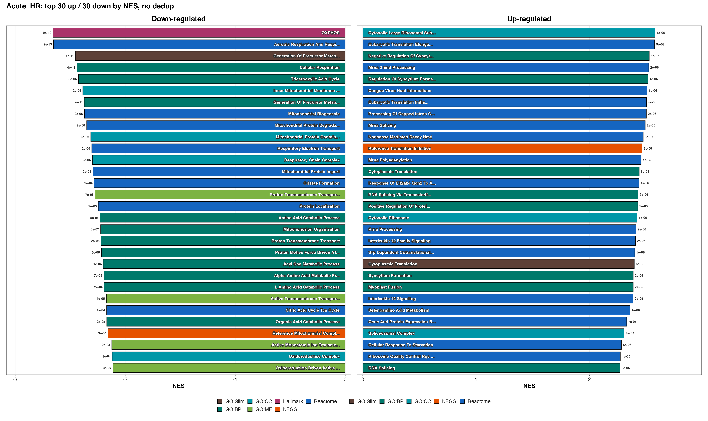
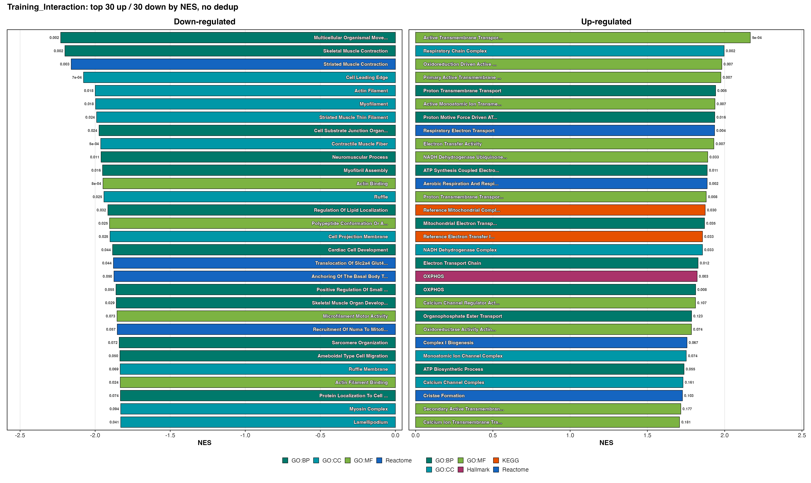
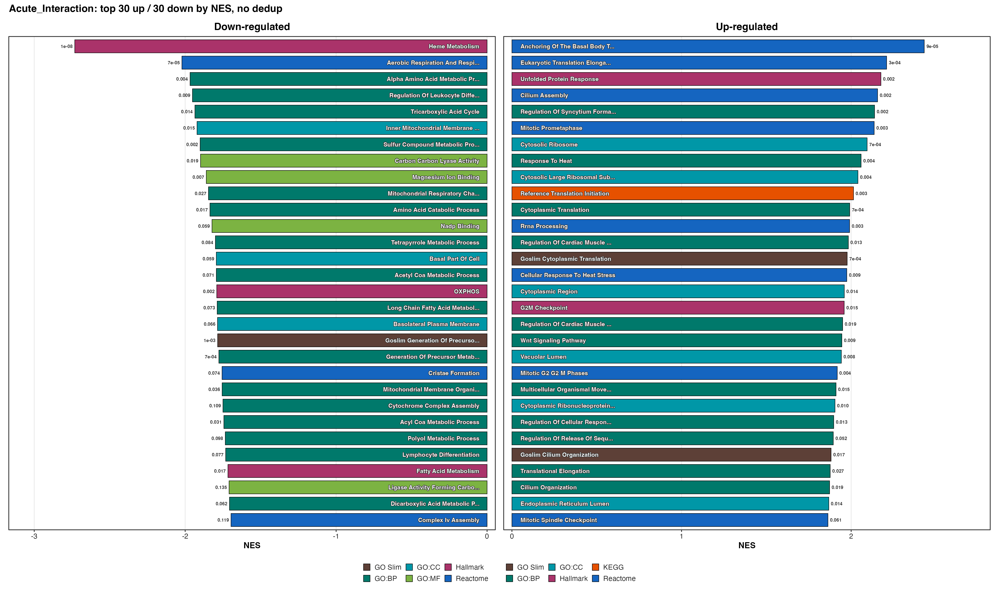

```{r}
#| label: load
#| echo: false
pacman::p_load(here, openxlsx, dplyr, readr, knitr)
fg <- read.xlsx(here("04_Figures", "F03", "c_data", "F03_source_data.xlsx"), sheet = "fgsea_all")
dep <- as.data.frame(read_csv(
  here("03_DEP", "a_non_imputed", "c_data", "03_combined_results.csv"),
  show_col_types = FALSE
))
source(here("03_DEP", "contrasts.R"))
cts <- trimws(sub(" =.*$", "", HRVLR_CONTRASTS))

n_tests <- nrow(fg)
n_sig <- sum(!is.na(fg$padj) & fg$padj < 0.05)
sc <- fg |>
  filter(!is.na(padj), padj < 0.05, is.finite(NES)) |>
  count(contrast)
sc <- setNames(sc$n, sc$contrast)[cts]
sc[is.na(sc)] <- 0
acute_ratio <- round(sc[["Acute_HR"]] / sc[["Acute_LR"]], 1)
```

## What the figure shows

F03 draws each differential-expression contrast as a **volcano-in-ring** plot. The
centre is an ordinary volcano — protein log fold-change on x, `−log10` p on y, one
point per protein. Around it sits a ring of arcs, one arc per enriched pathway,
coloured by GSEA normalised enrichment score. A single panel answers two questions at
once for one contrast: **which proteins move, and which pathways those movements add
up to.** The plot is drawn by the `enrichVolcano` package; F03 supplies the two tidy
frames and a family palette.

The study is 8 high responders (HR) against 8 low responders (LR) across baseline,
trained, and acute states. The nine estimable contrasts split across two composites,
each ring keyed to a family palette so a reader never mistakes one kind of comparison
for another.

## What F03 found

```{r}
#| label: sig-table
#| echo: false
tibble(
  Contrast = names(sc),
  `Significant pathways (BH < 0.05)` = as.integer(sc)
) |>
  arrange(desc(`Significant pathways (BH < 0.05)`)) |>
  kable()
```

Across `r format(n_tests, big.mark = ",")` pathway × contrast tests,
**`r n_sig` are significant at BH < 0.05**. Unlike the protein-level gate on this page,
these arcs are genuinely FDR-controlled.

Two things are worth reading off the table before looking at any ring.

**The acute bout dominates.** `Acute_HR` alone carries `r sc[["Acute_HR"]]` enriched
pathways against `Acute_LR`'s `r sc[["Acute_LR"]]` — a `r acute_ratio`× asymmetry that is
the strongest HR-versus-LR signal anywhere in the pipeline, the pathway-level echo of
F02's GO count.

**But `Baseline_HRvLR` returns `r sc[["Baseline_HRvLR"]]` pathways.** The groups were
*not* supposed to differ at baseline — that is the premise F01 works to establish. Enriched
biology at baseline is a caution against reading the `r sc[["Acute_HRvLR"]]` in
`Acute_HRvLR` as purely a response difference: some of it is a state difference the groups
carried in with them. The contrast that isolates the *response* difference is the
interaction (`r sc[["Training_Interaction"]]` training, `r sc[["Acute_Interaction"]]`
acute), read as exploratory for the reasons below.

## The two composites

The first holds the within-group and interaction contrasts in three columns —
training, acute, interaction — tagged down each column so a column reads as one kind
of comparison:

- **Responses** (red up, blue down) — the four within-group changes: what moves inside
  HR and inside LR over training (T2 − T1, left column) and over the acute bout
  (T3 − T2, middle column).
- **Interaction** (orange up, purple down) — where the two groups' *responses* diverge,
  over training and over the acute bout (right column).


The second holds the between-responder differences, HR against LR at each state:

- **Differential** (green up, purple down) — `Baseline_HRvLR`, `Trained_HRvLR`,
  `Acute_HRvLR`, read left to right as the untrained, trained, and acute states.


## What NES means {#sec-nes}

Every arc is coloured by it, so it is worth a paragraph.

A preranked GSEA sorts all proteins by a statistic (here the limma moderated-t) and
walks down the list, adding to a running score when it hits a member of the pathway and
subtracting when it does not [@subramanian2005]. The largest deviation of that walk is
the **enrichment score (ES)**: strongly positive if the pathway's proteins cluster at
the top of the ranking, strongly negative if they cluster at the bottom.

The ES depends on how many proteins the set contains — big sets drift further by chance.
So fgsea divides the ES by the mean ES of random sets of the same size [@korotkevich2021].
That ratio is the **normalised enrichment score (NES)**. Because it is size-normalised,
**a NES of +2 means the same thing for a 20-protein set as for a 200-protein set**, which
is what makes the ring's colour scale readable across arcs of very different size.

Sign is direction, magnitude is strength: positive NES = the pathway is shifted up the
ranking (up-regulated in that contrast), negative = shifted down.

## The two colour scales are different things {#sec-pi}

There are two significance signals in this figure and they follow **different rules**.
Keeping them straight is the single most important thing on this page.

### Ring arcs — a genuine FDR

fgsea results are filtered at `padj < 0.05` in the ordinary Benjamini-Hochberg sense
[@benjamini1995] before an arc is drawn, and the arc is coloured by NES. **These are
FDR-controlled.** The `r n_sig` significant pathways above are real BH counts.

### Volcano points — the π gate, which controls nothing

```{r}
#| label: pi-audit
#| echo: false
pull_ct <- function(prefix) unlist(lapply(cts, function(ct) dep[[paste0(prefix, ct)]]))
p <- pull_ct("P.Value_")
pi <- pull_ct("pi_score_")
q <- pull_ct("adj.P.Val_")
keep <- !is.na(pi)
p <- p[keep]
pi <- pi[keep]
q <- q[keep]
pi_calls <- sum(pi < 0.05)
bh_hits <- sum(q < 0.05, na.rm = TRUE)
pi_over <- sum(p[pi < 0.05] >= 0.05)
pi_over_pct <- round(100 * pi_over / pi_calls, 1)
pi_max_p <- round(max(p[pi < 0.05]), 3)
inflation <- round(pi_calls / bh_hits, 0)
```

Volcano points are coloured by the pipeline's gate, `pi_score = P.Value ^ |logFC|`,
significant when `pi_score < 0.05`. **This is the Xiao π-value** [@xiao2014] written in
exponential form. Taking log₁₀ of `p^|L| < 0.05`:

$$|L| \cdot \log_{10} p < \log_{10}(0.05) \iff |L| \cdot (-\log_{10} p) > 1.301$$

so thresholding the exponential form at 0.05 is algebraically identical to thresholding
Xiao's product `|log2FC| × (−log10 p)` at 1.301. They select the same proteins.

**It controls no error rate.** A large fold change drives `p^|logFC|` down on its own, so
fold change alone can buy admission. Across the nine contrasts, `r pi_over` of `r pi_calls`
π-calls (`r pi_over_pct`%) have a raw p ≥ 0.05, the largest admitted being
**p = `r pi_max_p`**. The π set is not even a subset of the nominally significant set.
Xiao's paper derives a dataset-specific empirical-null critical value rather than a flat
0.05, and never claims FDR control; the flat 0.05 here is a display threshold, not Xiao's
criterion.

For scale: the nine contrasts hold **`r pi_calls` π-calls against `r bh_hits` proteins at
BH < 0.05** — a `r inflation`× gap.

### The `padj` column name is a trap

`enrichVolcano` expects point significance in a column named `padj`. The panel hands the
π-score into that slot, so **inside the plotting object a column named `padj` holds
π-scores** — a few lines from a genuine fgsea BH q-value in the same file
(`ring_helpers.R`). The name is the package's; the statistic is not an adjusted p-value.

**Read the rings as FDR-controlled enrichment. Read the volcano points as an
effect-size-weighted ranking.** They are not the same kind of claim.

## Reads and writes

F03 reads one file:

- `03_DEP/a_non_imputed/c_data/03_combined_results.csv` — one row per protein, with
  `logFC_`, `P.Value_`, `t_`, and `pi_score_` columns suffixed by each of the nine
  contrast names.

It writes:

- `b_reports/F03_composite.{png,pdf}` — the responses-and-interaction composite (six rings).
- `b_reports/F03_HRvLR.{png,pdf}` — the between-responder composite (three rings).
- `b_reports/supp/top30_<contrast>.{png,pdf}` — a no-dedup top-30 up / top-30 down figure
  per contrast.
- `c_data/F03_source_data.xlsx` — the fgsea cache plus the ring provenance.

**The workbook is both the source-data export and the cache for the downstream figures.**
F03 recomputes fgsea fresh on every run, seeded, and the raw `fgsea_all` sheet is what the
F04 and F05 NES scatters read instead of rerunning GSEA. The enrichment is paid for once
per F03 run, and the three figures cannot drift apart. **Run F03 before F04/F05.**

### Setup: ranks and the fgsea cache

The rank is the **limma moderated-t statistic**, sorted high to low, one value per gene.
It is the natural ranking metric for a limma fit and the standard input to a preranked
GSEA: it already carries the empirical-Bayes variance shrinkage, so a protein with a big
fold change but an unstable variance does not outrank a modest, well-measured one
[@ritchie2015]. Shrinkage matters most when residual degrees of freedom are small, which
is exactly the n = 16 case here.

The chunk below is the heavy step; it runs in `HRvLR_F03_setup.R` and is shown, not
re-executed, so this page renders from the cached workbook.

```{r}
#| eval: false
pw <- build_pathway_collection(
  min_size = 15, max_size = 500, include_goslim = TRUE, exclude_variants = TRUE
)
set.seed(42)
fg <- lapply(cts, function(ct) {
  d <- tibble(gene = dep$gene, t = dep[[paste0("t_", ct)]]) |>
    filter(!is.na(gene), !is.na(t)) |>
    distinct(gene, .keep_all = TRUE)
  ranks <- sort(setNames(d$t, d$gene), decreasing = TRUE)
  res <- run_fgsea(ranks, pw)
  res$contrast <- ct
  res
}) |>
  bind_rows()
```

The collection spans Hallmark, KEGG, Reactome, GO:BP, GO:CC, GO:MF, and GO Slim, gated to
pathways of 15–500 genes. `fgseaMultilevel` runs with `eps = 0` and
`nPermSimple = 10000`. `run_fgsea` returns every result with **no redundancy collapse** —
the cache is the raw NES source that all three figures share; the ring's redundancy
control happens at display.

### Display dedup: the EnrichmentMap coefficient

The rings do not draw every significant pathway — 284 arcs would be unreadable, and most
would say the same thing. Each contrast's significant set is collapsed with the
EnrichmentMap combined similarity coefficient [@merico2010; @reimand2019]. For two gene
sets:

$$\text{similarity} = 0.5 \times \text{overlap} + 0.5 \times \text{Jaccard}$$

with `overlap = |A ∩ B| / min(|A|, |B|)` and `Jaccard = |A ∩ B| / |A ∪ B|`. Two sets are
redundant at `similarity ≥ 0.375`, the EnrichmentMap default. This is now the single dedup
in the pipeline: the cache is raw, so the rings and the F04/F05 concordance read one
un-collapsed NES source and the only collapse is this display step.

The collapse is **greedy in FDR order**, so the most significant member of a redundant
cluster is kept. It runs within each database first and then across databases, so
`REACTOME_TCA_CYCLE` and `KEGG_CITRATE_CYCLE` reduce to one arc. From the survivors the
ring shows the **top 12 by FDR**.

```{r}
#| eval: false
ring_enrich <- function(fg, ct, pw, ring_n = 12) {
  sig <- as.data.frame(ring_significant(fg, ct))
  report <- dedup_report(sig, pw)
  kept <- report[report$dedup_status == "kept", , drop = FALSE]
  kept <- kept[order(kept$padj), ][seq_len(min(ring_n, nrow(kept))), ]
  tibble(
    pathway = clean_pathway_name(kept$pathway),
    NES = kept$NES, padj = kept$padj, size = kept$size,
    leading_edge = kept$leadingEdge, database = kept$database
  )
}
```

**The ring is a top-12 view of a much larger significant set.** `ring_pathways` in the
workbook records, per contrast, which pathways were kept, which merged into which, and
which twelve were drawn — so nothing is silently dropped, it is all auditable.

## Supplement — the undeduplicated top 30

Each contrast also gets a no-dedup top-30-up / top-30-down bar figure, filled by database
with names inline. Where the ring shows twelve deduplicated arcs, these show the raw
ranking, so the reader can see exactly what the EnrichmentMap collapse removed and satisfy
themselves it removed redundancy rather than signal.







The remaining six contrasts follow the same layout in `b_reports/supp/`.

## The interactions are exploratory

The interaction contrasts carry the central claim — that HR and LR diverge in the
magnitude and trajectory of their response, not only in baseline state. They also sit at
the **lowest-powered cells** of an unbalanced 16-subject design (two subjects contribute a
single timepoint each).

GSEA aggregates weak per-protein signal into pathway signal, which is why enrichment is
defensible at this n where per-protein testing is not. But the interaction rings are read
as **hypothesis-generating**. Responder-stratified muscle omics treats enrichment on such
splits as descriptive rather than confirmatory: transcriptomic responder networks framed
as hypothesis-generating classifiers [@phillips2013], mechanistic training studies with
richer designs than n = 16 [@robinson2017], and the MoTrPAC rat multi-tissue map presented
as a discovery resource, not human responder evidence [@motrpac2024].

## Key terms

**Volcano-in-ring** — a volcano plot (proteins) with a ring of pathway arcs (enrichment)
around it, so one panel carries both scales of the same contrast.

**NES** — normalised enrichment score. Enrichment score divided by the mean score of random
sets of the same size, so it compares across sets of different size. Sign is direction,
magnitude is strength. See @sec-nes.

**Moderated-t** — the limma t-statistic after empirical-Bayes variance shrinkage. The rank
metric for every fgsea run here.

**π gate** — `p^|logFC| < 0.05`, equivalently `|log2FC| × (−log10 p) > 1.301`. The Xiao
π-value in exponential form. An effect-size-weighted ranking that **controls no error
rate**. See @sec-pi.

**EnrichmentMap similarity** — `0.5 × overlap + 0.5 × Jaccard`, redundant at ≥ 0.375.
Collapses near-duplicate gene sets greedily in FDR order; the pipeline's single dedup, run
at display.

**Leading edge** — the subset of a pathway's proteins that sit before the peak of the
running enrichment score, i.e. the members actually driving the signal.

## Recap

- **`r n_sig` of `r format(n_tests, big.mark = ",")` pathway × contrast tests are
  significant at BH < 0.05.** The ring arcs are genuinely FDR-controlled; the volcano
  points are not.
- Enrichment concentrates in the acute contrasts, and `Acute_HR` (`r sc[["Acute_HR"]]`)
  dwarfs `Acute_LR` (`r sc[["Acute_LR"]]`). That asymmetry is the strongest HR/LR signal in
  the pipeline.
- **`Baseline_HRvLR` returns `r sc[["Baseline_HRvLR"]]` pathways**, so the groups are not
  identical at baseline; read `Acute_HRvLR`'s `r sc[["Acute_HRvLR"]]` with that in mind. The
  interaction contrasts, which isolate the *response* difference, are read as exploratory.
- The volcano π gate is the Xiao π-value in exponential form. It controls no error rate,
  admits proteins with raw p up to `r pi_max_p`, and is stored in a column misleadingly
  named `padj`.
- Rings show the top 12 after an EnrichmentMap 0.375 collapse; the supplement shows the
  undeduplicated top 30 so nothing is hidden.

```{r sessioninfo, eval=TRUE}
#| echo: false
sessionInfo()
```

## References

::: {#refs}
:::
