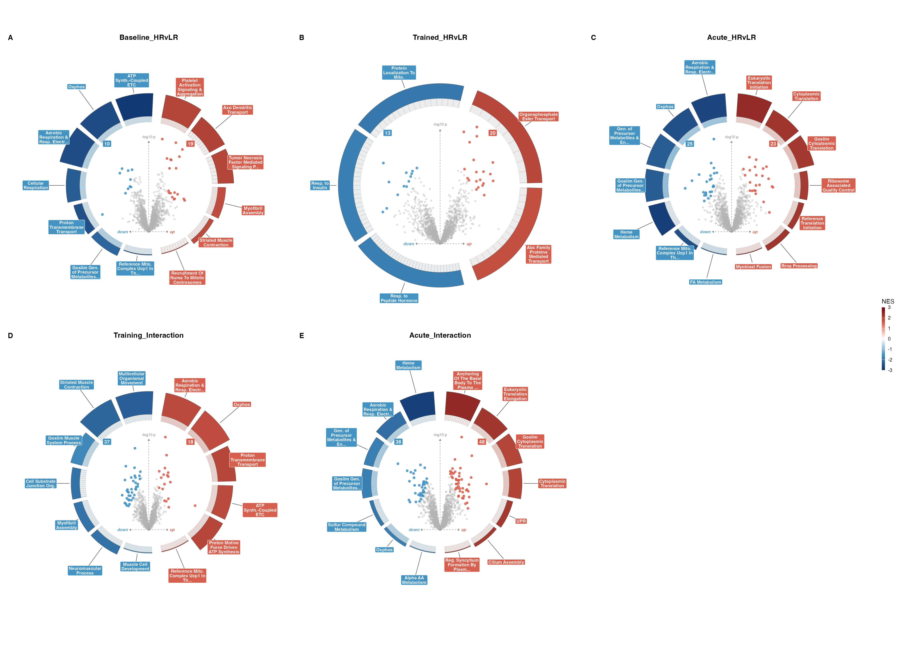
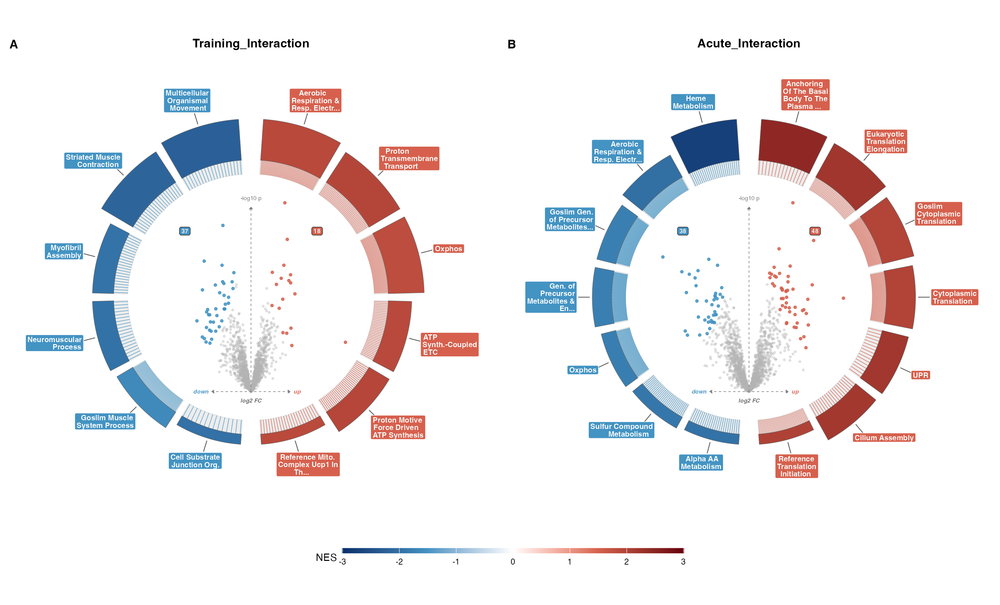
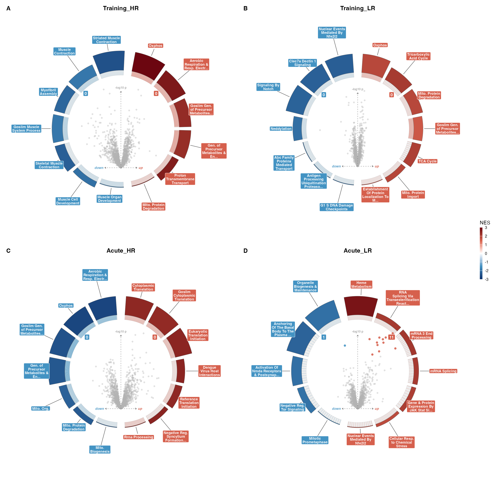

## What the figure shows

Figure 3 draws each of the nine differential-expression contrasts as a
volcano-in-ring plot. The centre is an ordinary volcano: protein log
fold-change on the x-axis, `-log10` p-value on the y-axis, one point per
protein. Around it sits a ring of arcs, one arc per enriched pathway,
coloured by GSEA normalised enrichment score (NES). So a single panel
answers two questions at once for one contrast: which proteins move, and
which pathways those movements add up to.

The study is 8 high responders (HR) against 8 low responders (LR),
measured across baseline, trained, and acute-exercise states. The
differential and interaction contrasts are the responder story: they ask
where the two groups' proteomes diverge, and where their exercise
responses diverge. The within-group contrasts are the plainer question of
what moves inside each group from one state to the next.







## Reads and writes

The figure reads one file, the combined DEP table from stage 03:

- `03_DEP/a_non_imputed/c_data/03_combined_results.csv` — one row per
  protein, with `logFC_`, `P.Value_`, `t_`, and `pi_score_` columns
  suffixed by each of the nine contrast names.

It writes into `b_reports/` and `c_data/`:

- `b_reports/F03_differential.png` / `.pdf` — the three between-responder
  states (baseline, trained, acute).
- `b_reports/F03_interaction.png` / `.pdf` — the two responder-by-timepoint
  interactions.
- `b_reports/F03_responses.png` / `.pdf` — the four within-group
  responses.
- `c_data/F03_source_data.xlsx` — the fgsea cache, with a `fgsea_all`
  sheet (every pathway result) and a `fgsea_significant` sheet.

The Excel workbook is both the source-data export and the cache. The
fgsea run is the slow part of this figure, and the same enrichment feeds
the F04 and F05 NES scatters. Computing it once and reading it back keeps
the three figures consistent and avoids paying for GSEA three times.
Deleting `F03_source_data.xlsx` forces a recompute.

## The two colour scales are different things

There are two significance signals in this figure and they do not use the
same rule. Keeping them straight matters for reading the panels.

**Volcano points** are coloured by the pipeline's pi-score gate, the same
gate every other stage uses. `pi_score = P.Value ^ |logFC|`, and a point
counts as significant when `pi_score < 0.05` (equivalently `sig_pi != 0`).
The pi-score rewards proteins that are both confidently and substantially
changed, rather than a raw p-value or an FDR threshold that a large
fold-change alone cannot rescue. Using the same gate here as in stage 03
means a point that reads as significant in the volcano is the same protein
that reads as significant everywhere else in the pipeline.

There is a naming trap. `enrichVolcano` expects a column called `padj` for
its point significance and treats anything below its threshold as a hit.
The panel code hands the pi-score into that `padj` slot. So inside the
plotting object the significant column is labelled `padj`, but the values
are pi-scores, not FDR-adjusted p-values. The label is the package's; the
statistic is ours.

**Ring arcs** use a genuine FDR. The fgsea results are filtered at
`padj < 0.05` in the usual adjusted-p sense before an arc is drawn, and
the arc is coloured by NES, not by that padj.

### Setup: ranks and the fgsea cache

The setup script builds moderated-t ranks per contrast and runs fgsea
against the pathway collection, then caches the result.

```{r}
#| eval: false
pacman::p_load(here, dplyr, tidyr, readr, tibble, fgsea, msigdbr, openxlsx)
source(here("04_Figures", "functions", "style.R"))
source(here("04_Figures", "functions", "pathway_utils.R"))

CONTRASTS <- c(
  "Training_HR", "Training_LR", "Acute_HR", "Acute_LR",
  "Baseline_HRvLR", "Trained_HRvLR", "Acute_HRvLR",
  "Training_Interaction", "Acute_Interaction"
)

dep <- read_csv(
  here("03_DEP", "a_non_imputed", "c_data", "03_combined_results.csv"),
  show_col_types = FALSE
)

cache_xlsx <- file.path(DAT_DIR, "F03_source_data.xlsx")
if (file.exists(cache_xlsx)) {
  fg <- as_tibble(read.xlsx(cache_xlsx, sheet = "fgsea_all"))
} else {
  pw <- build_pathway_collection(
    min_size = 15, max_size = 500, include_goslim = TRUE, exclude_variants = TRUE
  )
  fg <- lapply(CONTRASTS, function(ct) {
    d <- tibble(gene = dep$gene, t = dep[[paste0("t_", ct)]]) |>
      filter(!is.na(gene), !is.na(t)) |>
      distinct(gene, .keep_all = TRUE)
    ranks <- sort(setNames(d$t, d$gene), decreasing = TRUE)
    res <- run_fgsea_deduplicated(ranks, pw)
    res$contrast <- ct
    res$leadingEdge <- vapply(res$leadingEdge, function(x) paste(x, collapse = ";"), character(1))
    res
  }) |>
    bind_rows()
}
```

The rank for each contrast is the moderated-t statistic from limma, sorted
high to low, one value per gene. That is the vector fgsea walks. The
collection spans Hallmark, KEGG, Reactome, GO:BP, and GO Slim, gated to
pathways of 15 to 500 genes. `run_fgsea_deduplicated` collapses redundant
pathways so the ring is not five near-copies of the same gene set.

### Panel: the ring-volcano grid

The panel script assembles two frames per contrast. `volc_dfs` carries the
volcano coordinates and the pi-score in the `padj` slot; `enrich_dfs`
carries the top pathways for the ring.

```{r}
#| eval: false
pacman::p_load(here, dplyr, readr, tibble, enrichVolcano, ggplot2, patchwork)

volc_dfs <- lapply(CONTRASTS, function(ct) {
  tibble(
    gene = dep$gene,
    logFC = dep[[paste0("logFC_", ct)]],
    P.Value = dep[[paste0("P.Value_", ct)]],
    padj = dep[[paste0("pi_score_", ct)]]
  ) |>
    filter(!is.na(logFC) & !is.na(P.Value))
})
names(volc_dfs) <- CONTRASTS

enrich_dfs <- lapply(CONTRASTS, function(ct) {
  base <- fg |> filter(contrast == ct, is.finite(NES))
  e <- base |>
    filter(!is.na(padj), padj < 0.05) |>
    mutate(dir = if_else(NES > 0, "up", "dn")) |>
    group_by(dir) |>
    slice_min(padj, n = 7, with_ties = FALSE) |>
    ungroup()
  if (nrow(e) == 0) e <- slice_min(base, padj, n = 1)
  tibble(
    pathway = clean_pathway_name(e$pathway),
    NES = e$NES, padj = e$padj, size = e$size,
    leading_edge = e$leadingEdge, database = e$database
  )
})
names(enrich_dfs) <- CONTRASTS
```

The `padj` in `volc_dfs` is the pi-score, per the note above. The `padj`
in `enrich_dfs` is the fgsea FDR, used only to pick the arcs (top seven
per direction) and set their thickness. When a contrast has no pathway
below `padj < 0.05`, the ring falls back to its single best pathway so the
panel still draws.

`volcano_ring_grid` from `enrichVolcano` lays the panels out and shares one
NES legend across the grid.

```{r}
#| eval: false
save_grid <- function(contrasts, stem, ncol, width, height) {
  g <- suppressMessages(volcano_ring_grid(
    volc_dfs, enrich_dfs,
    contrasts = contrasts, ncol = ncol, genes_sep = ";"
  ))
  ggsave(file.path(RPT_DIR, paste0(stem, ".png")), g$plot,
    width = width, height = height, units = "mm", dpi = 200, bg = "white"
  )
  ggsave(file.path(RPT_DIR, paste0(stem, ".pdf")), g$plot,
    width = width, height = height, units = "mm", device = PDF_DEVICE, bg = "white"
  )
}

save_grid(c("Baseline_HRvLR", "Trained_HRvLR", "Acute_HRvLR"),
  "F03_differential",
  ncol = 3, width = 570, height = 230
)
save_grid(c("Training_Interaction", "Acute_Interaction"),
  "F03_interaction",
  ncol = 2, width = 380, height = 230
)
save_grid(c("Training_HR", "Training_LR", "Acute_HR", "Acute_LR"),
  "F03_responses",
  ncol = 2, width = 380, height = 380
)
```

## The ring

Each arc is one enriched pathway from fgsea run on the moderated-t ranks.
Arc colour is the NES: red for pathways enriched in the up direction, blue
for the down direction. Arc thickness scales with `-log10 padj`, so a
firmer enrichment draws a heavier arc. Up to seven arcs per direction keep
the ring legible rather than crowding it with every marginal hit. Because
one NES legend is shared across all panels in a grid, arc colours are
comparable from one contrast to the next.

## Why the split is 3 + 2 + 4

The nine contrasts are three kinds of comparison, and mixing them on one
sheet would invite reading them as if they answered the same question.

`F03_differential.png` holds the three between-responder states:
`Baseline_HRvLR`, `Trained_HRvLR`, and `Acute_HRvLR`. Each asks where HR
and LR differ at one state, from the untrained baseline through the trained
and acute-exercise states.

`F03_interaction.png` holds the two responder-by-timepoint interactions:
`Training_Interaction` and `Acute_Interaction`. These ask where the two
groups' *responses* diverge, over training and over the acute bout, which
is a different question from a difference measured at a single state.

`F03_responses.png` holds the four within-group contrasts: `Training_HR`,
`Training_LR`, `Acute_HR`, and `Acute_LR`. These ask what moves inside one
group from one state to the next, without reference to the other group.

A between-group difference, a difference in response, and a within-group
change are not the same measurement, so they get separate composites.
