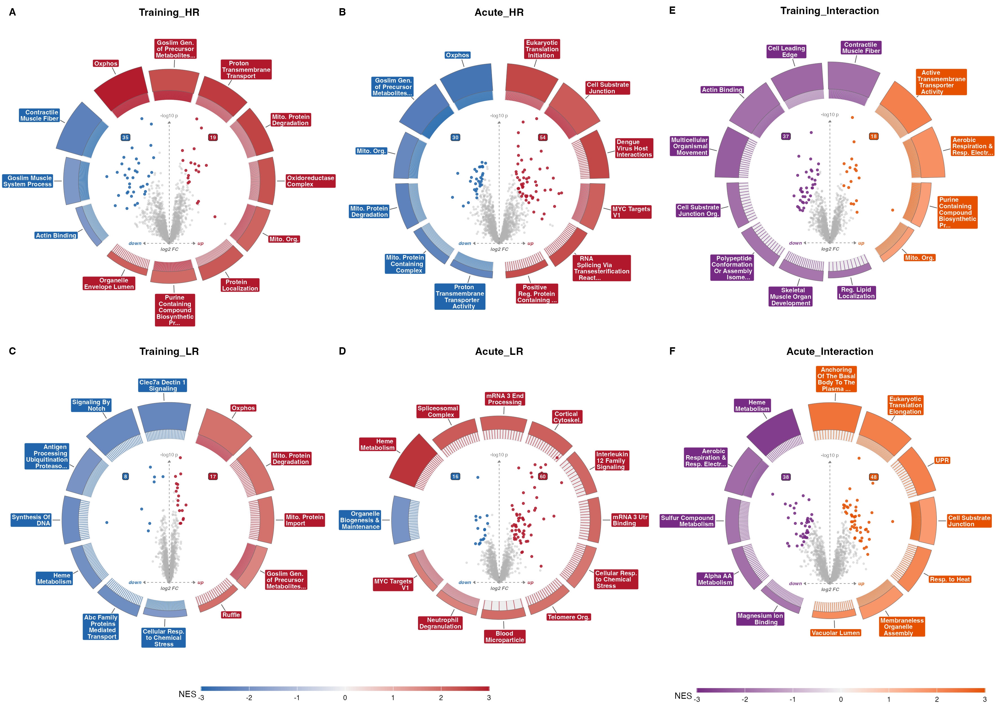
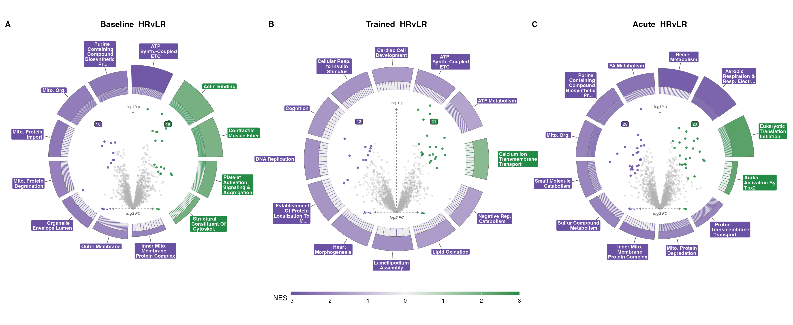

## What the figure shows

Figure 3 draws each differential-expression contrast as a volcano-in-ring
plot. The centre is an ordinary volcano: protein log fold-change on the
x-axis, `-log10` p-value on the y-axis, one point per protein. Around it
sits a ring of arcs, one arc per enriched pathway, coloured by GSEA
normalised enrichment score (NES). A single panel answers two questions at
once for one contrast: which proteins move, and which pathways those
movements add up to.

The study is 8 high responders (HR) against 8 low responders (LR), measured
across baseline, trained, and acute-exercise states. The nine estimable
contrasts split across two composites, each ring keyed to a family palette
so a reader never mistakes one kind of comparison for another.

The first composite holds the within-group and interaction contrasts in
three stacked columns — training, acute, interaction:

- **Responses** (red up, blue down) — the four within-group changes: what
  moves inside HR and inside LR over training (T2−T1, left column) and over
  the acute bout (T3−T2, middle column).
- **Interaction** (orange up, purple down) — where the two groups'
  *responses* diverge, over training and over the acute bout (right column).



The second composite holds the between-responder differences, HR against LR
at each state:

- **Differential** (green up, purple down) — `Baseline_HRvLR`,
  `Trained_HRvLR`, `Acute_HRvLR`, read left to right as the untrained,
  trained, and acute states.



## The two colour scales are different things

There are two significance signals in this figure and they follow different
rules. Keeping them straight matters for reading the panels.

**Volcano points** are coloured by the pipeline's gate, the same gate every
other stage uses: `pi_score = P.Value ^ |logFC|`, significant when
`pi_score < 0.05`. This is an in-house score, not the Xiao π-value (which is
the *product* `|log2FC| × -log10 P`). It rewards proteins that are both
confidently and substantially changed. `enrichVolcano` expects the point
significance in a column named `padj`; the panel hands the pi-score into
that slot, so inside the plotting object the significant column is labelled
`padj` while the values are pi-scores. The label is the package's; the
statistic is ours.

**Ring arcs** use a genuine FDR. The fgsea results are filtered at
`padj < 0.05` in the usual Benjamini-Hochberg sense before an arc is drawn,
and the arc is coloured by NES.

## Reads and writes

The figure reads one file, the combined DEP table from stage 03:

- `03_DEP/a_non_imputed/c_data/03_combined_results.csv` — one row per
  protein, with `logFC_`, `P.Value_`, `t_`, and `pi_score_` columns suffixed
  by each of the nine contrast names.

It writes into `b_reports/` and `c_data/`:

- `b_reports/F03_composite.png` / `.pdf` — the responses-and-interaction
  composite (six rings).
- `b_reports/F03_HRvLR.png` / `.pdf` — the between-responder composite
  (three rings).
- `b_reports/supp/top30_<contrast>.png` / `.pdf` — one no-dedup top-30 up /
  top-30 down figure per contrast.
- `c_data/F03_source_data.xlsx` — the fgsea cache plus the ring provenance.

The workbook is both the source-data export and the cache for the downstream
figures. F03 recomputes the fgsea enrichment fresh on every run, seeded for
reproducibility, and the `fgsea_all` sheet is what the F04 and F05 NES
scatters read instead of rerunning GSEA. The enrichment is paid for once per
F03 run, and the three figures cannot drift apart.

### Setup: ranks and the fgsea cache

The setup script builds the ranks per contrast and runs fgsea against the
pathway collection, then writes the result to the workbook. The rank is the
**limma moderated-t statistic**, sorted high to low, one value per gene —
the natural ranking metric for a limma fit and the standard input to a
preranked GSEA (Subramanian 2005; Korotkevich 2021; Smyth 2004).

```{r}
#| eval: false
pacman::p_load(here, dplyr, tidyr, readr, tibble, fgsea, msigdbr, openxlsx)
source(here("04_Figures", "functions", "style.R"))
source(here("04_Figures", "functions", "pathway_utils.R"))
source(here("03_DEP", "contrasts.R"))

CONTRASTS <- sub(" =.*$", "", HRVLR_CONTRASTS)

dep <- read_csv(
  here("03_DEP", "a_non_imputed", "c_data", "03_combined_results.csv"),
  show_col_types = FALSE
)

pw <- build_pathway_collection(
  min_size = 15, max_size = 500, include_goslim = TRUE, exclude_variants = TRUE
)
set.seed(42)
fg <- lapply(CONTRASTS, function(ct) {
  d <- tibble(gene = dep$gene, t = dep[[paste0("t_", ct)]]) |>
    filter(!is.na(gene), !is.na(t)) |>
    distinct(gene, .keep_all = TRUE)
  ranks <- sort(setNames(d$t, d$gene), decreasing = TRUE)
  res <- run_fgsea_deduplicated(ranks, pw)
  res$contrast <- ct
  res$leadingEdge <- vapply(res$leadingEdge, paste, character(1), collapse = ";")
  res
}) |>
  bind_rows()
```

The collection spans Hallmark, KEGG, Reactome, GO:BP, GO:CC, GO:MF, and GO
Slim, gated to pathways of 15 to 500 genes. `fgseaMultilevel` runs with
`eps = 0` and `nPermSimple = 10000`. Pooling GO Slim with the full GO
branches double-counts related terms, so the cache is only the shared NES
source; the
ring's own redundancy control happens at display.

### Display dedup: the EnrichmentMap coefficient

The rings do not draw every significant pathway. Each contrast's significant
set is collapsed with the EnrichmentMap combined similarity coefficient
(Merico 2010; Reimand 2019): for two gene sets,

$$\text{similarity} = 0.5 \times \text{overlap} + 0.5 \times \text{Jaccard},$$

with `overlap = |A ∩ B| / min(|A|, |B|)` and
`Jaccard = |A ∩ B| / |A ∪ B|`. Two sets are redundant at
`similarity ≥ 0.375`, the EnrichmentMap default. The collapse is greedy in
FDR order, so the most significant member of a redundant cluster is the one
kept, and it runs within each database first and then across databases, so
`REACTOME_TCA_CYCLE` and `KEGG_CITRATE_CYCLE` reduce to one arc. From the
survivors the ring shows the **top 12 by FDR**.

```{r}
#| eval: false
ring_enrich <- function(fg, ct, pw, ring_n = 12) {
  sig <- as.data.frame(ring_significant(fg, ct))
  report <- dedup_report(sig, pw)
  kept <- report[report$dedup_status == "kept", , drop = FALSE]
  kept <- kept[order(kept$padj), ][seq_len(min(ring_n, nrow(kept))), ]
  tibble(
    pathway = clean_pathway_name(kept$pathway),
    NES = kept$NES, padj = kept$padj, size = kept$size,
    leading_edge = kept$leadingEdge, database = kept$database
  )
}
```

This is the same EnrichmentMap dedup the Mito pipeline uses. It is kept
separate from the Jaccard collapse inside `run_fgsea_deduplicated`, which is
frozen because the F04/F05 concordance read pivots the cached `fgsea_all`;
`ring_pathways` in the workbook records, per contrast, which pathways were
kept, which merged into which, and which twelve were drawn.

### Panel: one family, one palette

Each family is a `volcano_ring_grid` recoloured to its palette. The package
owns the geometry, labels, and legend; the panel only prepares the two tidy
frames and names the palette.

```{r}
#| eval: false
render_family <- function(fg, dep, pw, contrasts, palette, ncol) {
  prep <- lapply(contrasts, function(ct) ring_enrich(fg, ct, pw))
  volc_dfs <- lapply(contrasts, function(ct) ring_volc(dep, ct))
  volcano_ring_grid(
    volc_dfs, lapply(prep, `[[`, "enrich"),
    contrasts = contrasts, ncol = ncol, genes_sep = ";",
    legend_position = "bottom",
    theme = volcano_ring_theme(
      up = palette$up, down = palette$down, nes_colors = palette$nes
    )
  )
}
```

## The interactions are exploratory

The interaction contrasts carry the central claim — that HR and LR diverge
in the magnitude and trajectory of their response, not only in baseline
state. They also sit at the lowest-powered cells of an unbalanced 16-subject
design (two subjects contribute a single timepoint). GSEA aggregates weak
per-protein signal into pathway signal, which is why enrichment is defensible
at this n, but the interaction arcs are read as hypothesis-generating.
Responder-stratified muscle omics reports enrichment on such splits as
descriptive rather than confirmatory (Phillips 2013; Robinson 2017; MoTrPAC
2024).

## Recap

- Two composites: responses and interactions (six rings, red/blue and
  orange/purple) and the between-responder HRvLR differences (three rings,
  green/purple). Every ring in a composite is the same size.
- Volcano points use the pipeline pi-gate `P.Value ^ |logFC| < 0.05`; ring
  arcs use fgsea FDR `< 0.05`, coloured by NES.
- Ranks are the limma moderated-t; fgsea against Hallmark, KEGG, Reactome,
  GO:BP, GO:CC, GO:MF, and GO Slim, sizes 15–500, seeded.
- Rings show the top 12 by FDR after an EnrichmentMap `0.375` collapse; the
  cache dedup that feeds F04/F05 is separate and frozen.
- Each contrast also gets a no-dedup top-30 up / top-30 down figure in the
  supplement, bars filled by database with names inline.

```{r}
#| eval: true
#| echo: false
sessionInfo()
```
