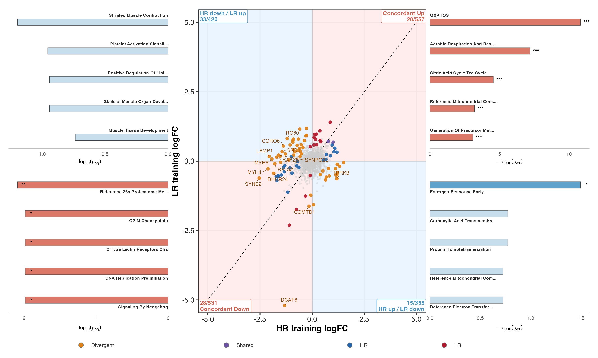
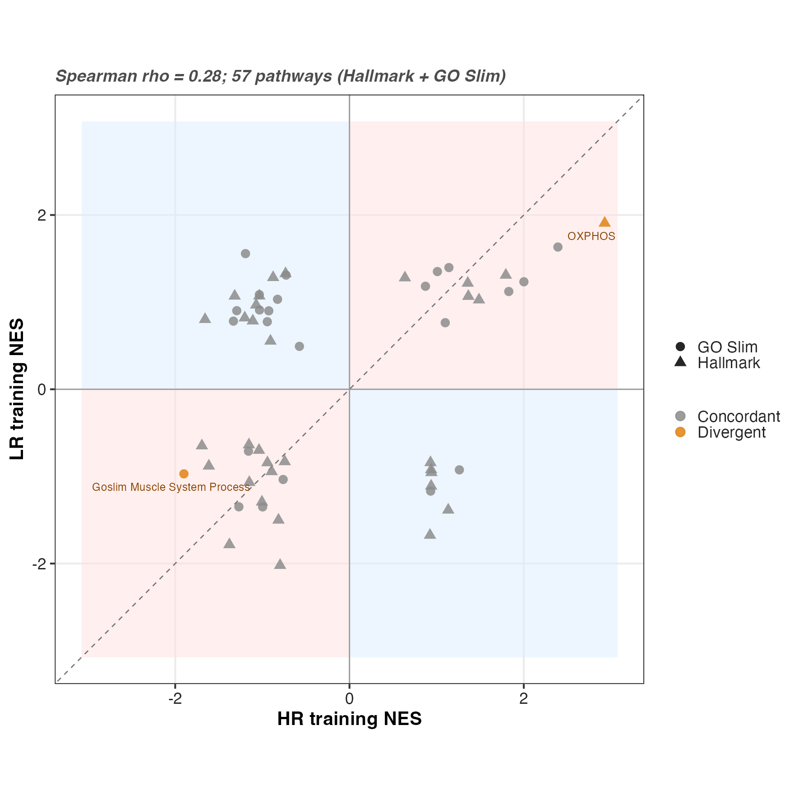
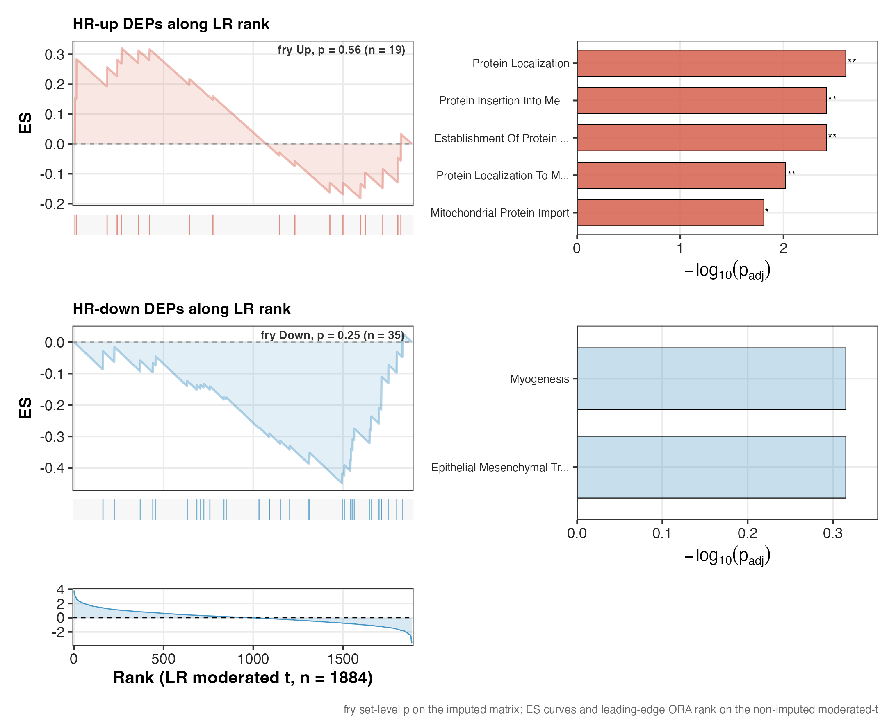
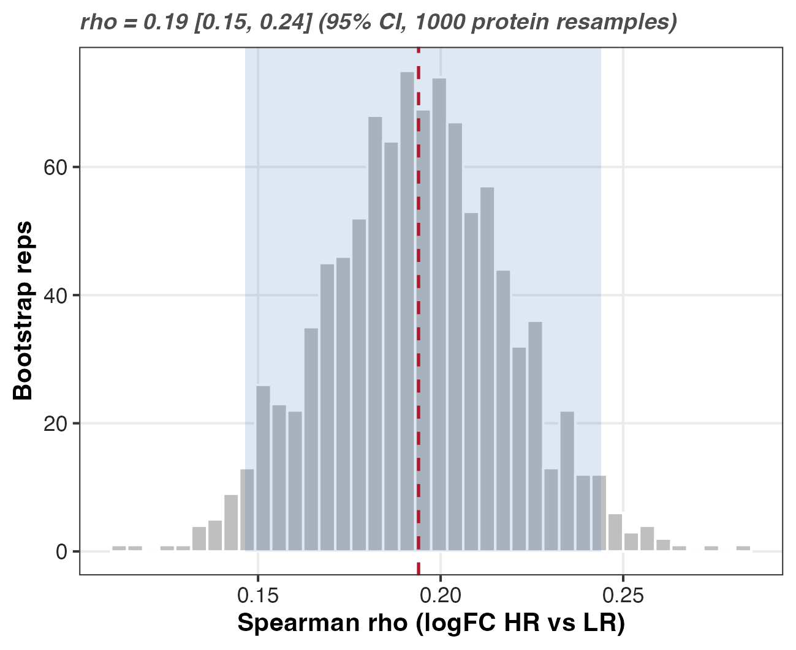
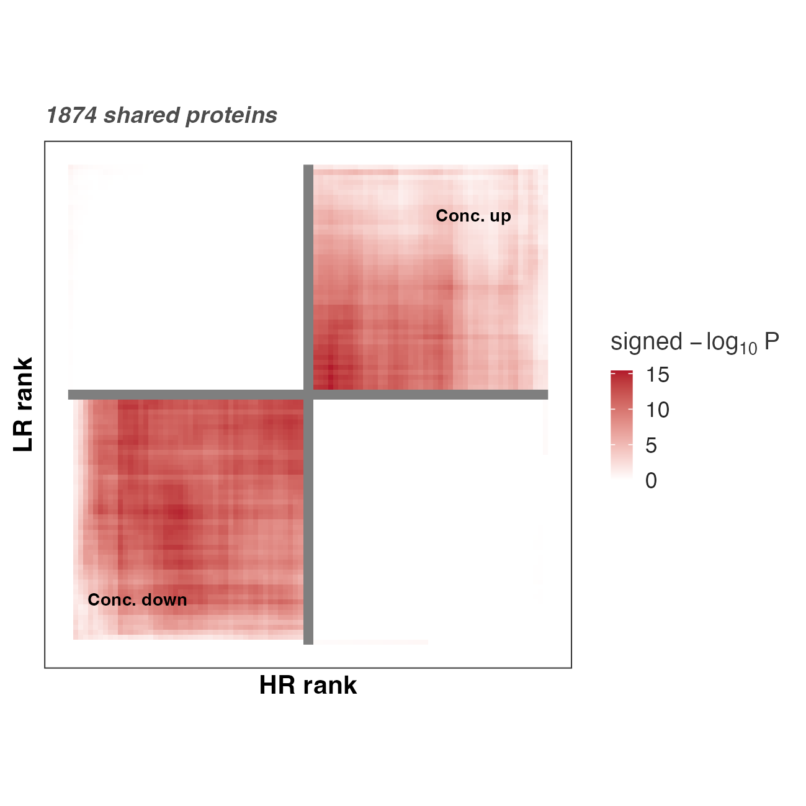
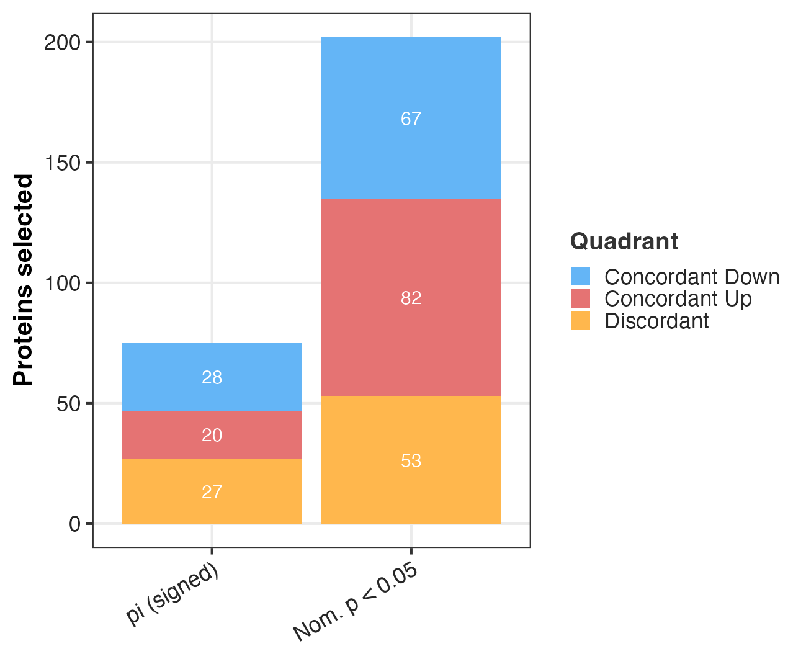

## The question

Eight high responders (HR) and eight low responders (LR) trained over the same
block. Both groups adapt from T1 to T2, so the question is not whether the
proteome moves but where the two groups move the same way and where they part.
Figure 4 is the training arm of that comparison. It maps the HR training
response against the LR training response and asks two things: which proteins
and pathways shift in the same direction in both groups (shared adaptation), and
which shift in a way that depends on responder status (responder-specific
divergence).

Divergence is read off the modelled interaction contrast, not off the eye. A
protein sits in the divergent class because its HR-vs-LR training difference is
significant under the interaction test, not because its two point estimates
happen to fall on opposite sides of a line. That keeps the divergence claim
anchored to a test rather than to visual separation on a scatter.

F04 is the training figure (T1 to T2). Its acute sibling, F05, runs the same
code on the acute contrast pair. Both call one parameterised driver,
`render_concordance_figure()`, and differ only in configuration (the contrast
pair, the factor levels, and the labels). There is one pipeline, not two.

## Composite


## Inputs and outputs

The driver reads three things and writes panel graphics, per-panel tables, and a
bundled source-data workbook.

Reads:

- `03_DEP/a_non_imputed/c_data/03_combined_results.csv` — per-protein logFC,
  moderated t, p-values, FDR, and the signed pi significance flag for every
  contrast, HR training, LR training, and the training interaction.
- `02_Normalization/imputation/c_data/DAList_imputed_missforest.rds` — the
  missForest-imputed matrix and metadata. The fry rotation test needs a complete
  matrix, so it uses the imputed DAList rather than the non-imputed DEP table.
- `04_Figures/F03/c_data/F03_source_data.xlsx` (sheet `fgsea_all`) — the fgsea
  cache. NES is computed once in F03 and reused here, so the F04 NES scatter and
  the F03 enrichment figure cannot drift apart and no permutation test reruns.

Writes, under `04_Figures/F04/`:

- `b_reports/panels/` and `b_reports/supp/` — panel and supplementary PNG + PDF.
- `c_data/*.csv` — one table per panel (quadrant table, quadrant ORA, NES
  scatter, fry results, threshold sensitivity, bootstrap CI).
- `c_data/F04_source_data.xlsx` — every table above plus an overview sheet.

```r
render_concordance_figure(list(
  fig_id = "F04",
  c_hi = "Training_HR", c_lo = "Training_LR", c_int = "Training_Interaction",
  hi_levels = c("HR_T1", "HR_T2"), lo_levels = c("LR_T1", "LR_T2"),
  labels = list(
    hi = "HR", lo = "LR", phase = "Training",
    x = "HR training logFC", y = "LR training logFC",
    x_short = "HR training", y_short = "LR training"
  ),
  title = "Figure 4. Training response: shared adaptation and responder-specific divergence",
  subtitle = "HR vs LR over T1 to T2. Diagonal = concordant; off-diagonal and orange = interaction-significant divergence."
))
```

## Panel A — quadrant concordance map with per-quadrant ORA



Each protein is placed by the sign pair of its HR and LR training logFC. The two
concordant quadrants hold proteins that move the same direction in both groups
(up in both, down in both); the two off-diagonal quadrants hold proteins that
move opposite ways. Points are coloured by class: divergent (interaction
significant), shared (significant in both arms), HR-only, LR-only, or NS. The
dashed identity line is where perfect agreement would fall, and the Spearman
correlation of the two logFC vectors summarises how tightly the cloud hugs it.

```r
build_quadrant_table <- function(dep, c_hi, c_lo, c_int) {
  q <- tibble(
    gene = dep$gene,
    lfc_hi = dep[[paste0("logFC_", c_hi)]],
    lfc_lo = dep[[paste0("logFC_", c_lo)]],
    sig_hi = dep[[paste0("sig_pi_", c_hi)]] != 0,
    sig_lo = dep[[paste0("sig_pi_", c_lo)]] != 0,
    sig_int = dep[[paste0("sig_pi_", c_int)]] != 0
  ) |>
    filter(!is.na(gene), !is.na(lfc_hi), !is.na(lfc_lo)) |>
    distinct(gene, .keep_all = TRUE)

  q$quadrant <- dplyr::case_when(
    q$lfc_hi > 0 & q$lfc_lo > 0 ~ "Concordant Up",
    q$lfc_hi < 0 & q$lfc_lo < 0 ~ "Concordant Down",
    q$lfc_hi > 0 & q$lfc_lo < 0 ~ "HR Up / LR Down",
    TRUE ~ "HR Down / LR Up"
  )
  q$class <- dplyr::case_when(
    q$sig_int ~ "Divergent",
    q$sig_hi & q$sig_lo ~ "Shared",
    q$sig_hi ~ "HR",
    q$sig_lo ~ "LR",
    TRUE ~ "NS"
  )
  q
}
```

Over-representation runs per quadrant. Two choices in `run_quadrant_ora()` carry
the interpretation.

The background universe is the set of proteins actually tested in this
experiment, `universe <- quad_tbl$gene`, not the human genome. This is the point
that makes the enrichment honest. A proteomics run measures a biased slice of
the proteome (abundant, soluble, tryptic-friendly proteins), so scoring a
quadrant against all human genes would count that measurement bias as biology
and inflate every term. Testing against the measured background asks the correct
question: given the proteins we could have detected, is this quadrant enriched
beyond chance.

Redundant pathways are collapsed by Jaccard overlap (`jaccard_cutoff = 0.5`), so
a quadrant's bars show distinct biology rather than five phrasings of one gene
set. `padj_cutoff = 1` keeps non-significant terms in the table so a sparse
quadrant still reports its leading terms, with significance shown by the bar
alpha and stars rather than by omission.

```r
run_quadrant_ora <- function(quad_tbl, pw, n_show = 5) {
  universe <- quad_tbl$gene
  out <- lapply(QUAD_LEVELS, function(q) {
    genes <- quad_tbl$gene[quad_tbl$quadrant == q]
    if (length(genes) < 5) {
      return(NULL)
    }
    res <- run_ora_deduplicated(
      genes = genes, universe = universe, pathways = pw,
      jaccard_cutoff = 0.5, min_size = 15, max_size = 500, padj_cutoff = 1
    )
    if (nrow(res) == 0) {
      return(NULL)
    }
    res |>
      mutate(
        quadrant = q,
        pathway_label = clean_pathway_name(pathway, 30),
        neg_log10_padj = -log10(padj),
        significant = padj < 0.05
      ) |>
      arrange(desc(neg_log10_padj)) |>
      slice_head(n = n_show)
  })
  bind_rows(out)
}
```

## Panel B — pathway NES concordance scatter



Panel B lifts the concordance question from proteins to pathways. It plots each
pathway's fgsea normalised enrichment score for the HR training contrast against
its score for the LR training contrast (Hallmark and GO Slim), and reports the
Spearman correlation of the two NES vectors. Pathways flagged by the cached
interaction GSEA are highlighted as divergent.

The NES values are read from the F03 cache, not recomputed. fgsea is a
permutation method, so computing NES once in F03 and reusing it keeps this panel
numerically identical to the enrichment figure and avoids a second stochastic
run.

The Spearman value is a within-cohort concordance, an association between two
responses measured in the same block. It says how similarly the HR and LR
proteomes reorganise under training. It is not a prediction: nothing here forecasts
one group's response from the other, and a high rho means the two groups adapt
alike, not that responder status can be read off the training proteome.

```r
panel_nes_scatter <- function(nes_wide, c_hi, c_lo, labels) {
  x <- nes_wide[[paste0("NES_", c_hi)]]
  y <- nes_wide[[paste0("NES_", c_lo)]]
  ct <- suppressWarnings(cor.test(x, y, method = "spearman"))
  lim <- max(abs(c(x, y))) * 1.05
  d <- nes_wide |>
    mutate(
      nx = x, ny = y,
      class = if_else(!is.na(padj_int) & padj_int < 0.05, "Divergent", "Concordant")
    )
  # ... geoms and labels ...
  list(plot = p, rho = unname(ct$estimate), data = d)
}
```

## Supp — fry rotation test



The fry panel asks a directional version of the concordance question: do the
proteins that changed in HR sit high (or low) in the LR ranking. It takes the
HR-significant up and down sets and tests their position along the LR
moderated-t statistic.

The method is fry, not camera, and the design is why. These are repeated
measures on 16 subjects, so the residuals within a subject are correlated. fry
carries that structure directly: it takes the same design matrix, the
within-subject block, and the `duplicateCorrelation` consensus that the DEP
model uses, so the rotation respects the subject grouping. camera instead leans
on an inter-gene correlation estimate that assumes a simpler error structure;
under this blocked repeated-measures design that assumption does not hold, and
its variance-inflation factor would be estimated on the wrong footing. fry gives
a valid set-level p-value here where camera would not. The seed is fixed so the
rotation is reproducible.

```r
run_fry_concordance <- function(da, dep, pw, c_hi, c_lo, lo_levels) {
  set.seed(42)
  mat <- as.matrix(da$data)
  meta <- da$metadata
  meta$Group_Time <- factor(meta$Group_Time)
  design <- model.matrix(~ 0 + Group_Time, data = meta)
  colnames(design) <- sub("^Group_Time", "", colnames(design))
  block <- meta$Subject_ID
  corfit <- duplicateCorrelation(mat, design, block = block)
  cm <- makeContrasts(contrasts = paste0(lo_levels[2], " - ", lo_levels[1]), levels = design)

  imp_ids <- rownames(mat)
  sig <- dep[dep[[paste0("sig_pi_", c_hi)]] != 0 & dep$uniprot_id %in% imp_ids, ]
  lfc_hi <- sig[[paste0("logFC_", c_hi)]]
  up_ids <- sig$uniprot_id[lfc_hi > 0]
  dn_ids <- sig$uniprot_id[lfc_hi < 0]
  idx <- list(Up = match(up_ids, imp_ids), Down = match(dn_ids, imp_ids))
  idx <- idx[vapply(idx, length, integer(1)) >= 3]
  res <- fry(mat,
    index = idx, design = design, contrast = cm[, 1],
    block = block, correlation = corfit$consensus.correlation
  )
  # ... running-ES ranking + leading-edge ORA ...
}
```

## Supp — bootstrap CI on the concordance



This panel puts an interval on the Panel A Spearman correlation by resampling. It
draws proteins with replacement 1000 times and recomputes rho each time, then
takes the 2.5th and 97.5th percentiles.

The resampled unit is the protein, and that is stated plainly. This is a
confidence interval on cross-protein concordance, how stable the HR-vs-LR
agreement is to which proteins entered the comparison. It is not a subject-level
interval and does not capture between-subject sampling variability; resampling 16
subjects would answer that separate question. The seed is fixed so the interval
is reproducible.

```r
panel_rho_bootstrap <- function(dep, c_hi, c_lo, reps = 1000) {
  set.seed(42)
  d <- tibble(
    x = dep[[paste0("logFC_", c_hi)]],
    y = dep[[paste0("logFC_", c_lo)]]
  ) |>
    filter(!is.na(x), !is.na(y))
  obs <- cor(d$x, d$y, method = "spearman")
  vals <- vapply(seq_len(reps), function(i) {
    idx <- sample(nrow(d), replace = TRUE)
    cor(d$x[idx], d$y[idx], method = "spearman")
  }, numeric(1))
  ci <- quantile(vals, c(0.025, 0.975))
  # ... histogram with observed rho and CI band ...
}
```

## Supp — RRHO2 and threshold sensitivity



RRHO2 is the threshold-free view. Rather than committing to a significance cut,
it slides across both moderated-t rankings and maps where the HR and LR lists
overlap, so concordant-up and concordant-down agreement shows up as signed
hotspots without any protein being called significant. It is a check that the
quadrant story does not hinge on the cutoff.



The threshold panel is the complementary sensitivity view. It recomputes the
concordant-up, concordant-down, and discordant counts at four selection rules
(the signed pi flag, FDR < 0.05, FDR < 0.10, and nominal p < 0.05) so the
balance of shared versus divergent proteins can be read as a function of
stringency rather than at one arbitrary line.

## One driver, two figures

F04 (training, T1 to T2) and F05 (acute) are the same analysis run on different
contrasts. Both call `render_concordance_figure()`, and only the config differs:
the contrast triple (`c_hi`, `c_lo`, `c_int`), the factor levels, the axis
labels, and the composite title. The quadrant map, the ORA background handling,
the NES scatter, and the fry, bootstrap, RRHO2, and threshold supplements are
defined once in `04_Figures/functions/concordance.R` and shared. Keeping a
single source means a method change lands in both figures at once and the two
cannot silently diverge.
