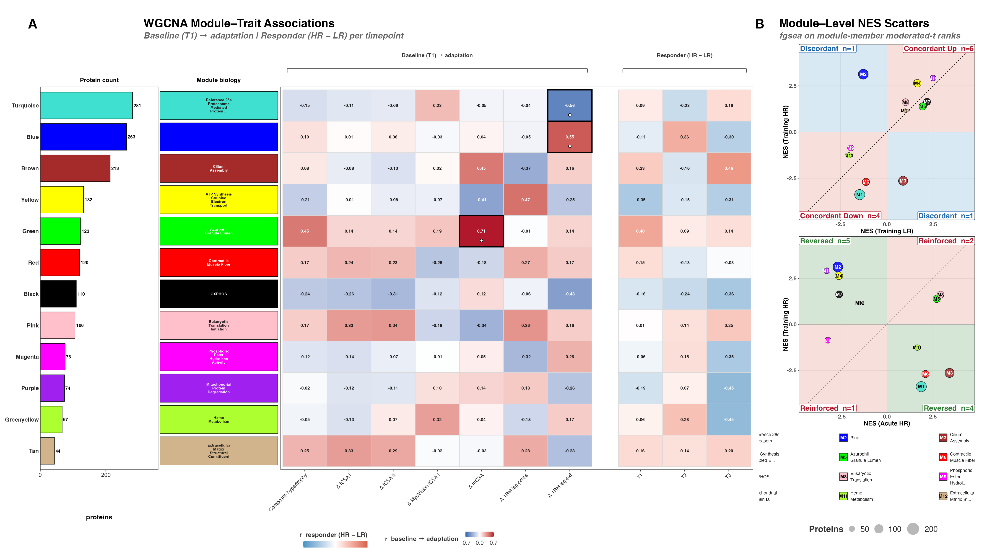
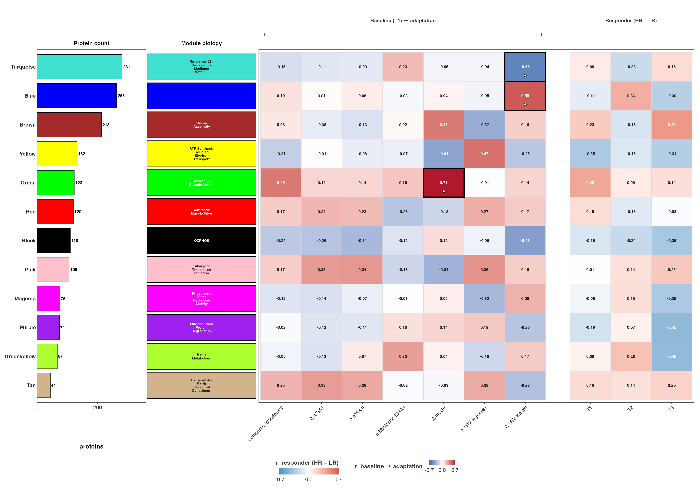
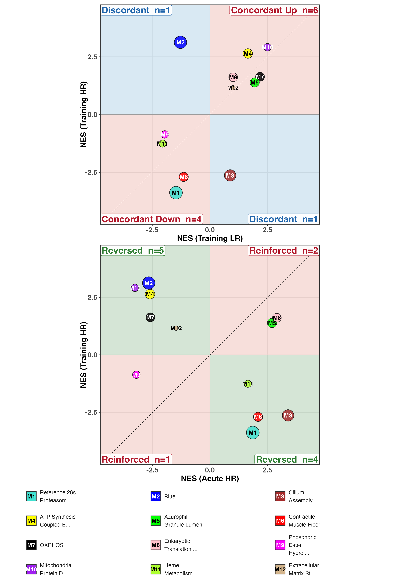
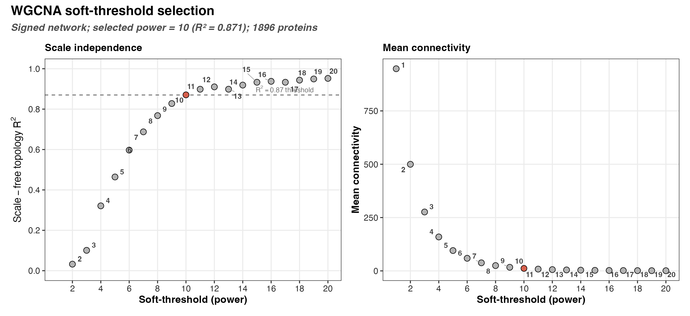
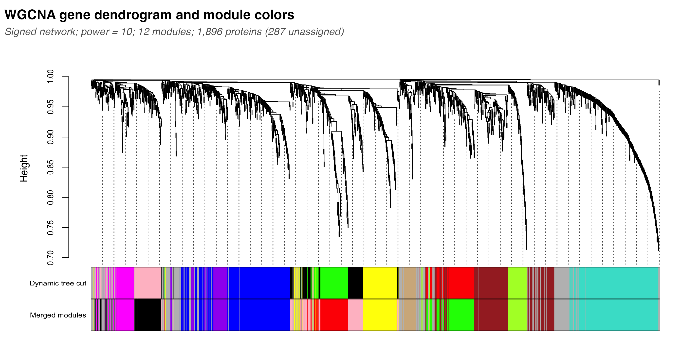
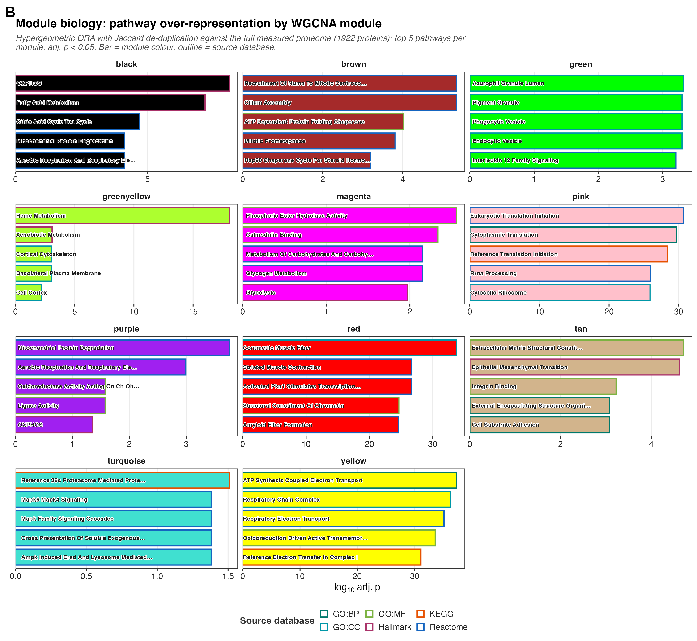
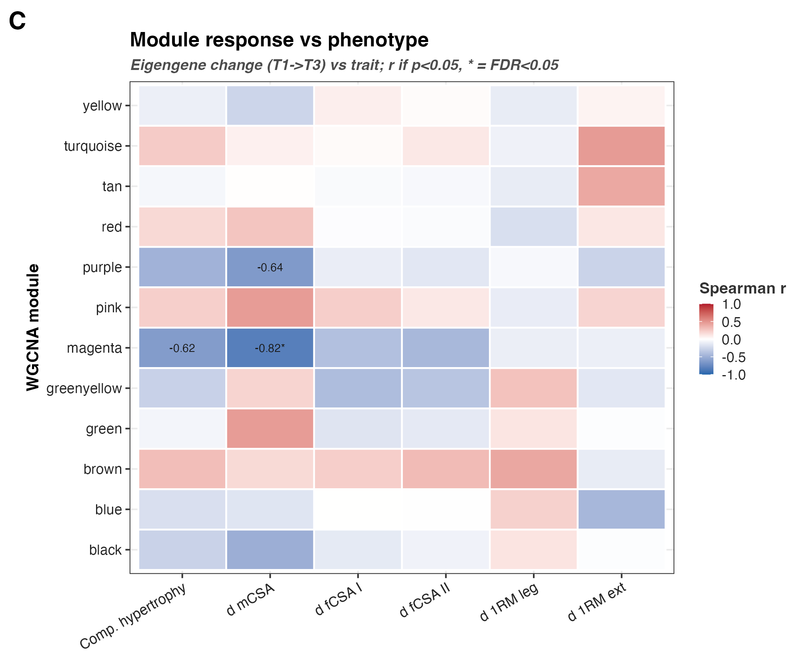
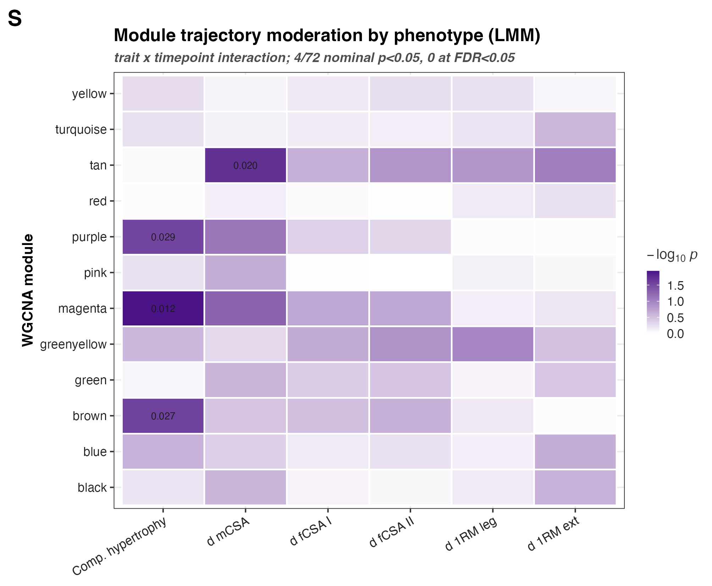

## What this figure asks

The earlier figures test proteins one at a time against a contrast we chose. F04
steps back and asks the data to group itself. WGCNA builds co-expression modules
from the full proteome without being told anything about HR, LR, or timepoint.
Proteins that move together across the 45 samples land in the same module, and
each module is summarised by its first principal component, the **eigengene**.

That gives three questions, answered in order:

- Which co-expression modules exist in this cohort, and how large are they?
- What biology does each module carry?
- Does a module track the phenotype — the baseline state, or the size of the
  training adaptation?

The modules come first and the phenotype links come after, so no module is defined
to fit the outcome. That ordering is the one real protection this figure has, and
it is worth keeping in mind while reading Panel B, where a different kind of
circularity does creep in (see @sec-circular).

## What F04 found

**The module atlas is essentially null, and that is the finding.** Of 84
module × trait cells in the baseline→adaptation grid, three reach p < 0.05 with a
positive leave-one-out Q²: green × ΔmCSA (r = 0.71, Q² = 0.32), blue × Δ1RM
leg-ext (r = 0.55, Q² = 0.10), turquoise × Δ1RM leg-ext (r = −0.56, Q² = 0.05).

**None of them survives multiple-testing correction.** The best BH-adjusted p in
the whole grid is **0.24**. Testing 12 modules against 7 traits and reporting the
best cell without paying for the search would be exactly the error this figure is
built to avoid.

**The responder grid is flatter still**: min BH-adjusted p = **0.82**. Module
eigengenes do not separate HR from LR at any timepoint.

**The trajectory LMM is also null**: no module × trait interaction clears FDR
(best 0.12), and 22 of 84 fits are singular.

**Panel B is the exception, and it should not be trusted as a p-value.** Its fgsea
q-values run down to 1.9 × 10⁻⁴⁴. That number is an artefact of asking a
gene-set test to score gene sets that were *defined* as the co-expressed blocks of
the same matrix. Read the NES directions; ignore the significance. @sec-circular
explains why in full.

So: the proteome organises into 12 coherent, biologically interpretable modules,
and **none of them is a validated marker of the hypertrophy phenotype**.

## Inputs and outputs

Reads:

- `02_Normalization/imputation/c_data/DAList_imputed_missforest.rds` — the
  missForest-imputed abundance matrix. WGCNA needs a complete matrix, so it runs on
  the imputed proteome, not the non-imputed one the DEP uses.
- `03_DEP/a_non_imputed/c_data/03_combined_results.csv` — the moderated-t columns
  that Panel B ranks on, and the π flags recording the gated protein set.
- `00_input/HRvLR_meta.csv` — subject metadata and phenotype traits.

Writes to `c_data/`: `wgcna_membership.csv`, `wgcna_eigengene.csv`,
`module_ora.csv`, `module_phenotype.csv`, `module_prediction.csv`,
`module_responder.csv`, `module_phenotype_lmm.csv`, `panel_b_module_fgsea.csv`,
`phenotype.csv`, and the bundled `F04_source_data.xlsx`. Panels land in
`b_reports/panels/`, supplements in `b_reports/supp/`.

The `module_prediction` filename is kept for continuity with the retired
standalone clustering stage. **The figure is framed as association, not
prediction**, and where the object name and the figure disagree, the figure is the
honest statement.

## Setup

```{r}
#| label: setup
pacman::p_load(here, tidyverse, patchwork, grid)

source(here("04_Figures", "functions", "style.R"))
source(here("04_Figures", "functions", "pathway_utils.R"))
source(here("04_Figures", "F04", "a_script", "functions", "clustering.R"))

ci <- load_clustering_inputs()
pheno_tbl <- build_phenotype_table(here("00_input", "HRvLR_meta.csv"))

wg <- run_wgcna(ci$full_abund, ci$meta)
wgcna_mem <- wg$membership
wgcna_eig <- wg$eigengene

pred <- run_module_prediction(wgcna_eig, pheno_tbl)
resp <- run_module_responder(wgcna_eig)
pheno_lmm <- run_module_phenotype_lmm(wgcna_eig, pheno_tbl)
```

WGCNA and AnnotationDbi mask tidyverse verbs (WGCNA takes over `cor`, AnnotationDbi
shadows `select`). The setup re-attaches `tidyr` and `dplyr` last so the panels'
unqualified verbs resolve to the tidyverse versions.

## Network construction

### What a co-expression network is

Take the 45-sample abundance matrix and correlate every protein against every other
protein. Proteins that rise and fall together across subjects and timepoints get a
high correlation. WGCNA turns that correlation matrix into a network, then cuts the
network into **modules** — clusters of proteins that are far more correlated with
each other than with anything outside. A module is a hypothesis that a set of
proteins is under shared regulation.

Three choices carry the weight.

**Signed network.** A signed adjacency keeps the direction of co-expression: two
proteins are neighbours only when they move up and down *together*, not when one
mirrors the other. Anti-correlated proteins belong to different biology, so folding
them into one module would blur the read-out.

**Soft power by scale-free fit.** Real co-expression networks are approximately
scale-free: a few hub proteins with many connections, most proteins with few. WGCNA
raises the correlation to a power β, which pushes weak correlations toward zero and
leaves strong ones nearly intact, until the resulting network matches that topology.
The code sweeps β = 1…20 and takes the first power whose signed scale-free fit R²
clears 0.87. When no power reaches the cutoff — small cohorts often fall short — it
falls back to the Horvath sample-size table rather than forcing a poor fit
[@langfelder2008].

```{r}
#| label: soft-power
powers <- 1:20
sft <- WGCNA::pickSoftThreshold(expr, powerVector = powers, networkType = "signed", verbose = 0)
fit <- sft$fitIndices
r2 <- -sign(fit$slope) * fit$SFT.R.sq
n_samp <- nrow(expr)
fallback_power <- if (n_samp < 20) 18L else if (n_samp <= 30) 16L else if (n_samp <= 40) 14L else 12L
candidates <- which(r2 > 0.87)
chosen_power <- if (length(candidates)) powers[candidates[1]] else fallback_power
```

The fallback is the honest choice at 45 samples. Forcing a high-R² power here would
fit the topology to noise, and the Horvath table is the field's default for exactly
this regime. The sweep itself is shown in the supplement below, so the reader can see
whether the cutoff was met or the fallback fired.

**Determinism.** `blockwiseModules()` runs single-threaded with a fixed
`randomSeed = 12345`, so the same input always yields the same modules. The grey
module (proteins assigned to no module) is dropped from every downstream read-out.

```{r}
#| label: modules
net <- WGCNA::blockwiseModules(
  expr,
  networkType = "signed", power = chosen_power,
  minModuleSize = 30, mergeCutHeight = 0.25, deepSplit = 2,
  randomSeed = 12345, verbose = 0
)
mes_all <- WGCNA::moduleEigengenes(expr, colors = net$colors)$eigengenes
```

**Eigengene sign fix.** An eigengene is a principal component, and a PC's sign is
arbitrary — which would make "high eigengene" mean opposite things in two modules.
Each eigengene is flipped so a positive value always means *higher mean abundance*
for that module's proteins. Every correlation in Panel A then reads the same
direction, and a red tile always means "more of this module".

```{r}
#| label: sign-fix
for (mod_col in names(mes_real)) {
  in_module <- net$colors == sub("^ME", "", mod_col)
  mod_mean <- rowMeans(expr[, in_module, drop = FALSE])
  if (stats::cor(mes_real[[mod_col]], mod_mean) < 0) {
    mes_real[[mod_col]] <- -mes_real[[mod_col]]
  }
}
```

## Composite



## Panel A — module–trait atlas



**What.** One row per module, four aligned blocks. Protein count; the module's
leading ORA term as a biology label; the middle grid correlating each module's
**baseline (T1)** eigengene against each **training adaptation** (the T1→T2 trait
deltas); and the right grid correlating each eigengene against HR-versus-LR group at
each timepoint. Tiles are filled by correlation on a shared diverging scale, a bold
outline marks p < 0.05, and a white dot marks a positive leave-one-out Q².

**The 12 modules.** Turquoise (281 proteins, 26S proteasome), Blue (263), Brown (213,
cilium assembly), Yellow (132, ATP synthesis / electron transport), Green (123,
azurophil granule lumen), Red (120, contractile muscle fibre), Black (110, OXPHOS),
Pink (106, eukaryotic translation initiation), Magenta (76), Purple (74,
mitochondrial protein degradation), Greenyellow (67, heme metabolism), Tan (44, ECM
structural constituent). These are coherent, recognisable muscle biology — the
network is finding real structure.

**What Q² means.** Fit the subject-to-trait line on all subjects but one, predict the
held-out subject, repeat. Q² = 1 − SS(residual)/SS(total) *on the held-out
predictions*. Unlike R², **Q² goes negative** when the model predicts worse than
simply guessing the mean. A positive Q² is the minimum bar for "this association
survives dropping a subject".

```{r}
#| label: loo-q2
loo <- function(d) {
  if (nrow(d) < 6) {
    return(NA_real_)
  }
  p <- vapply(seq_len(nrow(d)), function(i) predict(lm(y ~ x, d[-i, ]), d[i, ]), numeric(1))
  1 - sum((d$y - p)^2) / sum((d$y - mean(d$y))^2)
}
```

**Result.** Three cells clear p < 0.05 *and* Q² > 0: **green × ΔmCSA** (r = 0.71,
Q² = 0.32), **blue × Δ1RM leg-ext** (r = 0.55, Q² = 0.10), and **turquoise × Δ1RM
leg-ext** (r = −0.56, Q² = 0.05). Those are the three dotted, outlined tiles. Every
other cell of 84 has a negative Q² — the model does worse than the mean.

**How to read it — and the correction that matters.** Three positive Q² cells out of
84 is *approximately what chance produces*. The BH-adjusted p never gets below
**0.24**, so not one of them survives the multiplicity cost of scanning a 12 × 7
grid. The responder grid is flatter still (min BH p = 0.82).

Read Panel A as a **null result with three leads**, not as three findings. A
within-cohort LOO that comes back mostly negative is far more trustworthy than an
in-sample correlation that looks impressive because it was never held out.

**And the LOO is transductive.** This is the subtle one. The eigengenes being
cross-validated were produced by running WGCNA on **all 45 samples at once**,
including the subject held out on each LOO fold. The held-out subject's data helped
define the very modules whose eigengene is then used to predict them. The
*regression* is honestly held out; the *features* are not. A fully out-of-sample
estimate would refit WGCNA inside each fold. The Q² values above are therefore
optimistic, and the truly-null read-out is if anything understated.

## Panel B — module-level NES scatters {#sec-circular}



**What it does.** Each WGCNA module is handed to fgsea *as a gene set*, and scored
against the moderated-t ranking of each contrast. The top scatter reads training
concordance (do HR and LR move the same modules the same way). The bottom reads
whether the acute response reinforces or reverses the chronic one within HR.

**Result, read as directions only.** Training: 6 modules concordant-up, 4
concordant-down, 2 discordant — HR and LR move most modules the same way, echoing
F04. Acute-vs-training in HR: 9 of 12 modules are **reversed** (the acute bout pushes
the module opposite to the way training moved it) and 3 reinforced. That reversal is
the single most interesting pattern in F04 and it is biologically sensible: an acute
bout transiently suppresses the oxidative and contractile programs that training
chronically raises.

### The significance on this panel is not real

`panel_b_module_fgsea.csv` reports q-values down to **1.9 × 10⁻⁴⁴** (brown × Acute_HR
2.4 × 10⁻³⁹, blue × Training_HR 7.2 × 10⁻³³) across a BH family of **twelve** sets.
Nowhere else in this entire pipeline does any q drop below 0.24. That discrepancy is
the tell.

fgsea's competitive null assumes the genes *within* a set are exchangeable and
effectively independent, so the variance of a set's mean rank is roughly the
gene-level variance divided by the set size. **A WGCNA module is, by construction, the
maximal block of co-expressed proteins in this exact matrix** — the strongest possible
within-set correlation a gene set can have. Its members' ranks move together, so the
true variance of the set statistic is far larger than the independent-gene formula
assumes. Dividing by a variance that is much too small yields a p-value that is much
too extreme.

These are not biological p-values. They are the co-expression structure being
re-detected by a test that assumed it away. A reviewer who knows `camera` will read
them as evidence the pipeline does not understand its own tests.

**What to do with the panel.** The **NES directions are probably genuine** — the
reversal pattern above is a real feature of the data and does not depend on the
broken null. The *significance* is manufactured. The correct tool is `limma::fry`
with the subject block and the `duplicateCorrelation` consensus, which is already used
correctly elsewhere in this repo (`04_Figures/functions/concordance.R`) and which
would give a valid set-level p-value here [@wu2010]. Until Panel B is rebuilt on fry,
quote no q-value from it.

## Supplements

### Soft-threshold sweep



The β sweep behind the network. Read it to see whether any power actually cleared the
0.87 scale-free fit cutoff or whether the Horvath fallback fired — the sentence in
"Network construction" above is only checkable against this figure.

### Module dendrogram



The hierarchical clustering the modules were cut from. Well-separated colour blocks
under distinct branches mean the cut is clean; long stretches of grey mean many
proteins joined no module.

### Module biology (ORA)



For each non-grey module, `run_ora_deduplicated()` runs a hypergeometric test of the
module's proteins against the pathway collection and deduplicates near-identical hits
so one theme does not fill the panel five times. These terms supply the biology labels
in Panel A.

The **universe is the measured proteome**, not the genome. A mass-spec run sees a
biased slice — abundant, soluble, tryptic-friendly proteins. Test a module against the
genome and any pathway that is merely *detectable* by mass spec looks enriched, because
the genome holds thousands of proteins the assay never had a chance to see. Restricting
the universe to what was actually measured removes that detection bias.

```{r}
#| label: ora-universe
all_uniprot <- unique(wgcna_mem$protein_id)
sym_map <- clusterProfiler::bitr(
  all_uniprot,
  fromType = "UNIPROT", toType = "SYMBOL", OrgDb = org.Hs.eg.db
)
universe_syms <- unique(sym_map$SYMBOL)
```

Note this ORA is a *descriptive labelling* step, not a hypothesis test about the
phenotype. It asks what a module is made of, and it is not circular in the way Panel B
is: the module was defined by co-expression, and the pathway annotation is external.

### Module response vs phenotype



Panel A's middle grid looks at the *baseline state*. This supplement looks at the
*change*: per subject, the eigengene shift from T1 to T3, correlated against each trait
with Spearman (which assumes no straight-line relationship on 16 subjects). The r is
printed only when p < 0.05 and a star added only when BH-FDR clears 0.05.

### Trajectory moderation (LMM)



The correlation above collapses each module to one T1→T3 delta. The LMM keeps all three
timepoints:

```{r}
#| label: pheno-lmm
run_module_phenotype_lmm(wgcna_eig, pheno_tbl)
# ME ~ trait * timepoint + (1 | subject), per module x trait
```

The `trait:timepoint` interaction is the direct test of trajectory moderation — whether
a module's whole time-course bends with the size of the response, which a collapsed
delta cannot ask. The subject random intercept carries the repeated-measures design.

**Result: another null.** No module × trait interaction clears FDR (best 0.12). The
`trait` main effect is recorded in `module_phenotype_lmm.csv` but deliberately **not**
plotted: a time-invariant trait can drive the random-intercept variance to zero — the
`singular` flag, which fires on **22 of 84 fits** — and that inflates the main effect.
The panel plots the interaction only, framed as the null it is.

## No cherry-picking

Every module-by-trait cell is shown, filled or blank. Nothing is dropped for being
non-significant. The p-values are BH-adjusted across the grid, so the outline in Panel A
and the star in the supplement already pay the cost of scanning every module against
every trait. The reader sees the full field and can judge how many cells cleared the bar
against how many were tested — which, here, is none.

## Key terms

**Module** — a cluster of proteins more correlated with each other than with the rest of
the proteome. A hypothesis of shared regulation, built without reference to HR/LR or
timepoint.

**Eigengene** — the module's first principal component: one number per sample summarising
the whole module. Sign-fixed so positive always means "more of this module".

**Soft power (β)** — the exponent applied to the correlation matrix so the network becomes
approximately scale-free. Chosen by scale-free fit R² > 0.87, else the Horvath
sample-size fallback.

**Signed network** — neighbours must move in the *same* direction. Anti-correlated proteins
land in different modules.

**Q² (leave-one-out)** — cross-validated R². Goes **negative** when the model predicts worse
than the mean. Positive is the minimum bar. Here it is **transductive**: the modules were
built on all 45 samples including the held-out subject, so the features saw the test fold
even though the regression did not.

**Transductive** — the held-out sample influenced the feature definition, so the estimate is
optimistic and is not out-of-sample in the strict sense.

**Competitive gene-set test** — asks whether a set's genes rank higher than genes *outside*
the set. fgsea is one. It assumes within-set independence, which is precisely what a WGCNA
module violates. See @sec-circular.

## Recap

- The proteome resolves into **12 coherent modules** with recognisable muscle biology
  (proteasome, OXPHOS, contractile fibre, ECM, translation).
- **No module is a validated phenotype marker.** Three of 84 baseline→adaptation cells have
  a positive LOO Q², none survives BH (best q = 0.24); the responder grid's best q is 0.82;
  the trajectory LMM is null (best q = 0.12).
- The LOO Q² is **transductive** — WGCNA saw all 45 samples — so those three leads are
  optimistic, not out-of-sample.
- **Panel B's q-values (down to 1.9 × 10⁻⁴⁴) are an artefact** of scoring WGCNA modules with
  a test that assumes within-set independence. Read its NES directions (9 of 12 modules
  reverse between acute and training); quote none of its p-values.

```{r sessioninfo, eval=TRUE}
sessionInfo()
```

## References

::: {#refs}
:::
