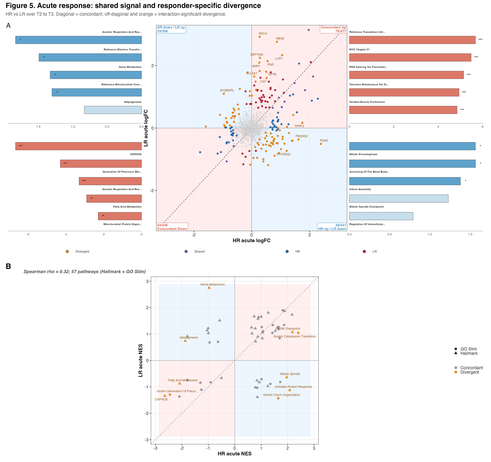
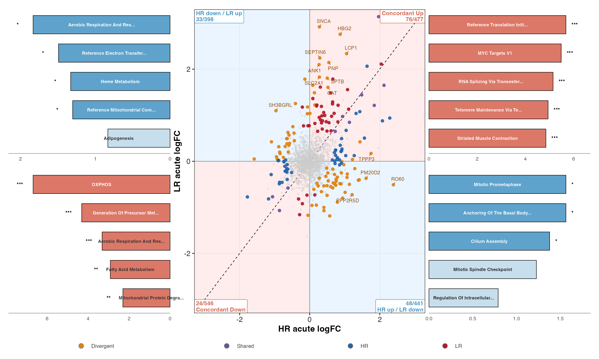
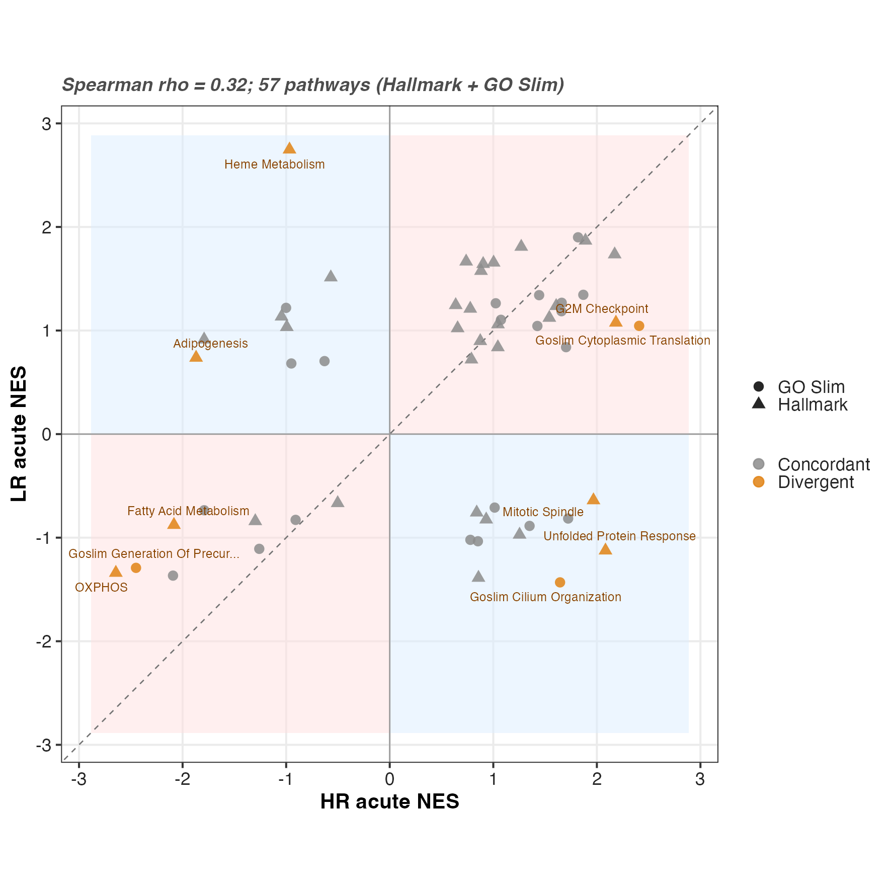
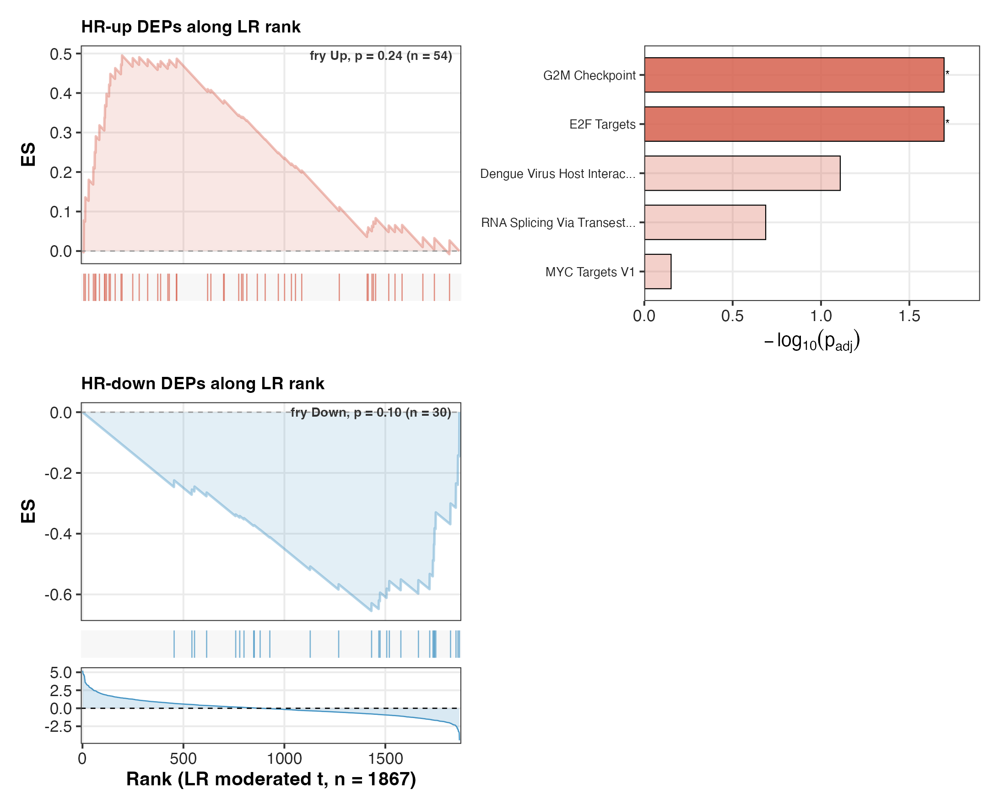
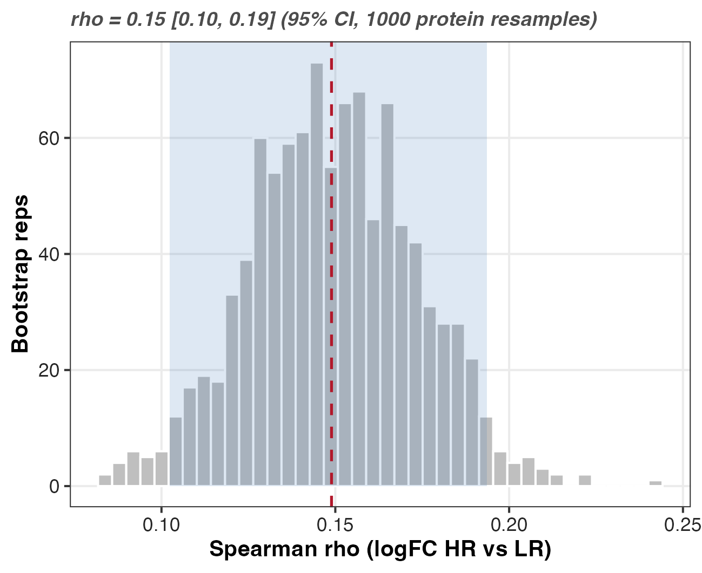
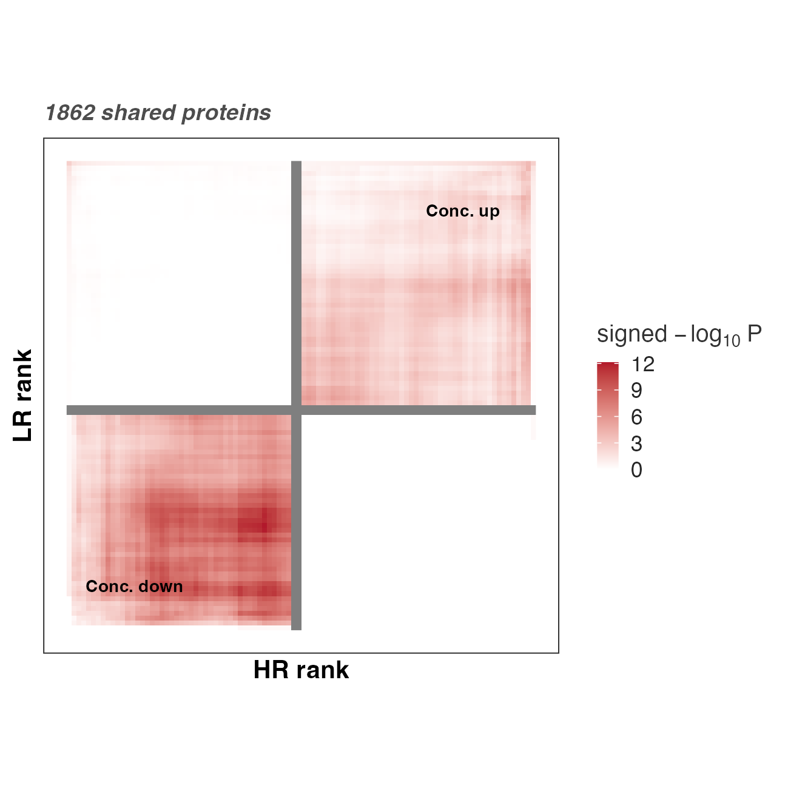

## What F05 asks

F05 covers the acute bout: the change from immediately before to after a single
session (T2 to T3). The question is whether the acute response looks the same in
high responders (HR) and low responders (LR), or whether the two groups already
diverge in how they react to one bout. A protein or pathway that moves the same
way in both groups is part of the common acute response to exercise. One that
moves in only one group, or in opposite directions, is where the responder
phenotype separates at the acute level.

This is the acute counterpart of F04. F04 maps the training response (T1 to T2);
F05 maps the acute response (T2 to T3). They are the same figure applied to
different contrasts. Both are drawn by one function,
`render_concordance_figure()`, and F05 differs from F04 only in its config: the
acute contrast triple (`Acute_HR`, `Acute_LR`, `Acute_Interaction`), the factor
levels (`HR_T2`/`HR_T3`, `LR_T2`/`LR_T3`), and the labels and titles. Because the
plotting and statistics live in the shared function, the two figures cannot drift
apart in method.

The design is 8 HR and 8 LR with repeated measures across time, which is why the
acute contrasts and the interaction come from the same subject-aware limma fit
used throughout the pipeline.

## The F05 call

`HRvLR_F05_run.R` sources the shared driver and hands it the acute config. Every
panel below comes from that one call.

```{r}
#| label: f05-run
#| eval: false
pacman::p_load(here)
source(here("04_Figures", "functions", "concordance_figure.R"))

render_concordance_figure(list(
  fig_id = "F05",
  c_hi = "Acute_HR", c_lo = "Acute_LR", c_int = "Acute_Interaction",
  lo_levels = c("LR_T2", "LR_T3"),
  labels = list(
    hi = "HR", lo = "LR", phase = "Acute",
    x = "HR acute logFC", y = "LR acute logFC",
    x_short = "HR acute", y_short = "LR acute"
  ),
  title = "Figure 5. Acute response: shared signal and responder-specific divergence",
  subtitle = "HR vs LR over T2 to T3. Diagonal = concordant; off-diagonal and orange = interaction-significant divergence."
))
```

## Reads and writes

The driver reads three inputs and writes panels, supplements, per-panel CSVs, and
one source-data workbook.

```{r}
#| label: f05-io
#| eval: false
dep <- read_csv(
  here("03_DEP", "a_non_imputed", "c_data", "03_combined_results.csv"),
  show_col_types = FALSE
)
da <- readRDS(here(
  "02_Normalization", "imputation", "c_data",
  "DAList_imputed_missforest.rds"
))
cache <- as_tibble(openxlsx::read.xlsx(
  here("04_Figures", "F03", "c_data", "F03_source_data.xlsx"),
  sheet = "fgsea_all"
))
```

- `03_combined_results.csv` carries the per-protein acute logFC, moderated t, FDR,
  and signed-pi significance for `Acute_HR`, `Acute_LR`, and `Acute_Interaction`.
  The panels read these columns by name.
- The missForest-imputed `DAList` is the complete matrix the fry rotation test
  needs. fry cannot run on the gappy non-imputed table, so the supplement uses the
  imputed abundances with the subject metadata attached.
- The F03 fgsea cache is the pathway NES table. GSEA is computed once in F03 and
  read here, so the acute NES scatter and the F03 enrichment figure report the
  same numbers.

Outputs land under `b_reports/` (panels and supp, PNG and PDF) and `c_data/`
(per-panel CSVs plus `F05_source_data.xlsx`).

## Composite

```{r}
#| label: f05-composite
#| eval: false
composite <- (wrap_elements(full = panel_a$plot) / panel_b$plot) +
  plot_layout(heights = c(1.5, 1.1)) +
  plot_annotation(tag_levels = "A")
save_panel(composite, file.path(rpt, "F05_composite"), 340, 320)
```



## Panel A — quadrant map and per-quadrant ORA

Panel A places each protein by its acute logFC in HR (x) against its acute logFC
in LR (y). The diagonal is agreement: proteins that rise or fall together in both
groups after the bout. The off-diagonal quadrants are where the acute response
points opposite ways. Proteins whose `Acute_Interaction` contrast is significant
are marked divergent, so the claim that a protein separates the groups rests on
the modelled interaction test, not on where it happens to sit in the scatter.

```{r}
#| label: panel-a
#| eval: false
quad_tbl <- build_quadrant_table(dep, cfg$c_hi, cfg$c_lo, cfg$c_int)
quad_ora <- run_quadrant_ora(quad_tbl, pw)
panel_a <- panel_quadrant_ora(quad_tbl, quad_ora, cfg$labels)
```

`build_quadrant_table()` assigns the quadrant from the sign pair of the two acute
logFCs and the divergence class from the signed-pi flags: `Divergent` when the
acute interaction is significant, then `Shared`, `HR`-only, `LR`-only, or `NS`.

Each quadrant gets its own over-representation test. The choice that matters here
is the universe: enrichment is tested against every protein measured in the acute
comparison, not against the genome.

```{r}
#| label: panel-a-ora
#| eval: false
run_quadrant_ora <- function(quad_tbl, pw, n_show = 5) {
  universe <- quad_tbl$gene
  # per quadrant: fora against the measured universe, Jaccard-deduplicated
}
```

Using the measured proteome as the background is the right call for a targeted
panel. Testing a quadrant's proteins against all human genes would count the
assay's own coverage bias as enrichment; testing against what the acute contrast
actually measured asks the honest question of whether that quadrant is enriched
relative to the rest of the detected proteins. Redundant terms are collapsed by
Jaccard overlap (cutoff 0.5) so a single biological theme does not fill the bar
block as five near-copies.



## Panel B — pathway NES scatter

Panel B is the pathway-level view of the same question. It plots the acute fgsea
NES in HR against the acute NES in LR (Hallmark and GO Slim), with pathways whose
cached acute interaction is significant highlighted as divergent.

```{r}
#| label: panel-b
#| eval: false
nes_wide <- build_nes_wide(cache, cfg$c_hi, cfg$c_lo, cfg$c_int)
panel_b <- panel_nes_scatter(nes_wide, cfg$c_hi, cfg$c_lo, cfg$labels)
```

The reported statistic is a Spearman correlation of the two NES vectors. It is a
within-cohort measure of how far the HR and LR acute pathway responses agree
across the pathways both groups express. It is a concordance, an association
between two response profiles measured in the same people. It is not a prediction:
nothing here uses one group's acute response to forecast the other, or the acute
response to forecast the training outcome. The rho says how aligned the two acute
profiles are, no more.



## Supplement — fry rotation test

The fry supplement tests whether the proteins that move in the HR acute response
are enriched, as a set, along the LR acute ranking. The design forces the choice
of test.

```{r}
#| label: supp-fry
#| eval: false
run_fry_concordance <- function(da, dep, pw, c_hi, c_lo, lo_levels) {
  set.seed(42)
  design <- model.matrix(~ 0 + Group_Time, data = meta)
  block <- meta$Subject_ID
  corfit <- duplicateCorrelation(mat, design, block = block)
  cm <- makeContrasts(
    contrasts = paste0(lo_levels[2], " - ", lo_levels[1]), levels = design
  )
  res <- fry(
    mat,
    index = idx, design = design, contrast = cm[, 1],
    block = block, correlation = corfit$consensus.correlation
  )
}
```

fry, not camera, because these are repeated measures. Each subject contributes at
both acute time points, so the observations are correlated within subject. fry
takes the subject block and the `duplicateCorrelation` consensus, so it tests the
HR set along the LR acute contrast while accounting for that within-subject
correlation. camera has no route to carry the block here and would treat paired
samples as independent. The rotation is seeded for reproducibility.



## Supplement — bootstrap CI on the concordance

```{r}
#| label: supp-bootstrap
#| eval: false
panel_rho_bootstrap <- function(dep, c_hi, c_lo, reps = 1000) {
  set.seed(42)
  obs <- cor(d$x, d$y, method = "spearman")
  vals <- vapply(seq_len(reps), function(i) {
    idx <- sample(nrow(d), replace = TRUE)
    cor(d$x[idx], d$y[idx], method = "spearman")
  }, numeric(1))
  ci <- quantile(vals, c(0.025, 0.975))
}
```

The bootstrap resamples proteins, not subjects. The interval it returns is the
variability of the HR-vs-LR acute concordance across the set of measured
proteins. It is stated openly as a protein-resampling CI: it does not capture
between-subject sampling variability, and it should not be read as one. With 8
per group the subject-level uncertainty is large and separate; this CI answers
only how stable the cross-protein concordance is. Seeded at 42.



## Supplement — RRHO2 and threshold sensitivity

Two threshold-free and sensitivity checks sit alongside the thresholded panels.

RRHO2 compares the two acute moderated-t rankings across every cutoff at once, so
the overlap between the HR and LR acute responses does not depend on one arbitrary
significance line.

```{r}
#| label: supp-rrho2
#| eval: false
rrho <- panel_rrho2(dep, cfg$c_hi, cfg$c_lo, cfg$labels)
```



The threshold-sensitivity panel recounts the concordant and discordant quadrants
under signed-pi, FDR, and nominal-p cutoffs, showing whether the acute split is an
artefact of one threshold or holds across several.

```{r}
#| label: supp-threshold
#| eval: false
supp_thresh <- panel_threshold_sens(dep, cfg$c_hi, cfg$c_lo)
```


## One function, two figures

F05 and F04 are the same figure. `render_concordance_figure()` holds the quadrant
builder, the ORA, the NES scatter, the fry test, the bootstrap, RRHO2, and the
threshold panel; F04 passes the training config and F05 passes the acute config,
and nothing else differs. The training figure reports T1-to-T2 adaptation and the
acute figure reports T2-to-T3 response, but they are drawn by identical code, so
the two cannot diverge in method. Any change to how concordance is computed lands
in both at once.
