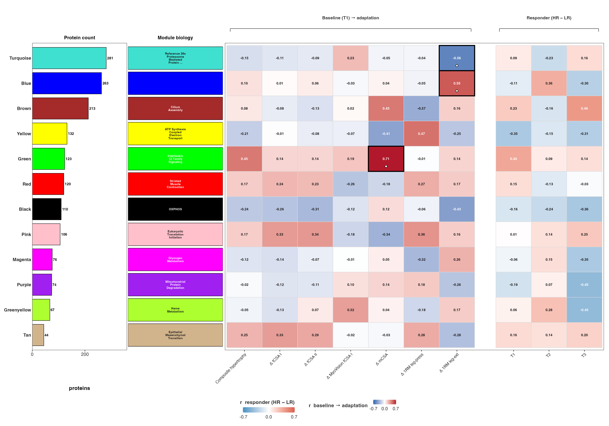
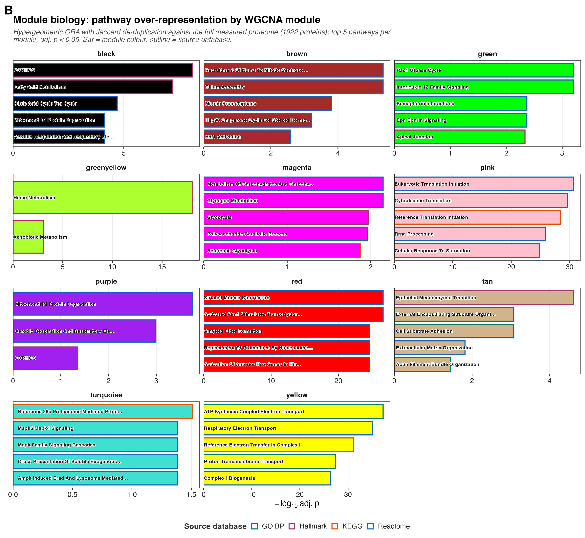
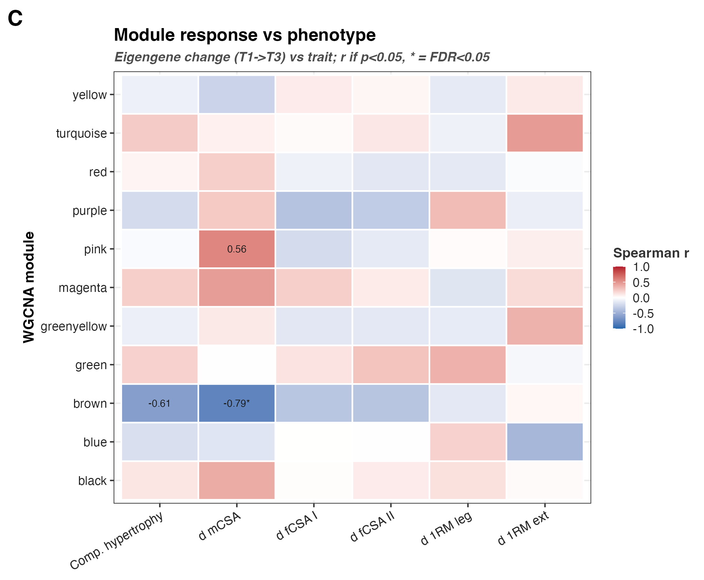
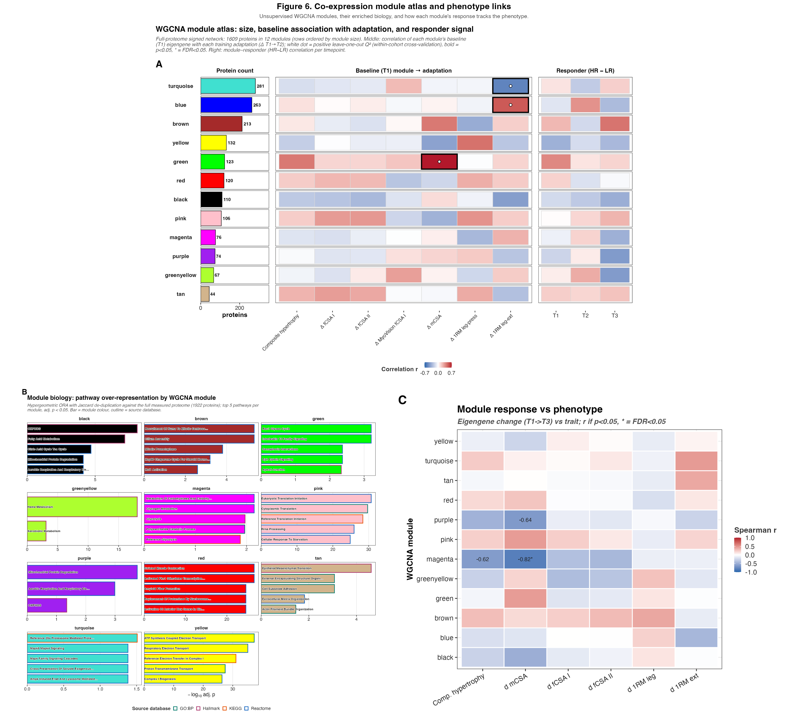

## What this figure asks

The earlier figures test proteins one at a time against a known contrast.
Figure 6 steps back from single proteins and asks the data to group itself.
WGCNA builds co-expression modules from the full proteome without being told
anything about HR, LR, or timepoint. Proteins that move together across the 45
samples land in the same module, and each module is summarised by its first
principal component, the eigengene.

That gives three questions the atlas answers in order:

- Which co-expression modules exist in this cohort, and how large are they?
- What biology does each module carry, read out by pathway over-representation?
- Does a module's response track the phenotype, either the baseline state or
  the size of the training adaptation?

The study is 8 HR versus 8 LR subjects sampled at T1, T2, T3 (n = 16, 45
samples, two subjects partial). The modules come first; the phenotype links
come after, so no module is defined to fit the outcome.

## Inputs and outputs

The compute reads the full imputed proteome and the non-imputed limma fit,
runs WGCNA once, and derives the module-level read-outs.

Reads:

- `03_DEP/a_non_imputed/c_data/01_limma_DAList.rds` — the canonical non-imputed
  limma fit. Only its per-contrast Xiao π-scores are used, to record the
  pi-gated protein set (`pi_set`).
- `02_Normalization/imputation/c_data/DAList_imputed_missforest.rds` — the
  missForest-imputed abundance matrix (no missing values) that WGCNA runs on.
- `00_input/HRvLR_meta.csv` — subject metadata and the phenotype traits.

Writes (to `c_data/`):

- `wgcna_membership.csv` — protein to module assignment.
- `wgcna_eigengene.csv` — per-sample module eigengenes.
- `module_ora.csv` — per-module pathway over-representation.
- `module_phenotype.csv` — eigengene change vs trait (Panel C).
- `module_prediction.csv` — baseline-to-adaptation association (Panel A middle).
- `module_responder.csv` — HR vs LR signal per timepoint (Panel A right).
- `phenotype.csv` — the per-subject trait table.
- Panel PNG/PDF pairs in `b_reports/panels/`, the stitched
  `b_reports/F06_composite.png` / `.pdf`, and `c_data/F06_source_data.xlsx`.

The `module_prediction` name is kept for continuity with the earlier
standalone clustering stage. The figure itself is framed as association, not
prediction. That distinction is the point of Panel A and is spelled out below.

## Setup

`HRvLR_F06_run.R` clears `b_reports`, sources the setup, renders the three
panels, then stitches the composite. The setup does the compute once so every
panel reads the same modules.

```{r}
#| label: setup
pacman::p_load(here, tidyverse, patchwork, grid)

source(here("04_Figures", "functions", "style.R"))
source(here("04_Figures", "functions", "pathway_utils.R"))
source(here("04_Figures", "F06", "a_script", "functions", "clustering.R"))

RPT_DIR <- here("04_Figures", "F06", "b_reports")
DAT_DIR <- here("04_Figures", "F06", "c_data")

ci <- load_clustering_inputs()
pi_set <- ci$pi_set
pheno_tbl <- build_phenotype_table(here("00_input", "HRvLR_meta.csv"))

wg <- run_wgcna(ci$full_abund, ci$meta)
wgcna_mem <- wg$membership
wgcna_eig <- wg$eigengene

pred <- run_module_prediction(wgcna_eig, pheno_tbl)
resp <- run_module_responder(wgcna_eig)
```

WGCNA and AnnotationDbi attach functions that mask tidyverse verbs (WGCNA
takes over `cor`, AnnotationDbi shadows `select`). The setup re-attaches
`tidyr` and `dplyr` last so the panels' unqualified verbs resolve to the
tidyverse versions.

## Network construction

`run_wgcna()` in `functions/clustering.R` builds one signed network on the
transposed abundance matrix. Two choices carry the weight.

**Signed network.** A signed adjacency keeps the direction of co-expression:
two proteins are neighbours only when they move up and down together, not when
one mirrors the other. Anti-correlated proteins belong to different biology, so
folding them into one module would blur the read-out. The soft-threshold power
is raised for signed networks accordingly.

**Soft power by scale-free fit.** Real co-expression networks are approximately
scale free: a few hub proteins, many peripheral ones. WGCNA raises the
correlation to a power so the resulting network matches that topology. The code
sweeps powers 1–20 and takes the first power whose signed scale-free fit R²
clears 0.87. When no power reaches the cutoff (small cohorts often fall short),
it falls back to the Horvath sample-size table rather than forcing a poor fit:

```{r}
#| label: soft-power
powers <- 1:20
sft <- WGCNA::pickSoftThreshold(
  expr,
  powerVector = powers, networkType = "signed", verbose = 0
)
fit <- sft$fitIndices
r2 <- -sign(fit$slope) * fit$SFT.R.sq
n_samp <- nrow(expr)
fallback_power <- if (n_samp < 20) 18L else if (n_samp <= 30) 16L else if (n_samp <= 40) 14L else 12L
candidates <- which(r2 > 0.87)
chosen_power <- if (length(candidates)) powers[candidates[1]] else fallback_power
```

The fallback is the honest choice for 45 samples. With this many observations a
forced high-R² power would overfit the topology to noise, and the Horvath table
is the field's default for exactly this regime.

**Determinism.** `blockwiseModules()` runs single-threaded with a fixed
`randomSeed = 12345`, so the same input always yields the same modules. The grey
module (proteins in no module) is dropped from every downstream read-out.

```{r}
#| label: modules
net <- WGCNA::blockwiseModules(
  expr,
  networkType = "signed", power = chosen_power,
  minModuleSize = 30, mergeCutHeight = 0.25, deepSplit = 2,
  randomSeed = 12345, verbose = 0
)

mes_all <- WGCNA::moduleEigengenes(expr, colors = net$colors)$eigengenes
```

**Eigengene sign fix.** An eigengene's sign is arbitrary out of the box, which
would make "high eigengene" mean the opposite thing in two modules. Each
eigengene is flipped so a positive value always means higher mean abundance for
that module's proteins. Every correlation in Panels A and C then reads the same
direction, and a red tile is always "more of this module".

```{r}
#| label: sign-fix
for (mod_col in names(mes_real)) {
  in_module <- net$colors == sub("^ME", "", mod_col)
  mod_mean <- rowMeans(expr[, in_module, drop = FALSE])
  if (stats::cor(mes_real[[mod_col]], mod_mean) < 0) {
    mes_real[[mod_col]] <- -mes_real[[mod_col]]
  }
}
```

## Panel A — module atlas



One row per module, three aligned blocks. The left block is module size, ordered
largest at top. The middle block correlates each module's baseline (T1)
eigengene with each training adaptation (the T1→T2 trait deltas). The right
block is the responder signal, correlating each eigengene with HR-versus-LR
group at each timepoint. Tiles are filled by correlation on a shared diverging
scale; a bold outline is p < 0.05.

The white dot in the middle block is the load-bearing mark. It appears when a
module's baseline eigengene has a **positive leave-one-out Q²**: fit the
subject-to-trait line on all subjects but one, predict the held-out subject,
and Q² > 0 means the model beats predicting the mean.

```{r}
#| label: loo-q2
loo <- function(d) {
  d <- d[stats::complete.cases(d), ]
  if (nrow(d) < 6) {
    return(NA_real_)
  }
  p <- vapply(seq_len(nrow(d)), function(i) predict(lm(y ~ x, d[-i, ]), d[i, ]), numeric(1))
  1 - sum((d$y - p)^2) / sum((d$y - mean(d$y))^2)
}
```

This is a within-cohort association with leave-one-out cross-validation, not
out-of-cohort prediction. The figure title says "association" and the subtitle
says "within-cohort" for that reason. Leave-one-out on 16 subjects tells you
whether the association holds up when you drop one subject at a time from the
same cohort. It does not tell you the model would transfer to a new cohort. The
internal object and CSV names still say "prediction" from the earlier
standalone clustering stage. Where the figure and the object name disagree, the
figure is the honest statement.

The read-out is a null one, and that is the finding. The baseline proteome does
not predict hypertrophy: leave-one-out Q² is not positive for the baseline
adaptation associations, so the white dots do not mark a real baseline
predictor. Only the acute signal carries suggestive structure. A within-cohort
LOO that comes back null is more trustworthy than an in-sample correlation that
looks impressive because it was never held out.

## Panel B — module biology (ORA)



For each non-grey module, `run_ora_deduplicated()` runs a hypergeometric
over-representation test of the module's proteins against a pathway collection,
keeps the top pathways per module, and de-duplicates near-identical hits by a
Jaccard cutoff so one biological theme does not fill the panel five times.

The universe choice is what makes the test valid.

```{r}
#| label: ora-universe
all_uniprot <- unique(wgcna_mem$protein_id)
sym_map <- clusterProfiler::bitr(
  all_uniprot,
  fromType = "UNIPROT", toType = "SYMBOL", OrgDb = org.Hs.eg.db
)
universe_syms <- unique(sym_map$SYMBOL)
```

The background universe is the full measured proteome, every protein in the
network mapped to SYMBOL, not the whole genome. A mass-spec experiment measures
a biased slice of the proteome: abundant, soluble, tryptic-friendly proteins.
Test a module against the genome and any pathway that is simply detectable by
mass spec looks enriched, because the genome contains thousands of proteins the
assay never had a chance to see. Restricting the universe to what was actually
measured removes that detection bias, so an enriched pathway means enriched
relative to the rest of this proteome.

```{r}
#| label: ora-loop
for (m in modules) {
  genes <- intersect(uniprot_to_syms(wgcna_non_grey$protein_id[wgcna_non_grey$group_id == m]), universe_syms)
  if (length(genes) < 3) next
  res <- run_ora_deduplicated(
    genes = genes, universe = universe_syms, pathways = pw,
    jaccard_cutoff = 0.5, min_size = 15, max_size = 500, padj_cutoff = 0.05
  )
  if (nrow(res) > 0) ora_rows[[m]] <- res |> mutate(group = m)
}
```

## Panel C — module response vs phenotype



Panel A middle looks at the baseline state. Panel C looks at the change. For
each subject it takes the eigengene change from T1 to T3, then correlates that
change against each phenotype trait with Spearman, which does not assume a
straight-line relationship on 16 subjects.

```{r}
#| label: panel-c-assoc
chg <- wgcna_eig |>
  dplyr::filter(group_id %in% mods, timepoint %in% c("T1", "T3")) |>
  dplyr::select(subject, module = group_id, timepoint, ME) |>
  tidyr::pivot_wider(names_from = timepoint, values_from = ME) |>
  dplyr::mutate(delta = T3 - T1)

assoc <- bind_rows(lapply(TRAITS, function(tr) {
  bind_rows(lapply(mods, function(m) {
    d <- chg |>
      dplyr::filter(module == m) |>
      dplyr::left_join(pheno_tbl |> dplyr::select(subject, dplyr::all_of(tr)), by = "subject")
    d <- d[!is.na(d$delta) & !is.na(d[[tr]]), ]
    if (nrow(d) < 6) {
      return(NULL)
    }
    ct <- suppressWarnings(cor.test(d$delta, d[[tr]], method = "spearman"))
    tibble(module = m, trait = tr, r = unname(ct$estimate), p = ct$p.value, n = nrow(d))
  }))
})) |>
  group_by(trait) |>
  mutate(fdr = p.adjust(p, "BH")) |>
  ungroup()
```

Each tile shows the correlation. The r value is printed only when p < 0.05, and
a star is added only when the BH-adjusted FDR clears 0.05. This too is a
within-cohort association: a module whose T1→T3 shift tracks the size of the
response in these subjects, not a validated marker.

## No cherry-picking

Every module-by-trait cell is shown, both here and in Panel A, filled or blank.
Nothing is dropped for being non-significant. The p-values are BH-adjusted
across the grid, so the star in Panel C and the outline in Panel A already pay
the multiple-testing cost of scanning every module against every trait. The
reader sees the full field and can judge how many cells cleared the bar against
how many were tested.

## Composite and source data

`HRvLR_F06_composite.R` reads the three committed panel PNGs, stitches them
with Panel A on top and B and C below, and writes the workbook with one sheet
per CSV.



```{r}
#| label: composite
composite <- (read_panel("panel_a_wgcna_map") /
  (read_panel("panel_b_wgcna_ora") | read_panel("panel_c_module_phenotype"))) +
  plot_layout(heights = c(1.1, 1))

ggsave(file.path(RPT_DIR, "F06_composite.png"), composite,
  width = 460, height = 420, units = "mm", dpi = 200, bg = "white"
)
```
