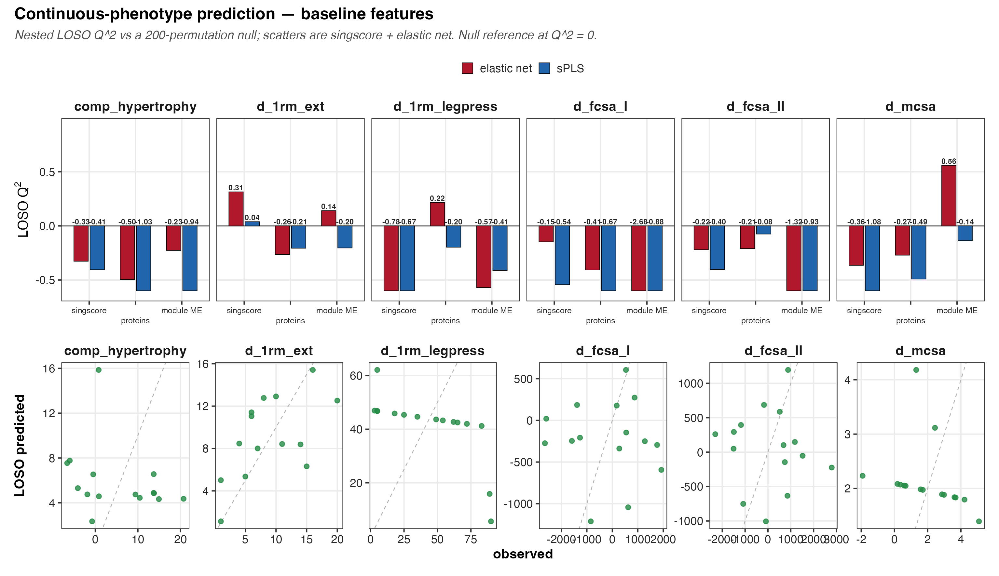
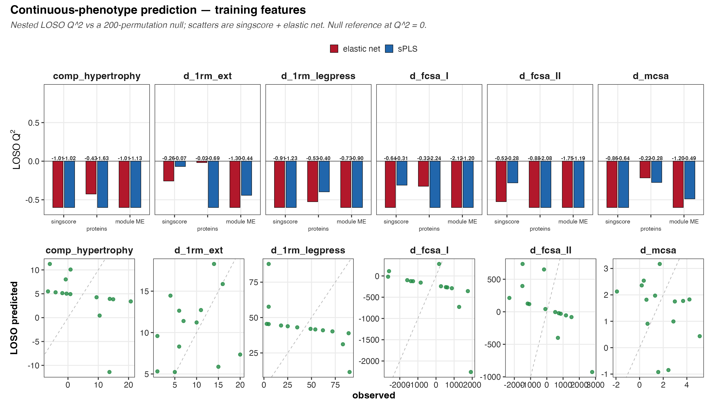
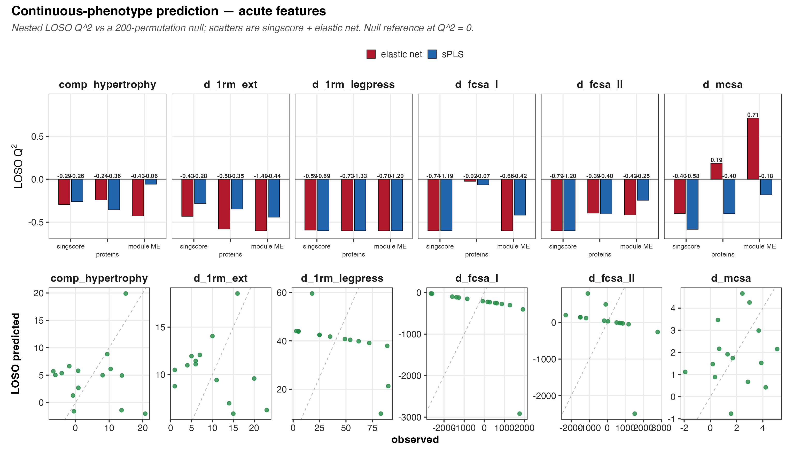

# The question

The HR/LR split is a coarse cut through a continuous response. This arm
skips the cut and predicts the response itself: composite hypertrophy
(`comp_hypertrophy`) and the paired change scores for fibre and whole
muscle size and strength — `d_fcsa_I`, `d_fcsa_II`, `d_mcsa`,
`d_1rm_legpress`, `d_1rm_ext`.

As in the class arm we ask it three ways — baseline (T1), training
(T1 to T2 change), and acute (T2 to T3 change) features — and within each
phase we compare singscore pathway scores (primary), proteins, and the
F04 module eigengenes, under an elastic net and a sparse PLS regression.

# How a continuous prediction is scored honestly

For a real-valued outcome the natural cross-validated score is
**Q^2**, the out-of-sample cousin of R^2:

$$Q^2 = 1 - \frac{\sum_i (y_i - \hat y_{-i})^2}{\sum_i (y_i - \bar y)^2},$$

where $\hat y_{-i}$ is the leave-one-subject-out prediction. Q^2 = 1 is
perfect, Q^2 = 0 is no better than predicting the mean, and — unlike R^2 —
Q^2 goes **negative** when the model predicts worse than the mean, which
is the usual fate of a flexible model on a tiny noisy sample. We report
RMSE and a Spearman correlation alongside it, and give each of the three a
permutation p.

The **singscore and protein** feature spaces are leakage-free for the same
two reasons as the class arm. singscore is single-sample and rank-based, so
scoring the full cohort once leaks nothing. The z-scoring and the
hyperparameter tuning (`glmnet`'s alpha/lambda, sPLS's keepX) are fit inside
each fold on the training subjects only, by an inner leave-one-subject-out
loop, and the 200-permutation null re-runs that whole nested procedure on
shuffled outcomes. No binarization is used anywhere; the outcome stays
continuous end to end.

## The eigengene feature space is transductive {#sec-transductive}

One exception matters, and it lands squarely on the only lead this arm
produces.

The **F04 module eigengenes were not built inside the cross-validation
loop.** WGCNA was run once, on all 45 samples, before any fold was drawn. So
on every leave-one-subject-out fold, the held-out subject's own data had
already helped define the modules whose eigengene is then used to predict
them. The *regression* is honestly held out; the *features* are not.

That is transduction, not leakage in the crude sense — no outcome label was
seen — but it does mean the eigengene Q² is **optimistic and is not
out-of-sample in the strict sense**. A fully out-of-sample estimate would
refit WGCNA inside each fold, on the training subjects only.

This matters because the eigengene cells are exactly the ones that top the
table. Read them as the most inflated numbers here, not the most trustworthy.

# The results

```{r}
#| message: false
pacman::p_load(here, dplyr, readr, purrr, knitr)

phases <- c("baseline", "training", "acute")
metrics <- map_dfr(phases, function(ph) {
  read_csv(
    here(
      "04_Figures", "F06_prediction", "prediction_continuous", ph, "c_data",
      "cont_metrics.csv"
    ),
    show_col_types = FALSE
  )
})

metrics |>
  transmute(phase, outcome, space, model, n,
    Q2 = round(q2, 2),
    RMSE = round(rmse, 2),
    rho = round(spearman, 2),
    perm_p = round(perm_p_q2, 3),
    BH_q = round(q_bh, 3)
  ) |>
  arrange(perm_p) |>
  head(20) |>
  kable(caption = "Top 20 cells by Q^2 permutation p across all phases.")
```

Reading the table with the sample size in mind:

**Most Q^2 values are negative.** That is not a bug; it is what an
honestly cross-validated flexible model does on 14-15 subjects when the
signal is weak — it does worse than simply guessing the mean. The
permutation null is centred in the same negative territory, so a negative
Q^2 is only interesting relative to that null, never against zero.

**The permutation p is the arbiter, and BH keeps us honest.** With six
outcomes times three feature spaces times two models per phase, there are
many cells and therefore many chances to see a lucky Spearman. Any cell
worth a second look has to clear its permutation null and then survive BH
correction. Cells that clear the nominal null but not BH are hypotheses, not
findings, and are labelled as such.

**The BH family in the table is a 36-cell leaf, but the search was 108
cells.** Each phase is a separate `run.R`, and `p.adjust()` is applied within
one phase leaf. The `BH_q` column above therefore pays for 36 comparisons.
The reader, however, has just been shown all three phases — a 108-cell search.
Pooled across all 108 continuous cells the best q is **0.806**, not 0.358.
Take the pooled number as the honest one; the per-leaf q flatters the
eigengene cell because it charges it for a third of the search that actually
happened.

**The headline p is at the resolution floor.** The best permutation p is
0.00995 — that is **2/201**, two permutations off the smallest value a
200-permutation null can return. It is not a precise small p; it is "nothing
beat it twice." A finer null would be needed to say more, and there is no
max-statistic null anywhere in this arm, which is what a search over 108 cells
would properly call for.

**Where any signal lives.** One lead recurs: change in whole-muscle CSA
(`d_mcsa`) predicted from the F04 module eigengenes under the elastic net, in
both the baseline window (Q² ≈ 0.56, Spearman ≈ 0.82, permutation p ≈ 0.015)
and the acute window (Q² ≈ 0.71, Spearman ≈ 0.85, permutation p ≈ 0.010). A
few strength cells (`d_1rm_ext` at baseline) also clear the nominal null.

Three things should temper it, and together they are decisive:

1. It **dies under BH** — at 0.358 within its own leaf, and at 0.806 pooled
   across the real search.
2. Its feature space is **transductive** (see @sec-transductive), so the Q²
   is optimistic by construction. The eigengenes saw the held-out subject.
3. Only **7 of 108 cells** have a positive Q² at all. Seven of 108 is about
   what chance delivers.

The training window is null for every outcome, and composite hypertrophy —
the very phenotype that defined the HR/LR split — is null out of sample in
every phase. The one thread worth pulling is the module-eigengene to ΔmCSA
coupling, and only as a hypothesis for a larger cohort, in which WGCNA is
refit inside the fold.

## The panels







# Key terms

**Q²** — the cross-validated cousin of R², computed on leave-one-subject-out
predictions. Q² = 0 means no better than predicting the mean, and unlike R² it
goes **negative** when the model does worse than the mean. On n = 15 that is
the normal outcome, not a bug.

**Nested LOSO** — the outer loop holds out one subject; the inner loop tunes
hyperparameters on the remaining subjects only. Tuning on all subjects and
then holding one out would leak the held-out subject into the choice of model.

**Permutation null** — re-runs the *entire* nested procedure on shuffled
outcomes, so the null carries the same optimism as the real fit. With 200
permutations the smallest reachable p is 1/201 ≈ 0.005.

**Transductive** — the held-out sample influenced how the *features* were
built, even though its outcome label was never seen. The F04 eigengenes are
transductive. See @sec-transductive.

# Recap

- Continuous outcomes were predicted with leave-one-subject-out Q², RMSE and
  Spearman, each against a 200-permutation null, with no binarization at any
  step.
- singscore's single-sample scoring plus strictly train-only z-scoring and
  inner-loop tuning keep the singscore and protein arms leakage-free. **The
  eigengene arm is transductive** — WGCNA saw all 45 samples — so its numbers
  are optimistic.
- Negative Q² is the expected baseline at this n; the permutation null, not
  zero, is the reference. Only 7 of 108 cells reach a positive Q² at all.
- Composite hypertrophy and the training window are null everywhere. The only
  recurring above-null lead is ΔmCSA from the module eigengenes, and it fails
  BH at 0.358 in its own leaf and 0.806 pooled across the real 108-cell search.
- **Nothing in this arm survives multiple testing.** At this sample size that
  null is the finding, not a failure.

```{r}
sessionInfo()
```
