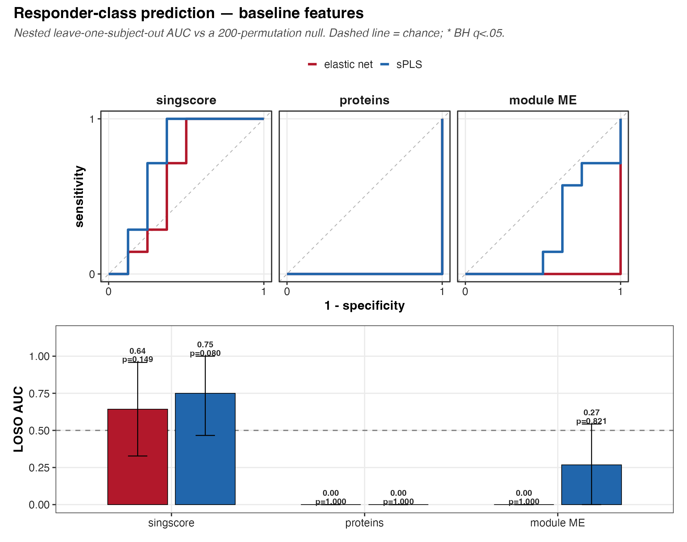
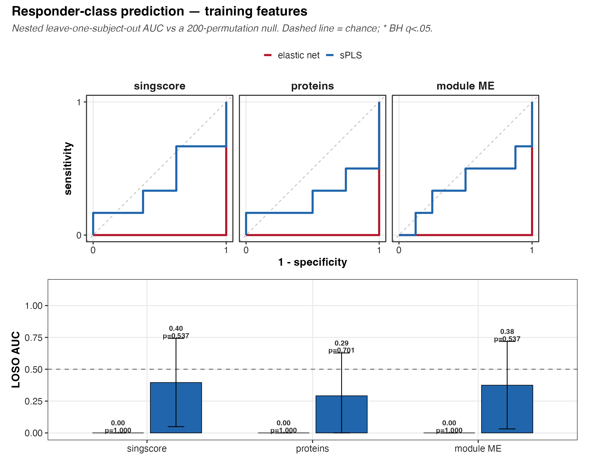
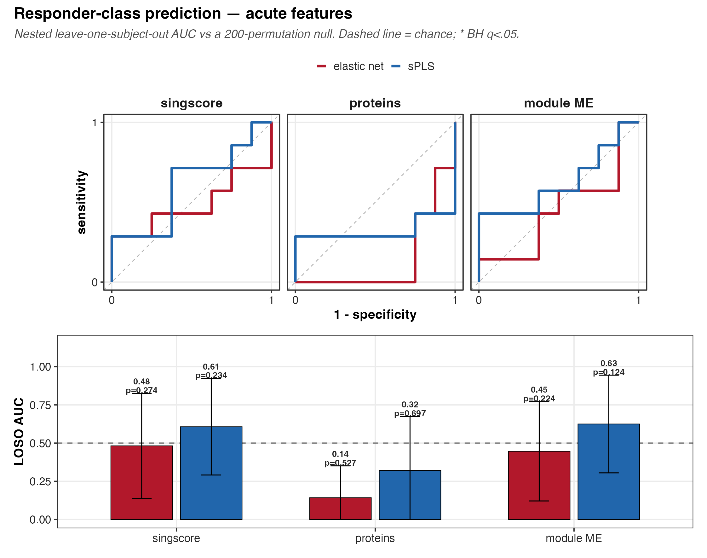

# The question

Can the muscle proteome tell a high responder (HR) from a low responder
(LR) *out of sample*? We ask it three ways, one per phase:

- **baseline** — the T1 proteome, before any training.
- **training** — the T1 to T2 change, the adaptation to the programme.
- **acute** — the T2 to T3 change, the response to a single bout.

Within each phase we compare three feature spaces — singscore pathway
scores (primary), individual proteins, and the F04 module eigengenes —
and two models, an elastic net (`glmnet`) and sparse PLS-DA (`mixOmics`).

Sixteen subjects is a small cohort, so a single accuracy number is close
to meaningless. Everything below is cross-validated and every number
carries a permutation p. A null result here is a real result: it is the
honest answer to "is there anything an out-of-sample model can grab?"

# Why this is leakage-free

The danger with a cohort this size is that a preprocessing step quietly
peeks at the held-out subject and hands the model an unfair hint. Two
choices rule that out.

**singscore is single-sample.** Each sample's pathway score is built from
that sample's own within-sample gene ranks. It never looks at the rest of
the cohort, so scoring all 45 samples at once cannot leak the held-out
subject into the training features. That is the whole reason we score
with singscore rather than a cohort-relative method such as GSVA, whose
scores shift when you add or remove a sample.

**Everything else is fit train-only, inside the fold.** The outer loop
leaves one subject out. On the remaining subjects we z-score the features
(centre and scale learned on the training subjects, then applied to the
held-out subject), and we tune the model — `glmnet`'s alpha and lambda,
sPLS's keepX — with a second, inner leave-one-subject-out loop that never
sees the held-out subject. Only then is the held-out subject predicted.
The permutation null re-runs that entire nested procedure on shuffled
labels, 200 times, so the null carries the same optimism the real fit
does.

# The results

```{r}
#| message: false
pacman::p_load(here, dplyr, readr, purrr, knitr)

phases <- c("baseline", "training", "acute")
metrics <- map_dfr(phases, function(ph) {
  read_csv(
    here(
      "04_Figures", "F06_prediction", "prediction_responder", ph, "c_data",
      "class_metrics.csv"
    ),
    show_col_types = FALSE
  )
})

metrics |>
  transmute(phase, space, model, n,
    AUC = round(estimate, 2),
    CI = sprintf("[%.2f, %.2f]", ci_lo, ci_hi),
    perm_p = round(perm_p, 3),
    BH_q = round(q_bh, 3)
  ) |>
  arrange(perm_p) |>
  kable()
```

A few things to read off the table.

**The effective sample size is small and phase-dependent.** Baseline uses
15 subjects (S29 has no T1), training 14 (S28 and S29 each miss an end of
the T1-to-T2 window), acute 15 (S28 has no post samples). Leave-one-out on
14-15 subjects is about as thin as cross-validation gets.

**Point AUCs wander below 0.5, and that is expected.** With leave-one-out
on an unbalanced cohort, removing an HR subject shifts the training
majority toward LR, which nudges the held-out prediction the wrong way.
An intercept-only model can therefore land at an AUC well under chance.
This is exactly why the reference is the permutation null and not the
0.5 line: the same bias sits in every permutation, so the p-value stays
honest.

**Nothing survives multiple testing.** The strongest single cell is the
baseline singscore sPLS-DA classifier (AUC 0.75, 95% CI 0.47–1.00), and even
it does not clear a nominal permutation p (0.080), let alone BH correction
across its leaf (q = 0.448). Read together with the near-chance protein and
eigengene models, the message is consistent: the baseline proteome does not
separate future responders out of sample, and the training and acute windows
do not rescue it.

**Two cells report an AUC of exactly zero, and should not be read as
results.** The baseline protein and eigengene `glmnet` cells come back with
AUC = 0.000, a 0.000–0.000 confidence interval, and a permutation p of 1.0. A
point estimate of exactly zero with a zero-width interval is not the same
phenomenon as the sub-chance wandering described above — it is the signature
of a degenerate fit, where the held-out predictions carry no usable ranking at
all. Read those two cells as **"no model was fit"** rather than as evidence of
anti-prediction. They are reported rather than hidden, and they are flagged
for a look at the harness.

## The eigengene feature space is transductive

The F04 module eigengenes used here were built by running WGCNA **once, on all
45 samples**, before any fold was drawn. On every leave-one-subject-out fold
the held-out subject had therefore already helped define the modules whose
eigengene is used to classify them. The regression is held out; the features
are not.

No outcome label leaked, so this is transduction rather than leakage in the
crude sense. But it means the eigengene cells are **optimistic by construction
and not out-of-sample in the strict sense**. That they come back null anyway is,
if anything, a stronger negative result than it appears.

## The panels







# Key terms

**AUC** — area under the ROC curve. The probability that a randomly chosen HR
subject is ranked above a randomly chosen LR subject. 0.5 is chance. Here the
reference is the **permutation null**, not 0.5, because leave-one-out on an
unbalanced cohort biases the point estimate downward.

**Nested LOSO** — the outer loop holds out one subject; the inner loop tunes
hyperparameters on the remaining subjects only. Tuning on everyone and then
holding one out would leak the held-out subject into the model choice.

**Permutation null** — re-runs the *entire* nested procedure on shuffled
labels, so the null inherits the same optimism as the real fit.

**Transductive** — the held-out subject shaped the *features*, even though its
label was never seen. The eigengene arm is transductive.

# Recap

- Prediction was scored with nested leave-one-subject-out and a
  200-permutation null, because point estimates on n = 16 cannot be trusted on
  their own.
- singscore was chosen precisely because it is single-sample and rank based, so
  full-cohort scoring introduces no leakage; every fold-specific transform
  stayed train-only. **The eigengene arm is transductive** and its numbers are
  optimistic.
- Two baseline `glmnet` cells are degenerate (AUC exactly 0, zero-width CI) and
  mean "no model", not "perfectly wrong".
- Across three phases, three feature spaces, and two models, **no classifier
  separated HR from LR beyond its permutation null after BH correction.** At
  this sample size that null is the finding, not a failure.

```{r}
sessionInfo()
```
