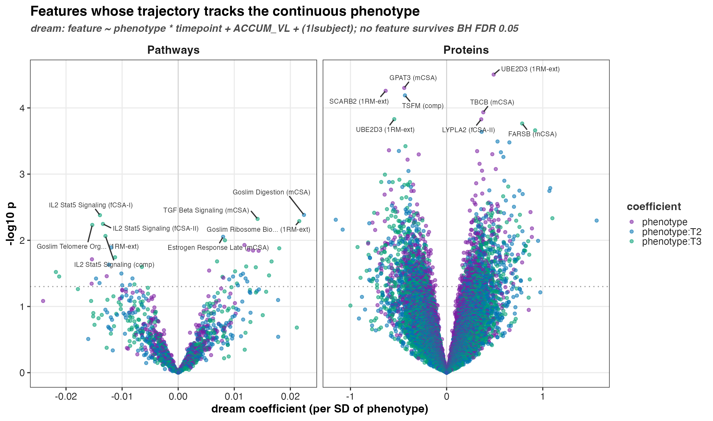
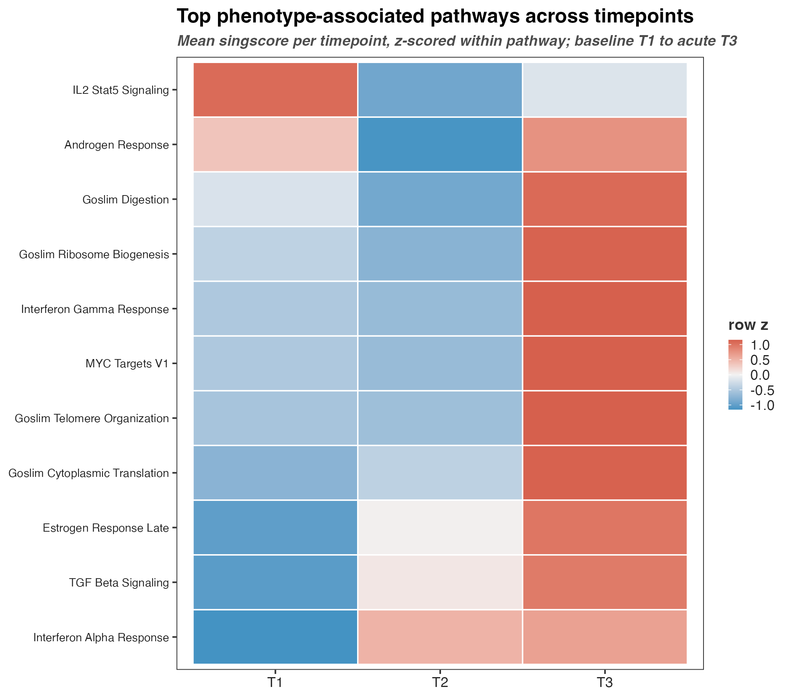
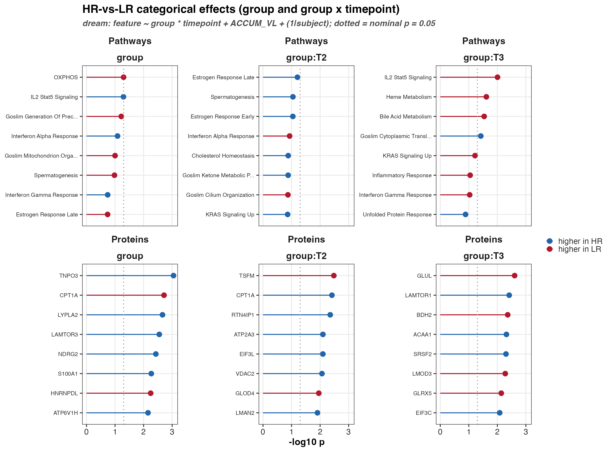

```{r setup, include=FALSE}
knitr::opts_chunk$set(echo = TRUE, message = FALSE, warning = FALSE)
```

# Why a mixed model here

Each of our 16 lifters is biopsied up to three times: baseline (T1), trained
(T2), and the acute post-exercise state (T3). Three measurements from one person
are not three independent observations. A subject who simply runs high on a
protein will run high at all three visits, so the residuals within a subject are
correlated. A plain per-feature linear model ignores that correlation, counts 45
correlated samples as 45 independent ones, and reports standard errors that are
too small and p-values that are too optimistic.

`variancePartition::dream` (Hoffman & Roussos 2021, *Bioinformatics* 37:192)
fixes this by fitting a **linear mixed model per feature** with a random
intercept for subject:

$$y_{ij} = X_{ij}\beta + u_i + \varepsilon_{ij}, \qquad u_i \sim N(0, \sigma^2_u)$$

The random intercept $u_i$ absorbs each subject's baseline offset, so the fixed
effects $\beta$ are estimated from *within-subject* change where the design
allows it. dream then applies the limma precision-weighting and empirical-Bayes
moderation across features, which stabilises the per-feature variance at n = 16.
That is the whole reason to reach for it over a naive `lm` loop: honest degrees
of freedom for a repeated-measures design, plus variance shrinkage that a small
cohort badly needs.

# What we score

We run dream on two feature matrices built from the same imputed protein data:

1. the **protein** log2-intensity matrix (1896 proteins, gene-symbol collapsed
   with `limma::avereps`), and
2. a **singscore** pathway matrix (Foroutan et al. 2018, *BMC Bioinformatics*
   19:404). singscore ranks the genes *within each sample* and scores each
   Hallmark / GO Slim set against that per-sample ranking, so a sample's pathway
   score never depends on the rest of the cohort. That single-sample property is
   what keeps the scores leakage-free and is exactly the point interrogated in
   the `singscore_vs_gsva_validation` unit.

```{r inputs}
library(here)
library(dplyr)
library(readr)

cont <- read_csv(
  here("05_test", "association_dream", "c_data", "dream_continuous.csv"),
  show_col_types = FALSE
)
cat_res <- read_csv(
  here("05_test", "association_dream", "c_data", "dream_categorical.csv"),
  show_col_types = FALSE
)
```

# Two model families

**Continuous** — for each response phenotype (composite hypertrophy and the
fibre / muscle / strength deltas) we fit

```
feature ~ phenotype * timepoint + accum_vl_z + (1 | subject)
```

The `phenotype` main effect is the association at baseline (T1, the reference
level). The `phenotype:timepoint` terms are the trajectory-tracks-phenotype
signal: does a feature's change from T1 scale with how much the subject
eventually gained? Cumulative training volume (`ACCUM_VL`, z-scored) is carried
as a moderator. All continuous predictors are z-scored, so a coefficient is the
per-SD-of-phenotype change and the six phenotypes sit on one comparable scale.

**Categorical** — a single fit per matrix,

```
feature ~ group * timepoint + accum_vl_z + (1 | subject)
```

Here `group` (HR vs LR) is the baseline difference and `group:timepoint` is the
divergence in trajectory. Composite hypertrophy is **deliberately excluded** from
this family: the HR / LR labels were defined by thresholding composite
hypertrophy, so putting it back in would be conditioning on the outcome.

One subject (S28) is baseline-only and has no recorded `ACCUM_VL`; that single
row drops from every fit, leaving 44 samples. Both families are BH-corrected
within each matrix x coefficient block.

# What tracks the phenotype

```{r top-continuous}
cont |>
  arrange(p_value) |>
  transmute(matrix, feature, phenotype, coefficient,
    estimate = round(estimate, 3), p_value = signif(p_value, 2),
    fdr = signif(fdr, 2)
  ) |>
  head(10) |>
  knitr::kable()
```



The honest headline is a negative one: **no protein and no pathway survives BH
FDR 0.05** for tracking any continuous phenotype. At n = 16 with the correlation
properly modelled, the cohort is underpowered to pin a single feature to the
response. The nominal leaders are still biologically coherent, though. `UBE2D3`
(a ubiquitin-conjugating enzyme) rises with strength gain; `FARSB`, `TSFM` and
`RPS17` -- mitochondrial and cytosolic translation machinery -- move with the
muscle- and fibre-size deltas. The pathway heatmap tells the same story at the
set level:



The phenotype-associated pathways -- ribosome biogenesis, cytoplasmic
translation, MYC targets, telomere organisation -- are flat at T1/T2 and light up
in the acute T3 state. The anabolic / translational signal lives in the acute
proteome, not at baseline, which matches what the prediction work found: the
resting proteome does not forecast who will grow.

# HR versus LR

```{r top-categorical}
cat_res |>
  arrange(p_value) |>
  transmute(matrix, feature, coefficient,
    estimate = round(estimate, 3), p_value = signif(p_value, 2),
    fdr = signif(fdr, 2)
  ) |>
  head(10) |>
  knitr::kable()
```



The categorical family is also null at FDR, but the nominal pattern is worth a
look: the Ragulator / mTORC1 scaffold `LAMTOR1` and `LAMTOR3` read higher in high
responders, while the fatty-acid-oxidation enzyme `CPT1A` and glutamine
synthetase `GLUL` read higher in low responders -- an anabolic-versus-oxidative
lean that is suggestive but not something to over-sell from 16 people.

# Recap

- Three biopsies per subject are correlated; dream's `(1 | subject)` random
  intercept is what lets us model that correlation instead of pretending we have
  45 independent samples.
- We fit both a continuous family (phenotype x timepoint, one per response) and a
  categorical family (group x timepoint), on both the protein and the singscore
  pathway matrix, adjusting for training volume.
- Nothing clears FDR 0.05 in either family -- the cohort is too small to nominate
  single features -- but the nominal signal is consistent and points at
  translational / anabolic machinery peaking in the acute state.
- Outputs: `c_data/dream_continuous.csv`, `c_data/dream_categorical.csv`,
  `c_data/singscore_matrix.csv`; panels in `b_reports/`.

```{r sessioninfo}
sessionInfo()
```
