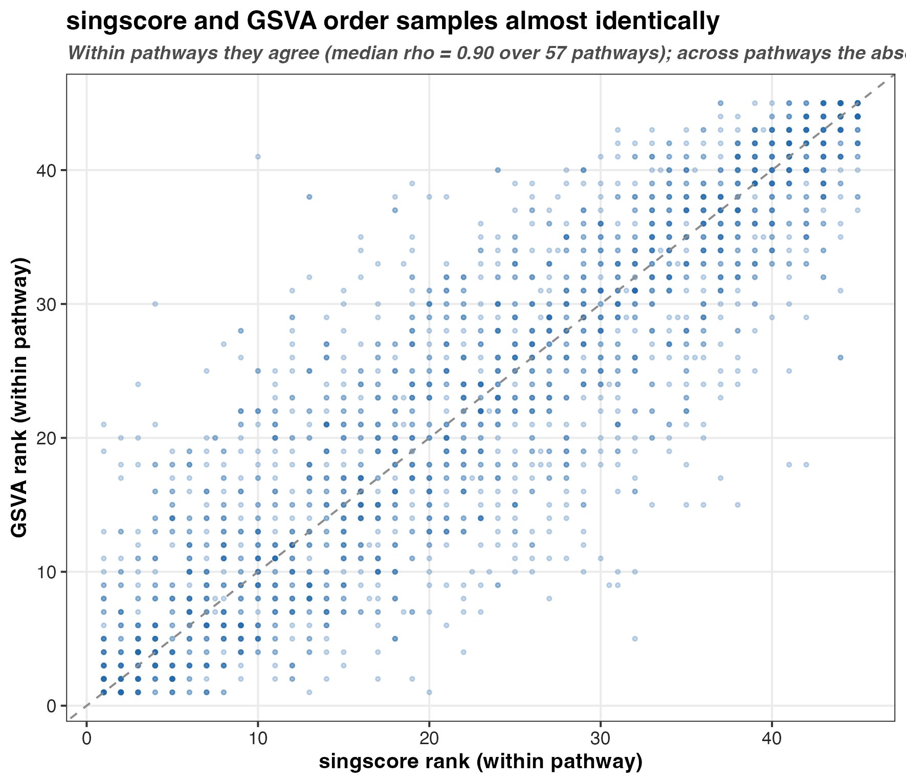
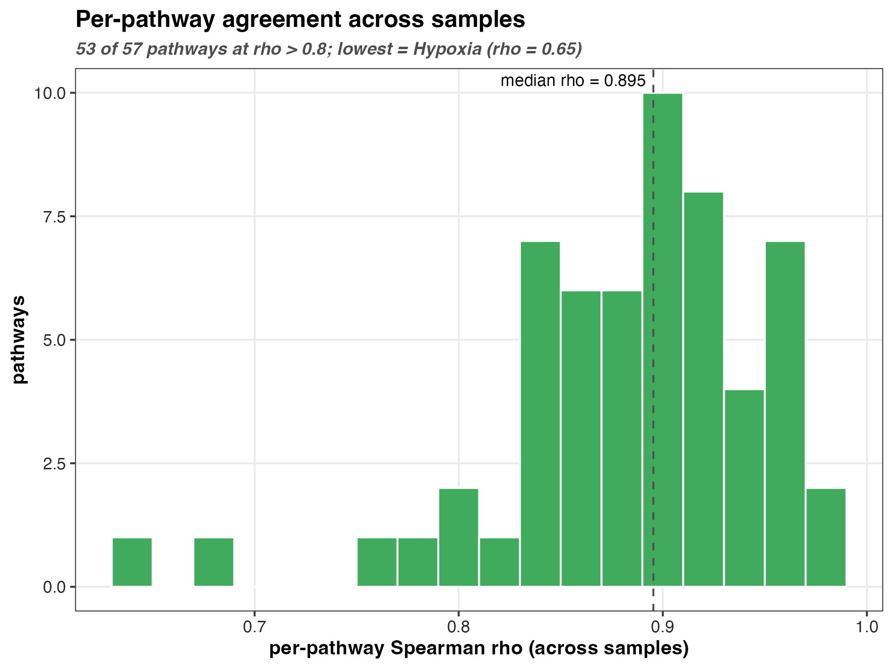

```{r setup, include=FALSE}
knitr::opts_chunk$set(echo = TRUE, message = FALSE, warning = FALSE)
```

# The question

Everything downstream of pathway scoring -- the dream association fits, any
prediction attempt -- inherits whatever the scoring method decides a sample's
pathway activity is. Two popular single-sample methods disagree on one crucial
design point:

- **singscore** (Foroutan et al. 2018, *BMC Bioinformatics* 19:404) ranks the
  genes *within each sample* and scores a set against that one sample's ranking.
  A sample's score is computed in isolation; adding or removing other samples
  cannot change it.
- **GSVA** (Hanzelmann et al. 2013, *BMC Bioinformatics* 14:7) ranks each gene
  *across the cohort* through a kernel-estimated CDF before scoring. A sample's
  score is therefore **cohort-relative**: it shifts if the cohort composition
  changes (Bhuva et al. 2020, *Nucleic Acids Research* 48:e113).

That difference is not academic. A cohort-relative score, re-estimated every time
the sample set changes, leaks information across a train/test split unless it is
recomputed strictly inside each fold. A single-sample score does not. Before
trusting either for prediction we should know how far apart they actually land on
our data.

# Same matrix, same sets, two scorers

`setup.R` collapses the imputed protein matrix to gene symbols and scores it two
ways against the identical Hallmark + GO Slim collection
(`build_pathway_collection`, size 15-500), then trims to the 57 pathways both
methods score. Scoring both on one collection is what makes the comparison
like-for-like.

```{r load}
library(here)
library(dplyr)
library(readr)

agree <- read_csv(
  here("05_test", "singscore_vs_gsva_validation", "c_data", "score_agreement.csv"),
  show_col_types = FALSE
)
```

# Agreement

We ask agreement two ways. **Within a pathway**, across the 45 samples, does one
method order the samples the same as the other? That is the Spearman correlation
that matters for any per-pathway model. **Across pathways**, are the absolute
scores on a common scale?

```{r summary}
tibble(
  metric = c(
    "median per-pathway rho (across samples)",
    "pathways with rho > 0.8",
    "lowest per-pathway rho",
    "pooled rho over all pathway-sample pairs"
  ),
  value = c(
    round(median(agree$rho), 3),
    sprintf("%d of %d", sum(agree$rho > 0.8), nrow(agree)),
    sprintf("%.2f (%s)", min(agree$rho), agree$pathway[which.min(agree$rho)]),
    round(agree$pooled_rho[1], 3)
  )
) |>
  knitr::kable()
```





# Reading the two numbers

The two summaries look contradictory until you see what each measures.

**Within a pathway the methods agree strongly** -- median Spearman 0.90, and 53 of
57 pathways above 0.8. If you rank the 45 samples by singscore activity for, say,
MYC targets, GSVA ranks them in nearly the same order. For every per-pathway
analysis in this project -- the dream trajectory fits, any HR-vs-LR contrast --
the choice of scorer barely moves the ordering, so those results are robust to it.

**Across pathways the absolute scales are not comparable** -- the pooled
correlation over every pathway-sample pair collapses to 0.15. That is expected,
not alarming: GSVA centres each pathway near zero across the cohort, while a
singscore value reflects where the set sits in each sample's own rank
distribution, so the two disagree completely on between-pathway offsets. The
lesson is to never compare a GSVA score for pathway A against pathway B as if they
were on one ruler; compare samples within a pathway.

The lone soft spot is `HALLMARK_HYPOXIA` (rho 0.65), a broad, heterogeneous set
where the cohort-relative and single-sample rankings drift apart most.

# The leakage implication for prediction

This is the practical payoff. Because within-pathway ordering agrees so closely,
**singscore buys the leakage safety of a single-sample method at almost no cost
in the signal GSVA would have seen.** GSVA's cohort-relative scoring means an
honest out-of-sample prediction has to re-score every training fold without the
held-out subject, or the score of a test sample is quietly informed by its
neighbours. singscore sidesteps that entirely: a sample's score is fixed the
moment you have that sample, so it can be scored once on the full cohort and still
used in leave-one-subject-out cross-validation without leakage. Given that the two
rank samples the same way within a pathway, singscore is the safer default for the
`prediction_*` units, and GSVA remains a fair cohort-relative comparator for the
descriptive association work.

# Recap

- singscore is single-sample; GSVA is cohort-relative. That is the only
  difference that matters for leakage.
- Within a pathway they order samples almost identically (median rho 0.90; 53/57
  above 0.8), so per-pathway results are robust to the choice.
- Across pathways their absolute scales are not comparable (pooled rho 0.15) --
  only ever compare samples within a pathway.
- Because the within-pathway agreement is high, singscore gives the leakage-free
  guarantee for prediction with negligible loss versus GSVA.
- Outputs: `c_data/score_agreement.csv`, `c_data/singscore_matrix.csv`,
  `c_data/gsva_recomputed.csv`; panels in `b_reports/`.

```{r sessioninfo}
sessionInfo()
```
